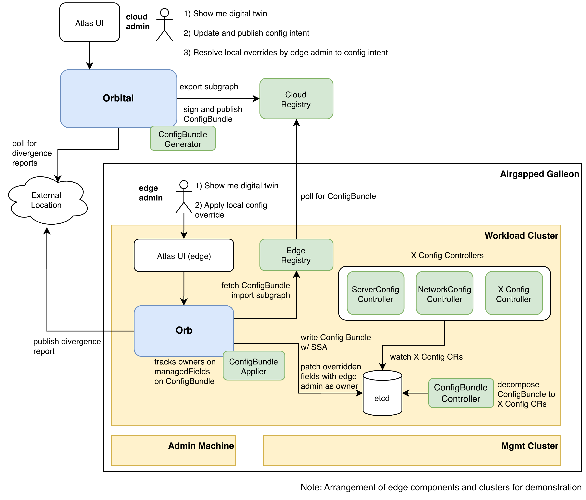

# 📡 Orbital

Orbital is an API-first, graph-native configuration management system for
modular data centers.

For project status, see [ROADMAP.md](./ROADMAP.md)

## Motivation

Operating modular data centers at scale surfaces questions that existing tools
cannot answer. When something breaks, tracing the impact across a PDU, switch,
bare metal nodes, and running workloads requires stitching together Netbox,
gitops repos, iDRAC scan output, and spreadsheets — there is no connected view.

Mature tools like [Ralph](https://ralph-ng.readthedocs.io/en/stable/),
[Netbox](https://netboxlabs.com/), [Device42](https://www.device42.com/), and
[SunbirdDCIM](https://www.sunbirddcim.com/) solve inventory and asset lifecycle
well. Based on our hands-on evaluation and operational experience, they fall
short in four areas:

- **No operational intelligence** — tools track what exists, not how components
  relate. Queries like "what workloads are impacted if this component fails?" or
  "show me everything connected to this server" require manual cross-referencing
  across systems. Without a connected view, root cause analysis is slow and
  mean time to recovery (MTTR) is high
- **Not designed as an intent layer** — existing tools assume direct actuation
  over persistent connectivity. There is no concept of publishing authoritative
  intent as versioned artifacts for local controllers to pull and reconcile at
  the edge — the pattern described in *Cloud-Authored, Edge-Enforced
  Configuration Management*
- **Not built for disconnected operations** — air-gapped and intermittently
  connected facilities are treated as edge cases, not first-class deployments
- **Bundled products, not composable layers** — monitoring, dashboards, and
  workflows you already have are included with no path to adopt just the
  configuration management layer

## Goals 

- **Air-gapped ready** — operates in disconnected and edge environments without
  external dependencies
- **Graph-first infrastructure model** — represent data centers as relationships
  between physical and logical resources
- **Topology API (digital twin)** — exposes the configuration graph as a live,
  traversable GraphQL API. Consumers such as Atlas define their own query shape
  and traversal depth — no custom endpoints required per use case
- **Intent-only CMDB** — mutations update design intent only; orbital is never
  in the reconciliation path. Actuation follows the pattern in *Cloud-Authored,
  Edge-Enforced Configuration Management*; ConfigBundles are pulled and applied
  at the edge via domain controllers; local field overrides surface as
  divergences for cloud admin resolution
- **API-first, transport-agnostic** — orbital provides export, intake, and
  topology APIs; packaging, delivery, and reconciliation belong to the adopting
  team

## Reference Architecture

*Blue — orbital and orb (this repository). Green — ConfigBundle pipeline and edge controllers (separate repository).*

<p align="center"></p>

## Concepts

- **`orbital`** — Cloud-hosted CMDB and Topology API. Single source of truth for
  configuration intent. GraphQL mutations update authoritative intent only —
  never execute actions remotely.
- **`orb`** — Self-contained edge service inside a modular data center. Holds a
  local copy of intended configuration, serves it fully offline, and produces
  divergence reports.
- **`namespace`** — Tenancy boundary scoping a data center's configuration
  graph. One namespace per data center; used for export scoping, query
  partitioning, and orphan detection.
- **`orbId`** — Stable, human-readable identity key for every configuration item
  in the format `namespace:entity-name`. Primary reference key across API calls,
  seed data, and exports — DGraph UIDs are internal and must not be relied upon
  across environments.
- **`configuration item`** — The fundamental unit of the graph. Anything in a
  modular data center that can be named, related, and tracked — from physical
  assets (racks, servers) to logical constructs (Kubernetes clusters,
  application configs).
- **`subgraph export`** — Scoped export of a single data center's configuration
  graph, produced by orbital's export API as `json.gz` + `schema.gz`. Source
  artifact for ConfigBundle generation.
- **`subgraph import`** — Loading a subgraph into a DGraph instance. Orb
  performs subgraph import to seed or refresh its local configuration graph from
  a delivered ConfigBundle.
- **`ConfigBundle`** — Signed, versioned artifact assembled by a separate bundle
  service from orbital's subgraph export. Contains at minimum `json.gz` and
  `schema.gz` alongside a ConfigBundle manifest. A local ConfigBundle controller
  decomposes it into domain-specific CRs for edge reconciliation. Implemented in
  a separate repository (TBD).
- **`divergence report`** — Report produced by orb describing the gap between
  design intent and observed reality. Divergence during disconnection windows is
  expected — it is data, not an error. Orbital surfaces it to cloud admins for
  explicit resolution.

## Quick Start

```bash
# Start dependencies (DGraph + PostgreSQL)
docker compose -f deploy/local/docker-compose.yml up -d

# Run orbital
make run-orbital

# Seed example data (9 data centers)
make seed
```

- GraphQL playground: http://localhost:8001/graphql
- Swagger API docs: http://localhost:8001/swagger/index.html

See [CONTRIBUTING.md](CONTRIBUTING.md) for seeding example data and running tests.

## Deploy

See [deploy/README.md](deploy/README.md) for local and AKS deployment instructions.

