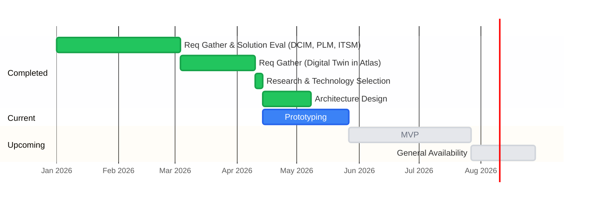

# Roadmap

## Development Timeline

**Note:** All future dates are subject to change.

---

## Spikes

Each spike is a question to answer. Results define the MVP.

| # | Spike | Key Question | Owner | Status | Open items |
|---|---|---|---|---|---|
| 1 | AKS deployment validation | Can we deploy orbital and DGraph on AKS and reach a working baseline? | Daniel | ✅ Done (4/20) | |
| 2 | Orb CLI structure | What is the right command structure for the orb binary? | Daniel | ✅ Done (4/22) | |
| 3 | PostgreSQL / ent data model | What is the right schema for orbital's operational data? | Daniel | ✅ Done (5/5) | |
| 4 | Web UI | Can we build the orbital management UI with HTMX and Go templates? | Daniel | ✅ Done (5/6) | |
| 5 | Authentication | How do we implement OIDC + local auth in orbital? | Daniel | ✅ Done (5/8) | |
| 6 | DGraph backup to S3 | What is the right DGraph backup strategy, including deduplication and retention? | Daniel | ✅ Done (5/9) | |
| 7 | DGraph restore from backup | How do we restore DGraph from a known-good backup? | Daniel | ✅ Done (5/14) | |
| 8 | AKS dev environment | Do we have a working, repeatable AKS dev deployment to prototype against? | Daniel | ✅ Done (5/18) | |
| 9 | Seed iDRAC and storage devices | Does the schema cover all iDRAC and storage fields we need? | Daniel | ✅ Done (5/15) | |
| 9b | Valkey cache-aside | What is the right caching strategy for read-heavy graph queries, and does orbital degrade correctly without it? | Daniel | Not started | |
| 10 | Air-gap sync round-trip | Does orbital's config export work as a complete, importable payload for orb? | — | ✅ Done | Orb loads `json.gz` into local DGraph and serves offline; validate export sizes |
| 11 | Authorization | How do we restrict mutations to authorized roles and test authz offline? | — | 🔄 In progress | App Roles, DGraph `@auth` directives, middleware enforcement, offline JWT tests, AKS OIDC validation |
| 12 | DGraph operations | Can our team operate DGraph on AKS without prior experience? | — | Not started | Runbook: schema change apply, validate, rollback |
| 13 | Orb import API | What is the right mechanism for orb to pull a signed OCI subgraph from a local Zot registry and load it into local DGraph? | — | ✅ Done | OCI puller (oras-go v2), cosign verify (air-gap safe), `dgraph live` subprocess, polling loop, Zot ACR upstream sync config, docker-compose DGraph for orb |
| 14 | Divergence reports | How does orbital surface divergence and let an admin resolve it? | — | Not started | |
| 15 | Orb deployment model | What does orb look like deployed at the edge — topology, runtime deps, air-gap constraints? | — | Not started | |
| 16 | Orb API surface & authN/Z | What endpoints does orb expose locally, who calls them, and what is the consumer auth model? | — | Not started | |
| 17 | Orb UI | Can orbital and orb share a template infrastructure while serving different nav and capability surfaces? End-to-end demo: import → browse config offline → divergence → publish report. | — | ✅ Done | |
| 18 | ES module split of app.js | Can we split the 2,529-line JS monolith into per-feature ES modules with zero build step? | — | Not started | shared.js + orbital.js + orb.js; conditional loading via UIConfig; window.* bridge for onclick handlers |
| — | Schema migration | Do we need automation or is a runbook sufficient? | — | ❌ Out of scope | |

---

## What We've Built

| Spike | Completed | Summary |
|---|---|---|
| 1 · AKS deployment | Apr 20 | Orbital + DGraph on AKS, NetworkPolicy, pod recovery validated |
| 2 · Orb CLI | Apr 22 | Single binary: `orb start/scan/export/import` subcommands |
| 3 · PostgreSQL schema | May 5 | 9 ent tables: users, orbs, namespaces, jobs, audit log, OCI artifacts |
| 4 · Web UI | Apr 20 – May 14 | Data Centers tab (HTMX, inline edit, audit diff); Servers cross-DC DataTable + drill-down (iDRAC, Storage, Config Profile); Export, Backup, Restore, Audit Log, Signed Artifacts, Schema, Divergence pages; Playwright E2E suite |
| 5 · Authentication | May 8 | OIDC + local auth, CLI keychain, bearer token validation end-to-end |
| 6 · DGraph backup | May 9 | Async backup to Azure Blob/S3, SHA-256 dedup, retention, presigned download |
| Config Export + OCI Pipeline | May 9 – May 18 | 8 endpoints, blue-green DGraph export topology, per-job scratch dirs, oras-go v2 + cosign signing, air-gap safe OCI publish — orbital side complete |
| 7 · DGraph restore | May 14 | Full restore from backup via dgraph-live pod, validated on AKS |
| Audit Log System | May 5 – May 13 | GraphQL mutation interceptor, before-state capture, LCS line diff, three-source orbId extraction, per-entity audit tabs on DC and server views, ADR (`docs/decisions/001-mutation-audit-recording.md`) |
| 8 · AKS dev environment | May 18 | Deploy manifests, Helm charts, seed scripts, step-by-step deploy guide |
| 9 · Hardware Data Modeling | May 15 | 4 new iDRAC schema fields; 9 data centers modeled from real Netbox hostnames and rack topology; schema validated against live hardware |
| orbital-cli | May 11 | `orbital get datacenter/datacenters`; bearer auth; macOS keychain; kubectl-style output |

*Full implementation detail, API contracts, and what was validated: [CHANGELOG.md](CHANGELOG.md)*

---

## MVP Planning

The following are not prototype questions — they are prerequisites for shipping. They will be defined in a dedicated MVP planning session, with infra team input where needed.

### Production deployment
Ingress architecture, dedicated hostnames, TLS, internal vs external load balancer. Auth/authz flows in production (App Roles propagation, OIDC issuer, token lifetimes). Production namespace layout, resource limits, horizontal scaling. CI/CD pipeline: build, tag, push on merge to main, deploy to AKS dev on tag. `//go:embed` to make the binary self-contained. Ratel access via dedicated DNS hostname with its own Istio VirtualService.

*These decisions depend on infra team input and are coupled to auth/authz and ingress architecture — not resolvable in prototype spikes alone.*

### Security & correctness hardening
Fix all critical and high security findings before any staging or production exposure. Full findings and fix order: `docs/security-and-deployment-findings.md` (S.1–S.18), `docs/additional-findings.md` (A.1–A.7), implementation plan: `docs/maintainability.md` Phase 1.

Key items: unauthenticated `/graphql` root route, no K8s liveness/readiness probes, no CSRF on GraphQL mutations, audit actor forged by client, raw JWT logged at INFO, missing `Secure` cookie flag.

### Testing foundations
Automated test pyramid: unit tests, integration tests against real DGraph/PostgreSQL/MinIO/OCI registry, Playwright expansion, CI pipeline, post-deploy AKS smoke suite. Full strategy and actionable steps: `docs/testing-strategy.md`. Requires one Opus design session first (DGraph client interface shape — see T.1 in that doc).

### Performance, cost & observability
Benchmark DGraph query latency under realistic load, validate Valkey caching mitigates bottlenecks, produce AKS node SKU cost estimate. Add Prometheus metrics endpoint, DGraph alpha scraping, Grafana dashboard, and at least one alert for error rate or memory pressure.

---

## MVP Definition

> Working draft — final scope confirmed once prototype spikes complete.

### Orbital (cloud)
- ✅ GraphQL Topology API — proxy DGraph with auth and caching
- ✅ Export API — scoped `json.gz` + `schema.gz` per data center
- ✅ Backup and restore — DGraph full snapshots to Azure Blob, restore via UI
- ✅ Audit log — all config mutations with actor, before/after diff
- ✅ OCI publish — signed artifacts to configured registry
- ⬜ Authorization — App Roles + DGraph `@auth` (Spike 11)
- ⬜ Schema management — versioned apply with backwards compatibility on startup
- 🔲 Orb registry — register, authenticate, and revoke orbs *(post-MVP: revisit when orb onboarding is scoped)*
- ⬜ Security hardening — critical/high items (MVP Planning)
- ⬜ `namespaceID` index on `ConfigItem` — add `namespaceID: String! @search(by: [exact])` to the interface, backfill existing nodes, enforce at application layer on all add mutations. Enables pure GraphQL namespace-scoped queries for external Topology API consumers; required before any external team consumes the API.

### Orb (edge)
- ✅ CLI structure — `orb start`, `orb scan`, `orb export`, `orb import`
- ⬜ Local DGraph — hold intended state, serve fully offline
- ⬜ Config import — load `json.gz` from export API or file (air-gap)
- ⬜ Divergence reporting — surface local admin overrides to orbital

### Explicitly out of scope for v1
- Network infrastructure config items (owned externally)
- PLM and ITSM integrations — vendor selection in progress
- Multi-DGraph instance per data center
- PostgreSQL backup and restore — handled out-of-band by managed PostgreSQL (Azure)

---

## Technical Debt

| Item | Notes |
|---|---|
| `//go:embed` for templates and schema | Read from disk at runtime. Replace with `//go:embed` — self-contained binary. Addressed in MVP Planning. |
| DGraph client abstraction | 22+ raw `http.Post` calls across 7 handler files, no timeouts, no pooling. Extract `internal/dgraph/client.go`. Prerequisite for testing. See `docs/maintainability.md` item 2.1. |
| `internal/handler/` god package | 3,560 lines mixing HTTP, business logic, DGraph calls, file I/O. Decompose post-MVP. See `docs/maintainability.md` item 5.4. |
| `web/static/app.js` monolith | 2,400+ lines, no module system, duplicate event listeners. Spike 18 planned. See `docs/claude/SPIKE_18_EXECUTION.md`. |
| Quick wins (independent, any time) | `docs/maintainability.md` items 3.1–3.7, 4.1, 4.2, 4.4 — none are blocking, all improve correctness or reduce duplication. |

---

## External Integration Dependencies

| System | Role | Status |
|---|---|---|
| **Atlas UI** | Digital twin — queries orbital via GraphQL to visualize topology | Integration approach defined |
| **PLM** | Bill of materials for hardware — orbital may query to enrich config items | Vendor evaluation in progress |
| **ITSM** | Links support tickets to config changes | Vendor evaluation in progress |
