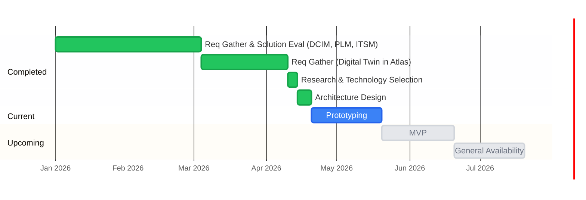

# Roadmap

## Development Timeline

**Up next:** MVP → General Availability. Dates to be set once prototyping spikes are complete.

## Current Phase: Prototyping

Goal is learning, not shipping. Each spike below is a question to answer, not a feature to build.
Results from these spikes define the MVP.

| # | Spike | Key Question | Owner | Status | Depends On |
|---|---|---|---|---|---|
| 1 | AKS Deployment Validation | Can we deploy orbital and DGraph on AKS and reach a working baseline? | Daniel | ✅ Done (4/20) | — |
| 2 | BMC Discovery end-to-end | Can we scan a real fleet and get clean data into the graph? | — | 🔄 In progress | — |
| 3 | DGraph performance and cost | Does DGraph hold up at scale, and what does it cost on AKS? | — | Not started | — |
| 4 | DGraph operations | Can our team operate DGraph on AKS without prior experience? | — | Not started | — |
| 5 | Schema migration — build vs runbook | Do we need automation or is a runbook sufficient? | — | Not started | Spike 4 |
| 6 | Air-gap sync round-trip | Does the DGraph export/import model work reliably for orb sync? | — | Not started | — |
| 7 | Orb registration | What is the right mechanism for securely registering an orb with orbital? | — | Not started | — |
| 8 | DGraph backup to blob storage | What is the right backup strategy and can we build it ourselves? | — | Not started | Spike 4 |

---

### Spike 1. AKS Deployment Validation ✅
**Question:** Can we deploy orbital and DGraph on AKS and reach a working baseline?

**Context:** First end-to-end deployment of the stack — validates that orbital, DGraph Alpha, DGraph Zero, and supporting networking can run together in our shared AKS dev environment.

**Completed:** April 20, 2026 — orbital and DGraph deployed in AKS dev. GraphQL endpoint reachable. NetworkPolicy applied to restrict DGraph access to orbital only.

### Spike 2. BMC Discovery end-to-end
**Question:** Can we scan a real server fleet over Redfish, build a graph, export it from orb, and import it into orbital cleanly?

**Success criteria:**
- Orb CLI scans BMCs and produces a valid DGraph-importable file
- Orbital ingests the file and the graph is queryable via the Topology API
- Data is accurate against known hardware

### Spike 3. DGraph performance and cost
**Question:** Does DGraph hold up at realistic scale for graph traversal queries, and what does it cost to run on AKS?

**Context:** There are unsubstantiated reports of high CPU usage under unknown conditions. This spike reproduces and characterizes that before any optimization work begins.

**Success criteria:**
- Define a realistic query mix: expected patterns from the digital twin UI (deep traversals — DataCenter → Servers → StorageControllers → StorageDevices), read/write ratio, and target dataset size for v1
- Seed DGraph with a representative dataset and benchmark query latency under increasing concurrency
- Identify which specific queries are expensive and whether they correlate with the reported CPU spikes
- Determine if Valkey caching is sufficient mitigation or if DGraph is a hard bottleneck
- Map peak CPU/memory profile to an AKS node SKU and produce a cost estimate for v1 workload

### Spike 4. DGraph operations
**Question:** Can our team operate DGraph reliably on AKS without prior experience?

**Context:** The team has strong Go/Java and PostgreSQL experience but no DGraph operational background. Schema migrations, backup/restore, and cluster behavior during restarts are all unknowns. This spike must be completed before building any automation around these processes.

**Success criteria:**
- Perform a full backup and restore cycle on AKS — validate data integrity after restore
- Apply a schema change to a live DGraph instance — document the process, failure modes, and rollback steps
- Test DGraph behavior during a rolling restart on AKS (pod eviction, zero downtime feasibility)
- Evaluate blue/green deployment viability — determine if DGraph cluster state makes this practical or prohibitively complex
- Produce a runbook: what the on-call engineer does for each of the above scenarios

### Spike 5. Schema migration — build vs runbook
**Question:** Do we need a built-in schema migration tool in orbital, or is a well-maintained runbook sufficient?

**Context:** The architecture calls for orbital to own schema versioning and apply changes to DGraph automatically on startup. But this is non-trivial to build correctly. Spike 4 (DGraph operations) will reveal how painful schema changes are in practice — this spike uses those findings to decide whether automation is worth the investment or whether operational discipline (runbooks, manual apply, version tracking in PostgreSQL) is good enough for the foreseeable future.

**Do not start until spike 4 is complete.**

**Success criteria:**
- Assess the real operational cost of manual schema migrations based on spike 4 findings
- Determine if the frequency and risk of schema changes justifies building automation
- If yes — produce a design doc for the migration tool (not code)
- If no — produce a runbook that covers schema apply, rollback, and version tracking in PostgreSQL

### Spike 6. Air-gap sync round-trip
**Question:** Does the DGraph export/import model work reliably for orb sync?

**Success criteria:**
- Orbital exports a data center subgraph (`json.gz` + `schema.gz`)
- Orb receives and loads it into local DGraph
- Orb serves the graph correctly offline after import
- Validate file sizes are reasonable for USB/manual transfer

### Spike 7. Orb registration
**Question:** What is the right mechanism for securely registering an orb with orbital?

**Context:** The current design follows the GitHub Actions runner pattern — one-time token → long-lived opaque API key. This needs to be validated against the realities of our deployment model: tokens handed to on-site admins, orbs potentially offline for months, and the need to revoke access without touching the orb.

**Success criteria:**
- Validate the one-time token → long-lived API key flow end-to-end
- Confirm that long-lived keys are the right choice over expiring tokens given air-gap constraints
- Define how keys are stored on the orb and how revocation works from orbital
- Produce a design doc covering the registration API, token lifecycle, and key storage

### Spike 8. DGraph backup to blob storage
**Question:** What is the right backup strategy for DGraph, and can we build it ourselves without enterprise features?

**Context:** DGraph enterprise supports incremental binary backups to S3/GCS/Azure. Community edition only has the export mutation (`json.gz` + `schema.gz`), which produces full snapshots — no diffs. This spike evaluates the right approach for our scale and builds or validates a solution. Backup metadata (timestamp, location, schema version, size) will be tracked in PostgreSQL.

**Approaches to evaluate:**

| Approach | Notes |
|---|---|
| DGraph export + blob upload | CronJob triggers export mutation, uploads to Azure Blob. Simple, portable, same format as orb sync. Full snapshots only. |
| Velero | Backs up DGraph PVCs at the Kubernetes storage layer. More atomic but heavier dependency. |
| Azure Disk snapshots | VolumeSnapshot via CSI driver. Near-instant but Azure-specific and restore process needs validation. |

**Success criteria:**
- Determine if full snapshot backups are acceptable at our data volume, or if incremental is required
- Validate chosen approach end-to-end: trigger backup, store in Azure Blob, restore from backup into a fresh DGraph instance
- Measure backup size and restore time against a representative dataset
- Define retention policy and storage cost estimate
- Design how orbital tracks backup records in PostgreSQL

**Do not start until spike 4 (DGraph operations) is complete.**

---

## MVP Definition

> To be defined once spikes are complete.

The MVP will be scoped based on what the spikes validate. At minimum it will answer:
- What does orbital *must* do on day one for a customer to get value?
- What does orb *must* do fully disconnected?
- What is explicitly out of scope for v1?

---

## External Integration Dependencies

These are integration touchpoints that orbital must support but does not own. Vendor selection and design are being driven by other teams. Orbital's API-first design should remain flexible enough to accommodate them — no orbital work is blocked on these, but MVP scope may be affected by their timelines.

| System | Role | Status |
|---|---|---|
| **Atlas UI** | Customer-facing digital twin — queries orbital via GraphQL to visualize modular data center topology | Integration approach defined. Atlas calls orbital; orbital proxies DGraph. |
| **PLM (Product Lifecycle Management)** | Source of bill of materials for data center hardware — orbital may query PLM to enrich or validate configuration items | Vendor evaluation in progress by another team. Integration design TBD. |
| **ITSM (IT Service Management)** | Links customer support tickets to configuration changes in the data center — ITSM may call orbital to correlate incidents with config state | Vendor evaluation in progress by another team. Integration design TBD. |

---

## Parking Lot

Items that are intentionally deferred until post-MVP:

- Internal admin UI
- External SDK (`pkg/orbital`)
- Istio AuthorizationPolicy
- Valkey caching layer
- Drift detection reconciliation
- Multi-DGraph instance per data center
- DGraph backup pipeline — see Spike 8
