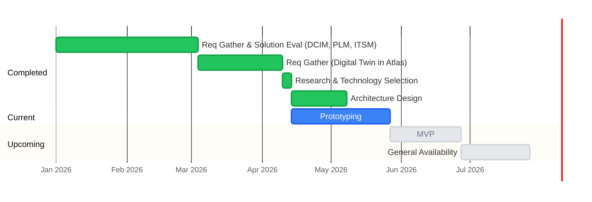

# Roadmap

## Development Timeline

**Note:** All future dates are subject to change.

## Current Phase: Prototyping

Goal: learning, not shipping. Each spike is a question to answer. Results define the MVP.

| # | Spike | Key Question | Owner | Status | Depends On |
|---|---|---|---|---|---|
| 1 | AKS Deployment Validation | Can we deploy orbital and DGraph on AKS and reach a working baseline? | Daniel | ✅ Done (4/20) | — |
| 2 | Orb CLI structure | What is the right command structure for the orb binary? | Daniel | ✅ Done (4/22) | — |
| 3 | PostgreSQL / ent data model | What is the right schema for orbital's operational data in PostgreSQL? | Daniel | ✅ Done (5/5) | — |
| 4 | Web UI | Can we build the orbital management UI with HTMX and Go templates? | Daniel | ✅ Done (5/6) | — |
| 5 | Authentication | How do we implement OIDC + local auth in orbital? | Daniel | ✅ Done (5/8) | — |
| 6 | DGraph backup to S3 | What is the right DGraph backup strategy, including deduplication and retention? | Daniel | ✅ Done (5/9) | — |
| 17 | DGraph restore from backup | How do we restore DGraph blue from a known-good backup? | Daniel | ✅ Done (5/14) | 6 |
| 7 | Air-gap sync round-trip | Does orbital's config export work reliably as a complete, importable payload for orb? | — | 🔄 In progress | — |
| 8 | Authorization | How do we restrict mutations to authorized roles and test authz offline? | — | 🔄 In progress | 5 |
| 14 | Production deployment | What does a repeatable, production-ready AKS deployment look like? | Daniel | 🔄 In progress | — |
| 9 | DGraph performance and cost | Does DGraph hold up at scale, and what does it cost on AKS? | — | Not started | — |
| 10 | DGraph operations | Can our team operate DGraph on AKS without prior experience? | — | Not started | — |
| 11 | Schema migration | Do we need automation or is a runbook sufficient? | — | ❌ Out of scope (MVP) | 10 |
| 12 | Orb import API | What is the right API contract for orb's local config import endpoint? | — | Not started | — |
| 13 | Divergence reports | How does orbital surface divergence and let an admin resolve it? | — | Not started | 17 |
| 15 | AKS smoke test suite | How do we validate critical user flows after each AKS dev deployment? | — | Not started | 14 |
| 16 | Seed iDRAC and storage devices | Does the schema cover all iDRAC and storage fields we need? | Daniel | ✅ Done (5/15) | — |
| 18 | Observability | What does useful monitoring look like for orbital and DGraph in AKS? | — | Not started | 1 |

---

### Spike 1. AKS Deployment Validation ✅
**Completed:** April 20, 2026

- ✅ Orbital and DGraph deployed in AKS dev namespace
- ✅ GraphQL endpoint reachable; NetworkPolicy restricts DGraph access to orbital only
- ✅ DGraph pod recovery validated — StatefulSet recreation after pod deletion works correctly

---

### Spike 2. Orb CLI structure ✅
**Completed:** April 22, 2026

- ✅ `cmd/orb/` Cobra root command with subcommand split: `orb start`, `orb scan`, `orb export`, `orb import`
- ✅ `internal/cli/` shared scaffolding and output utilities (`internal/cli/out/`)
- ✅ Confirmed: single binary, subcommand-driven is the right model for edge deployment

---

### Spike 3. PostgreSQL / ent data model ✅
**Completed:** May 5, 2026 (tables added through May 14)

- ✅ `users` — local accounts + OIDC-provisioned, nullable `password_hash` for SSO-only
- ✅ `orbs` — orb registry with Ed25519 public key and namespace association
- ✅ `namespaces` — tenancy boundary records
- ✅ `backups` — backup job records (status, checksum, S3 path, size, initiated by)
- ✅ `export_jobs` — export job records (status, datacenter, scratch dir path)
- ✅ `registry_artifacts` — OCI publish records (tag, digest, datacenter name, job FK)
- ✅ `events` — audit log (actor, operations, resource types/IDs, raw GraphQL payload, before-state diff)
- ✅ `restore_jobs` — restore job records (status, backup FK, stdout/stderr log, initiated by)
- ✅ `schema_versions` — applied DGraph schema version tracking
- ✅ `ent generate` workflow; all CRUD methods code-generated
- ✅ Schema migrations via ent `migrate` package against local PostgreSQL

---

### Spike 4. Web UI ✅
**Completed:** May 6, 2026 (additions through May 14)

- ✅ HTMX + Go templates with Bulma CSS, server-side rendering — no SPA
- ✅ Pages: Data Centers, Servers, Backups, Export Jobs, Signed Artifacts, Audit Log, Divergence Reports, Schema, Restore
- ✅ Shared components: navbar, sidebar, delete/edit modals, table partials
- ✅ All JS in `web/static/app.js`; all styles in `web/sass/main.scss`
- ✅ Data Centers: tab-per-DC view, drill-down to servers, inline edit modal with JSONEditor, before/after diff in audit tab
- ✅ Servers page: cross-DC DataTable (Data Center, OOB IP, Hostname, Service Tag, Model, Rack), tab persistence
- ✅ Server detail: iDRAC settings tab, Storage tab (controllers + devices), Config Profile tab, edit modal
- ✅ Export Jobs: trigger, poll, download, publish to OCI, stale detection, per-DC repo display
- ✅ Backups: trigger, list, download, restore trigger
- ✅ Restore: job table, backup selector, trigger button, manual kubectl runbook
- ✅ Audit log: full mutation history, before/after field diff (LCS), per-entity audit tabs on DC and server views
- ✅ Signed Artifacts: published OCI artifacts table
- ✅ DGraph schema: `KubernetesCluster`, `EksaConfig`, `IPAddress` types; IP hub pattern with typed back-refs
- ✅ 8 real-data seed files (Alaska DOT Cruiser, Alaska DOT Galleon, Houston, Seattle, Colo, Grayling, Livermore, 2F UAE) with Netbox hostnames and rack positions
- ✅ Playwright E2E test suite with global auth setup, `data-testid` conventions, `make test-e2e`
- ✅ Favicon: FA6 satellite-dish SVG with white rounded-rect background

---

### Spike 5. Authentication ✅
**Completed:** May 8, 2026

- ✅ OIDC Authorization Code Flow via `go-oidc/v3` + `golang.org/x/oauth2`; Azure AD as IdP
- ✅ Session-based auth via `gorilla/sessions` cookie; CSRF token in same cookie
- ✅ User auto-provisioned on first OIDC login (no password hash = SSO-only)
- ✅ Local email/password login for dev (`admin@armada.ai`)
- ✅ `orbital-cli`: Auth Code + PKCE login, macOS keychain (CGo + Security framework) stores refresh token, access token written to `~/.orbital/credentials.json`
- ✅ `orbauth` shared package — PKCE, token exchange, refresh, FileStore, KeychainStore — used by both `orb` and `orbital-cli`
- ✅ Bearer token validation end-to-end with real Azure AD v2 tokens (`go-oidc/v3` JWKS discovery)
- ✅ `/api/v1/graphql` registered on bearer-protected route group

---

### Spike 6. DGraph backup to S3 ✅
**Completed:** May 9, 2026

- ✅ `POST /api/v1/backups` — async backup job, returns job ID
- ✅ `GET /api/v1/backups`, `GET /api/v1/backups/:id` — list and status
- ✅ `GET /api/v1/backups/:id/download` — presigned URL (15 min TTL)
- ✅ `DELETE /api/v1/backups/:id` — removes record and S3 object
- ✅ `POST /api/v1/backups/test-connection` — validates storage credentials
- ✅ SHA-256 checksum dedup — skips upload if graph unchanged since last backup
- ✅ Retention enforcement — prunes oldest beyond `ORBITAL_S3_RETENTION_COUNT`
- ✅ Azure Blob Storage auto-detected by `.blob.core.windows.net`; Shared Key auth. All other endpoints use AWS SDK with path-style addressing.
- ✅ Backup zip named `orbital-<version>-<timestamp>.zip`
- ✅ Backups UI: status, size, download, trigger; blocked during restore (409)
- ✅ End-to-end validated on AKS: trigger → confirm in Azure Blob → restore → confirm data intact

---

### Spike 17. DGraph restore from backup ✅
**Completed:** May 14, 2026

- ✅ `POST /api/v1/restore` — creates restore job; blocked if backup/export/restore in progress
- ✅ `GET /api/v1/restore`, `GET /api/v1/restore/:id` — list and status (jobs permanent, never deleted)
- ✅ Restore runner: downloads backup from S3 to shared PVC → `drop_all` against DGraph Alpha → `dgraph live` via exec into `dgraph-live` idle pod
- ✅ `dgraph-live` idle pod (`deploy/dev/dgraph-live.yaml`) — runs `sleep infinity`, mounts restore PVC, exec-ready instantly
- ✅ `client-go` in-cluster auth; `k8sAvailable` flag; Restore page hides stored-backup section when not in-cluster
- ✅ ServiceAccount `Role` + `RoleBinding` in DGraph namespace (`deploy/dev/rbac.yaml`)
- ✅ `ORBITAL_RESTORE_TIMEOUT` env var (default 10m)
- ✅ Restore UI: job table, backup selector, trigger, manual kubectl runbook always visible
- ✅ Backup and export triggers reject with 409 if restore job is pending/running
- ✅ End-to-end validated on AKS

---

### Spike 7. Air-gap sync round-trip 🔄

- ✅ `POST /api/v1/datacenters/{id}/export` — async; queries blue DGraph, loads subgraph into scratch, native export, packages `json.gz` + `schema.gz`
- ✅ Export jobs globally serialized (scratch DGraph is shared state)
- ✅ Per-job scratch export directories via DGraph `destination` parameter
- ✅ `GET /api/v1/export/jobs`, `GET /api/v1/export/jobs/:jobId`, `GET /api/v1/export/jobs/:jobId/download`
- ✅ `DELETE /api/v1/export/jobs/:jobId` — removes record, zip, scratch dir
- ✅ Stale detection: marks jobs whose scratch file no longer exists
- ✅ OCI publish: `POST /api/v1/export/jobs/:jobId/publish` — signed OCI artifact (oras-go v2 + cosign, air-gap safe, `TlogUpload: false`)
- ✅ `GET /api/v1/oci/artifacts`, `GET /api/v1/oci/public-key`, `POST /api/v1/oci/test-connection`
- ⬜ Orb receives and loads `json.gz` into local DGraph, serves graph offline after import
- ⬜ Validate export sizes are reasonable (USB/manual transfer reference point)

---

### Spike 8. Authorization 🔄

- ✅ Bearer token validation end-to-end with real Azure AD v2 tokens
- ✅ `/api/v1/graphql` protected by bearer middleware
- ✅ `orbital get datacenter` / `orbital get datacenters` CLI commands with bearer auth
- ⬜ Azure AD App Roles (`orbital-admin`, `orbital-viewer`) defined in app manifest
- ⬜ DGraph schema updated with `@auth` directives; `ClosedByDefault: true`
- ⬜ Go middleware role enforcement on REST mutation endpoints
- ⬜ Offline JWT integration tests (local test RSA key pair, no Azure AD call)
- ⬜ `orbital-viewer` cannot mutate; `orbital-admin` can do everything

---

### Spike 14. Production deployment 🔄

- ✅ `deploy/dev/deploy.yaml` — Deployment + Service, env vars from `orbital-secrets`
- ✅ `deploy/dev/postgres.yaml` — in-cluster PostgreSQL StatefulSet with 5Gi PVC
- ✅ `deploy/dev/dgraph-live.yaml`, `deploy/dev/orbital-restore-pvc.yaml` — restore infrastructure
- ✅ `deploy/dev/rbac.yaml` — orbital ServiceAccount RBAC for pod exec
- ✅ `deploy/charts/values-dev-scratch.yaml` — DGraph scratch Helm values
- ✅ Two DGraph helm releases: `dgraph-blue` (live) and `dgraph-scratch` (export only)
- ✅ `deploy/README.md` — step-by-step AKS dev deploy guide
- ✅ `scripts/seed-aks.sh` — port-forwards DGraph blue + scratch + zero, runs seed-dgraph.sh
- ✅ `scripts/seed-aks-postgres.sh` — port-forwards orbital-postgres, creates admin user
- ✅ `ORBITAL_EXPORT_DIR` set to PVC-backed `/scratch-exports/zips` — fixes export zips lost on pod restart
- ✅ AKS dev end-to-end validated: seed, export, backup, restore
- ⬜ `//go:embed` replaces `template.ParseFiles` — binary self-contained, no `COPY web/` in Dockerfile
- ⬜ CI pipeline: build, tag, push on merge to main
- ⬜ `kubectl apply -f deploy/dev/` brings up working orbital in a clean namespace
- ⬜ OIDC login end-to-end via port-forward validated

---

### Spike 9. DGraph performance and cost
- ⬜ Define realistic query mix and target dataset size for v1
- ⬜ Benchmark query latency under increasing concurrency with representative data
- ⬜ Identify expensive queries; correlate with reported CPU spikes
- ⬜ Determine if Valkey caching is sufficient mitigation
- ⬜ Map peak CPU/memory to an AKS node SKU; produce cost estimate

---

### Spike 10. DGraph operations
- ✅ DGraph pod recovery on AKS — pod deletion + StatefulSet recreation validated (2026-05-12)
- ✅ Full backup and restore cycle on AKS validated (Spike 17)
- ⬜ Produce a runbook covering schema change apply and rollback

---

### Spike 12. Orb import API
- ⬜ Define `/import` API: endpoint, payload format, auth model
- ⬜ Validate orb loads `json.gz` into local DGraph and serves offline after import
- ⬜ Confirm import is idempotent; confirm behavior on stale/older payload
- ⬜ API design doc covering the endpoint contract

---

### Spike 13. Divergence reports
- ⬜ `orb_registrations` ent table: namespace, orb name, S3 snapshot prefix
- ⬜ Orb registration UI — admin registers an orb's S3 location
- ⬜ `POST /api/v1/orbs/:id/fetch-snapshot` — download snapshot, load into scratch DGraph, diff against blue, store in PostgreSQL; blocked if export in progress
- ⬜ Divergence report UI — field-level diffs, accept/reject controls
- ⬜ Accept writes GraphQL mutations against blue DGraph; report marked `resolved`

---

### Spike 15. AKS smoke test suite
- ⬜ `e2e/smoke/` suite; `make smoke-aks` target (port-forward + run + teardown)
- ⬜ Covers: login, export end-to-end, DC field edit, backup trigger, OCI test connection
- ⬜ Completes in under 2 minutes; clear pass/fail output

---

### Spike 16. Seed iDRAC and storage devices ✅
**Completed:** May 15, 2026

- ✅ 4 new `IdracSettings` fields added to schema: `ipmiEnabled`, `lockdownModeEnabled`, `dhcpEnabled`, `racadmEnabled`
- ✅ iDRAC seed files added for all data centers (Alaska DOT Cruiser, Galleon, Seattle, Houston, Grayling, Livermore, 2F UAE, Colo, Navy Cruiser)
- ✅ Server detail iDRAC tab renders all 8 fields correctly
- ✅ Navy Cruiser data center seeded (Rack-3, 16 servers, 16 OOB IPs)

---

### Spike 18. Observability
- ⬜ `GET /metrics` — Prometheus-format metrics (request latency, error rate, job counters)
- ⬜ DGraph alpha metrics scraped by Prometheus
- ⬜ Grafana dashboard: orbital API p95 latency, DGraph query latency, job health
- ⬜ At least one alert: high error rate or DGraph memory pressure

---

## MVP Definition

> Working draft — final scope confirmed once spikes complete.

### Orbital (cloud)
- ✅ GraphQL Topology API — proxy DGraph with auth and caching
- ✅ Export API — scoped `json.gz` + `schema.gz` per data center
- ✅ Backup and restore — DGraph full snapshots to Azure Blob, restore via UI
- ✅ Audit log — all config mutations with actor, before/after diff
- ✅ OCI publish — signed artifacts to configured registry
- ⬜ Authorization — App Roles + DGraph `@auth`
- ⬜ Schema management — versioned apply with backwards compatibility on startup
- ⬜ Orb registry — register, authenticate, and revoke orbs

### Orb (edge)
- ✅ CLI structure — `orb start`, `orb scan`, `orb export`, `orb import`
- ⬜ Local DGraph — hold intended state, serve fully offline
- ⬜ Config import — load `json.gz` from export API or file (air-gap)
- ⬜ Divergence reporting — surface local admin overrides to orbital

### Explicitly out of scope for v1
- Network infrastructure config items (owned externally)
- PLM and ITSM integrations — vendor selection in progress
- Multi-DGraph instance per data center
- PostgreSQL backup and restore — handled out-of-band by managed PostgreSQL service (Azure). Post-MVP: coordinate DGraph and PostgreSQL backups into a consistent point-in-time snapshot.

---

## Technical Debt

| Item | Notes |
|---|---|
| `//go:embed` for templates and schema | Currently read from disk at runtime. Replace with `//go:embed` — self-contained binary, no `COPY web/` in Dockerfile. Tracked in Spike 14. |
| DQL calls: raw HTTP → `dgo` client | `internal/handler/export.go` uses raw HTTP to `/query`, `/mutate`, `/alter`. Replace with `dgraph-io/dgo` gRPC client. |
| Audit mutation detection: regex → AST | `extractOperations` in `internal/handler/graphql.go` uses regex on raw query string. Replace with `vektah/gqlparser` AST walking when regex causes real problems. |

---

## External Integration Dependencies

| System | Role | Status |
|---|---|---|
| **Atlas UI** | Digital twin — queries orbital via GraphQL to visualize topology | Integration approach defined |
| **PLM** | Bill of materials for hardware — orbital may query to enrich config items | Vendor evaluation in progress |
| **ITSM** | Links support tickets to config changes | Vendor evaluation in progress |
