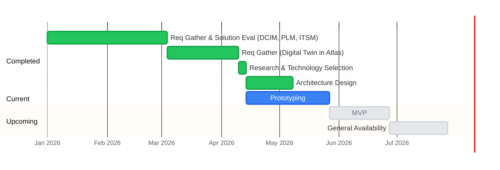

# Roadmap

## Development Timeline

**Note:** All future dates are subject to change.

## Current Phase: Prototyping

Architecture Design is complete (closed 2026-05-06). Prototyping continues through 2026-05-27; spike scope is now stable.

Goal of prototyping is learning, not shipping. Each spike below is a question to answer, not a feature to build. Results from these spikes define the MVP.

| # | Spike | Key Question | Owner | Status | Depends On |
|---|---|---|---|---|---|
| 1 | AKS Deployment Validation | Can we deploy orbital and DGraph on AKS and reach a working baseline? | Daniel | ✅ Done (4/20) | — |
| 2 | BMC Discovery end-to-end | Can we scan a real fleet and get clean data into the graph? | — | 🔄 In progress | — |
| 3 | DGraph performance and cost | Does DGraph hold up at scale, and what does it cost on AKS? | — | Not started | — |
| 4 | DGraph operations | Can our team operate DGraph on AKS without prior experience? | — | Not started | — |
| 5 | Schema migration — build vs runbook | Do we need automation or is a runbook sufficient? | — | Not started | Spike 4 |
| 6 | Air-gap sync round-trip | Does orbital's config export work reliably as a complete, importable payload for orb? | — | Not started | — |
| 7 | Orb import API | What is the right API contract for orb's local config import endpoint? | — | Not started | — |
| 8 | DGraph backup to S3-compatible storage | What is the right DGraph backup strategy, including deduplication and retention? | — | Not started | Spike 4 |
| 9 | Authentication | How do we implement JWT bearer auth in orbital for Atlas UI consumers? | Daniel | ✅ Done (5/8) | — |
| 10 | Report intake API | What is the right transport-agnostic API for orbital to receive drift and divergence reports? | — | Not started | — |
| 11 | Authorization | How do we restrict mutations to authorized roles using Azure AD App Roles + DGraph @auth, and how do we test authz offline? | — | Not started | 9 |

---

### Spike 1. AKS Deployment Validation ✅
**Question:** Can we deploy orbital and DGraph on AKS and reach a working baseline?

**Context:** First end-to-end deployment of the stack — validates that orbital, DGraph Alpha, DGraph Zero, and supporting networking can run together in our shared AKS dev environment.

**Completed:** April 20, 2026 — orbital and DGraph deployed in AKS dev. GraphQL endpoint reachable. NetworkPolicy applied to restrict DGraph access to orbital only.

### Spike 2. BMC Discovery end-to-end
**Question:** Can we scan a real server fleet over Redfish, build a graph, export it from orb, and import it into orbital cleanly?

**Success criteria:**
- Orb CLI scans BMCs and produces a valid DGraph-importable file
- Orbital ingests the file and the graph is queryable via the Topology API
- Data is accurate against known hardware

### Spike 3. DGraph performance and cost
**Question:** Does DGraph hold up at realistic scale for graph traversal queries, and what does it cost to run on AKS?

**Context:** There are unsubstantiated reports of high CPU usage under unknown conditions. This spike reproduces and characterizes that before any optimization work begins.

**Success criteria:**
- Define a realistic query mix: expected patterns from the digital twin UI (deep traversals — DataCenter → Servers → StorageControllers → StorageDevices), read/write ratio, and target dataset size for v1
- Seed DGraph with a representative dataset and benchmark query latency under increasing concurrency
- Identify which specific queries are expensive and whether they correlate with the reported CPU spikes
- Determine if Valkey caching is sufficient mitigation or if DGraph is a hard bottleneck
- Map peak CPU/memory profile to an AKS node SKU and produce a cost estimate for v1 workload

### Spike 4. DGraph operations
**Question:** Can our team operate DGraph reliably on AKS without prior experience?

**Context:** The team has strong Go/Java and PostgreSQL experience but no DGraph operational background. Schema migrations, backup/restore, and cluster behavior during restarts are all unknowns. This spike must be completed before building any automation around these processes.

**Success criteria:**
- Perform a full backup and restore cycle on AKS — validate data integrity after restore
- Apply a schema change to a live DGraph instance — document the process, failure modes, and rollback steps
- Test DGraph behavior during a rolling restart on AKS (pod eviction, zero downtime feasibility)
- Evaluate blue/green deployment viability — determine if DGraph cluster state makes this practical or prohibitively complex
- Produce a runbook: what the on-call engineer does for each of the above scenarios

### Spike 5. Schema migration — build vs runbook
**Question:** Do we need a built-in schema migration tool in orbital, or is a well-maintained runbook sufficient?

**Context:** The architecture calls for orbital to own schema versioning and apply changes to DGraph automatically on startup. But this is non-trivial to build correctly. Spike 4 (DGraph operations) will reveal how painful schema changes are in practice — this spike uses those findings to decide whether automation is worth the investment or whether operational discipline (runbooks, manual apply, version tracking in PostgreSQL) is good enough for the foreseeable future.

**Do not start until spike 4 is complete.**

**Success criteria:**
- Assess the real operational cost of manual schema migrations based on spike 4 findings
- Determine if the frequency and risk of schema changes justifies building automation
- If yes — produce a design doc for the migration tool (not code)
- If no — produce a runbook that covers schema apply, rollback, and version tracking in PostgreSQL

### Spike 6. Air-gap sync round-trip
**Question:** Does orbital's config export work reliably as a complete, importable payload?

**Context:** Orbital must expose a data center-scoped export endpoint (`POST /api/v1/datacenters/{id}/export`) that returns a `json.gz` + `schema.gz` pair for that data center's subgraph. This is not a raw pass-through of DGraph's export mutation — orbital must partition the graph by data center. In deployments using `configbundle`, its Bundle Generator calls this endpoint to produce a ConfigBundle. This spike builds the endpoint and validates the export is reliable and loadable.

**Success criteria:**
- Implement `POST /api/v1/datacenters/{id}/export` — returns scoped `json.gz` + `schema.gz`
- Orb receives and loads the `json.gz` into local DGraph (simulating what `configbundle`'s edge agent does)
- Orb serves the graph correctly offline after import
- Validate export sizes are reasonable (reference point: USB/manual transfer)

### Spike 7. Orb import API
**Question:** What is the right API contract for orb's local config import endpoint?

**Context:** In deployments using `configbundle`, config reaches orb via the edge agent calling orb's local `/import` API with the `json.gz` payload — not by orb polling orbital directly. Orb has no direct connection to orbital; the delivery mechanism is the deployment layer's concern. This spike defines and validates that local API contract between the delivery layer and orb.

**Success criteria:**
- Define the `/import` API: endpoint, payload format, auth model (local loopback — what, if any, auth is appropriate)
- Validate that orb correctly loads the `json.gz` into local DGraph and serves it offline after import
- Confirm the import is idempotent and safe to re-run on the same or newer payload
- Confirm behaviour on a stale or older payload (should orb reject, warn, or accept?)
- Produce an API design doc covering the endpoint contract

### Spike 8. DGraph backup to S3-compatible storage
**Question:** What is the right backup strategy for DGraph, and how do we handle deduplication and retention?

**Context:** Orbital is the authoritative intent store for the fleet — if DGraph data is lost, no configuration exports can be produced and no modular data centers can be onboarded. DGraph community edition only has the export mutation (`json.gz` + `schema.gz`), which produces full snapshots. PostgreSQL is handled by the managed service layer and is not orbital's concern.

**v1 approach — admin-initiated full snapshots with checksum dedup:**
An admin triggers a backup via the UI or API. Orbital runs DGraph's export mutation, computes a checksum, compares against the last successful backup record — if identical, skips the upload. Otherwise uploads `json.gz` + `schema.gz` to S3-compatible storage and records the result in PostgreSQL. Backup is async: the trigger returns a job ID; a status endpoint tracks progress.

**Storage:** Any S3-compatible backend (AWS S3, Cloudflare R2, MinIO, Azure Blob via S3 API). Configured at startup via environment variables — not user-selectable at runtime.

**S3 configuration (env vars):**
- `ORBITAL_S3_ENDPOINT` — custom endpoint for S3-compatible providers; empty = AWS S3
- `ORBITAL_S3_REGION`
- `ORBITAL_S3_BUCKET`
- `ORBITAL_S3_ACCESS_KEY`
- `ORBITAL_S3_SECRET_KEY`
- `ORBITAL_S3_PREFIX` — optional path prefix within the bucket (e.g. `orbital/backups/`)
- `ORBITAL_S3_RETENTION_COUNT` — max number of backups to retain; oldest deleted after upload (default: 30)

If S3 is not configured, the backup UI button is disabled with a visible explanation.

**PostgreSQL `backup_records` table:**
| Column | Type | Notes |
|---|---|---|
| `id` | serial PK | |
| `status` | varchar | `pending`, `running`, `completed`, `failed` |
| `initiated_by` | int FK → users | |
| `initiated_at` | timestamptz | |
| `completed_at` | timestamptz | nullable |
| `s3_path` | text | full S3 URI of the uploaded archive; nullable until complete |
| `schema_version` | text | orbital schema version at time of backup |
| `checksum` | text | SHA-256 of `json.gz`; used for dedup |
| `size_bytes` | bigint | nullable until complete |
| `error` | text | nullable; populated on failure |

**Post-v1 — incremental and dedup:**
DGraph community has no native incremental backup. Options to evaluate once real data volumes are known from Spike 3:
- DGraph enterprise binary incremental backups
- Frequent full snapshots with storage-side versioning and lifecycle rules
- Export diff against previous snapshot (complex — only if snapshot sizes become a real problem)

**Success criteria:**
- `POST /api/v1/backups` triggers an async backup job; returns job ID
- `GET /api/v1/backups` lists backup history from PostgreSQL
- `GET /api/v1/backups/:id` returns job status
- `GET /api/v1/backups/:id/download` returns a presigned S3 URL (valid for a short TTL) for admin download
- Checksum dedup: if graph unchanged since last backup, upload is skipped and job completes with status `skipped`
- Retention: after a successful upload, backups exceeding `ORBITAL_S3_RETENTION_COUNT` are deleted from S3 and marked `deleted` in PostgreSQL
- S3 credentials validated at startup — warning logged and backup disabled if missing or unreachable
- End-to-end validated: trigger backup, confirm `json.gz` + `schema.gz` appear in S3, confirm record in PostgreSQL

**Do not start until Spike 4 (DGraph operations) is complete.**

### Spike 9. Authentication ✅
**Question:** How do we implement auth in orbital?

**Completed:** May 8, 2026

**What was built:**
- OIDC Authorization Code Flow via `go-oidc/v3` + `golang.org/x/oauth2`
- Azure AD as the IdP (tenant `8f231c2a-9551-4b40-be17-5b24afe5e890`)
- Session-based auth via `gorilla/sessions` cookie; CSRF token in same cookie
- User auto-provisioned on first OIDC login (no password hash = SSO-only account)
- Local email/password login retained for dev/seed user (`admin@armada.ai`)
- Name and email stored in session at login — no DB query per request
- `password_hash` is nullable in PostgreSQL; nil = OIDC-only user

### Spike 11. Authorization
**Question:** How do we restrict mutations to authorized roles, and how do we test authz offline?

**Context:** Authentication (Spike 9) is complete — orbital knows who the user is. Authorization is the next layer: what they are allowed to do. Two mechanisms will work together: Azure AD App Roles for role assignment, and DGraph's native `@auth` directive for enforcing mutation access at the graph layer.

**Approach settled:**
- **Azure AD App Roles** (not group GUIDs) — define roles like `orbital-admin` and `orbital-viewer` in the Azure app manifest. App Roles appear in the JWT `roles` claim as strings, not GUIDs, and can be included in a custom namespace claim that DGraph's `@auth` can read.
- **DGraph `@auth` directive** — add `@auth(add/update/delete: { rule: ... })` to each type in `schema/v1.graphql`. Mutation rules check the `roles` claim; query requires only a valid JWT (`ClosedByDefault: true`). Field-level auth is not supported by DGraph and will not be attempted.
- **Go middleware** — route-group-level role checks in Echo for REST endpoints. GraphQL endpoint protected at HTTP layer (role check); DGraph `@auth` is defense-in-depth.
- **Offline JWT testing** — integration tests generate and sign JWTs locally using a test RSA key pair. DGraph's `# Dgraph.Authorization` in the test schema points to the test public key (not Azure JWKS). No network call required. This pattern allows authz integration tests to run fully offline and in CI.

**Success criteria:**
- Azure AD App Roles defined in app manifest; `orbital-admin` and `orbital-viewer` roles assignable to users/groups
- DGraph schema updated with `@auth` directives on all mutable types; `ClosedByDefault: true` active
- Orbital Go middleware enforces role checks on REST mutation endpoints
- Integration tests sign JWTs with a local test key — authz enforced without hitting Azure AD
- A user with `orbital-viewer` role cannot perform mutations via GraphQL or REST
- A user with `orbital-admin` role can perform all operations

### Spike 10. Report intake API
**Question:** What is the right API for orbital to receive drift and divergence reports?

**Context:** Orbital exposes a transport-agnostic report intake API. The edge writes signed reports to a shared external location (deployment layer concern); a delivery agent reads from that location and calls orbital's intake API. Orbital never knows or cares about the transport — it just receives and verifies structured reports.

Orbital must receive these reports and expose divergence to cloud administrators, who resolve field-level conflicts by publishing a new ConfigBundle with one of three directives: **Force** (cloud intent wins), **Accept overrides** (incorporate local values), or **Ignore** (acknowledge divergence, leave as-is).

**Success criteria:**
- Define the intake API: endpoint(s), payload schema, and signature verification behavior — verify Ed25519 signature when a public key is registered for the orb; accept without verification when no key is registered
- Validate that reports are actionable — orbital can surface which modular data centers have diverged, on which fields, by whom, since when
- Define how orbital stores report state and orb public keys in PostgreSQL and how they are queried by admins
- Confirm orbital imposes no constraints on how the report reached the intake API — transport is the caller's concern
- Produce an API design doc covering the endpoint contract, data model, and the three resolution modes

---

## MVP Definition

> Working draft — final scope will be confirmed once spikes complete.

### Orbital (cloud)
- GraphQL Topology API — proxy DGraph with auth, rate limiting, and caching
- Schema management — versioned schema apply with backwards compatibility validation on startup
- Export API — `POST /api/v1/datacenters/{id}/export` returning scoped `json.gz` + `schema.gz`
- Orb registry — register, authenticate, and revoke orbs
- Audit log — record all config mutations with actor and timestamp
- Backup — DGraph and PostgreSQL backup to Azure Blob with tracked records

### Orb (edge)
- Local DGraph — hold a complete copy of its data center's intended state, fully offline
- Config import — load `json.gz` from export API or file (air-gap)
- Drift reporting — observe actual state, compare to intended state, report the gap to orbital
- Discovery — scan local BMC and inventory APIs; export discovered graph for orbital import

### Explicitly out of scope for v1
- Network infrastructure config items (owned externally)
- PLM and ITSM integrations — design TBD, vendor selection in progress
- Multi-DGraph instance per data center

---

## Technical Debt

| Item | Notes |
|---|---|
| Switch DGraph DQL calls to `dgo` client | `internal/handler/export.go` uses raw HTTP calls to `/query`, `/mutate`, `/alter`. Replace with `dgraph-io/dgo` (gRPC-based official Go client) for idiomatic usage and proper transaction management. |

---

## External Integration Dependencies

These are integration touchpoints that orbital must support but does not own. Vendor selection and design are being driven by other teams. Orbital's API-first design should remain flexible enough to accommodate them — no orbital work is blocked on these, but MVP scope may be affected by their timelines.

| System | Role | Status |
|---|---|---|
| **Atlas UI** | Customer-facing digital twin — queries orbital via GraphQL to visualize modular data center topology | Integration approach defined. Atlas calls orbital; orbital proxies DGraph. |
| **Product Lifecycle Management (PLM)** | Source of bill of materials for data center hardware — orbital may query PLM to enrich or validate configuration items | Vendor evaluation in progress by another team. Integration design TBD. |
| **IT Service Management (ITSM)** | Links customer support tickets to configuration changes in the data center — ITSM may call orbital to correlate incidents with config state | Vendor evaluation in progress by another team. Integration design TBD. |
