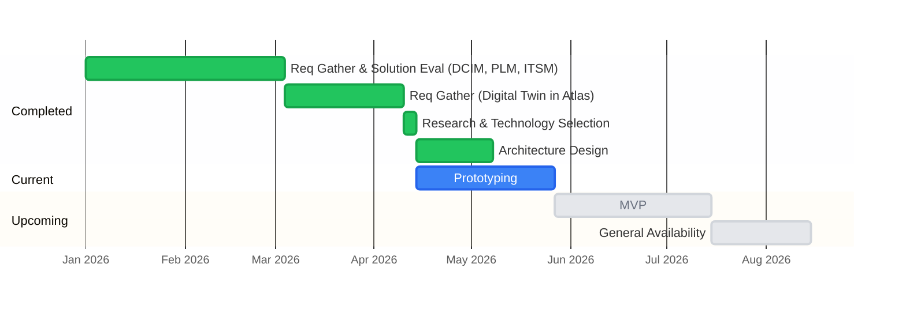

# Roadmap

## Development Timeline

```mermaid
%%{init: {'theme': 'base', 'themeVariables': {'doneTaskBkgColor': '#22c55e', 'doneTaskBorderColor': '#16a34a', 'activeTaskBkgColor': '#3b82f6', 'activeTaskBorderColor': '#2563eb', 'taskBkgColor': '#e5e7eb', 'taskBorderColor': '#d1d5db', 'taskTextColor': '#6b7280', 'taskTextDarkColor': '#fff'}}}%%
gantt
    dateFormat YYYY-MM-DD
    axisFormat %b %Y

    Section Completed
    Req Gather & Solution Eval (DCIM, PLM, ITSM)    :done, 2026-01-01, 2026-03-04
    Req Gather (Digital Twin in Atlas)              :done, 2026-03-04, 2026-04-10
    Research & Technology Selection                 :done, 2026-04-10, 2026-04-14
    Architecture Design                             :done, 2026-04-14, 2026-05-08

    Section Current
    Prototyping                   :active, 2026-04-14, 2026-05-27

    Section Upcoming
    MVP                           :2026-05-27, 2026-07-15
    General Availability          :2026-07-15, 2026-08-15
```

**Note:** All future dates are subject to change.

---

## Spikes

Each spike is a question to answer. Results define the MVP.

| # | Spike | Key Question | Owner | Status | Open items |
|---|---|---|---|---|---|
| 1 | AKS deployment validation | Can we deploy orbital and DGraph on AKS and reach a working baseline? | Daniel | ✅ Done (4/20) | |
| 2 | Orb CLI structure | What is the right command structure for the orb binary? | Daniel | ✅ Done (4/22) | |
| 3 | PostgreSQL / ent data model | What is the right schema for orbital's operational data? | Daniel | ✅ Done (5/5) | |
| 4 | Web UI | Can we build the orbital management UI with HTMX and Go templates? | Daniel | ✅ Done (5/6) | |
| 5 | Authentication | How do we implement OIDC + local auth in orbital? | Daniel | ✅ Done (5/8) | |
| 6 | DGraph backup to S3 | What is the right DGraph backup strategy, including deduplication and retention? | Daniel | ✅ Done (5/9) | Dedup dropped — DGraph exports non-byte-deterministic; count-based retention only |
| 7 | DGraph restore from backup | How do we restore DGraph from a known-good backup? | Daniel | ✅ Done (5/14) | |
| 8 | AKS dev environment | Do we have a working, repeatable AKS dev deployment to prototype against? | Daniel | ✅ Done (5/18) | |
| 9 | Seed iDRAC and storage devices | Does the schema cover all iDRAC and storage fields we need? | Daniel | ✅ Done (5/15) | |
| 9b | Valkey cache-aside | What is the right caching strategy for read-heavy graph queries, and does orbital degrade correctly without it? | Daniel | Not started | |
| 10 | Air-gap sync round-trip | Does orbital's config export work as a complete, importable payload for orb? | — | ✅ Done | Orb loads `json.gz` into local DGraph and serves offline |
| 11 | Authorization | How do we restrict mutations to authorized roles? | — | ✅ Done (6/5) | Three-role system `readonly < dev < admin` (default `readonly`); `ORBITAL_ADMIN_EMAILS` bootstrap; `RequireRole`/`RequireAdmin` middleware; GraphQL mutations require `dev`; `/api/v1/users` list + role update (admin-only, last-admin guard); `/users` admin UI (button group R/D/A); readonly UI gating (`CanMutate bool` + `access-required` partial on privileged pages); Azure AD App Roles deferred (no Application Administrator access) |
| 12 | DGraph operations | Can our team operate DGraph on AKS without prior experience? | — | Not started | Runbook: schema change apply, validate, rollback |
| 13 | Orb import API | What is the right mechanism for orb to pull a signed OCI subgraph from a registry and load it into local DGraph? | — | ✅ Done | OCI puller (oras-go v2), cosign verify, `dgraph live` subprocess, polling loop; full consumer dispatch pipeline on both `triggerImport` (OCI tag path) and `importArtifact` (direct upload) — both dispatch `ExtraLayers` to `ORB_CONSUMERS`; import history: reverse-chronological, friendly layer labels (`mediaTypeLabel`), dispatch errors in Error column, `ORB_DEV` hot-reload |
| 14 | Divergence reports (orb intake) | How does orb accept and relay divergence reports from edge components? | Daniel | ✅ Done (5/24) | `POST /api/v1/divergence` replaces pending set; `POST /api/v1/divergence/publish` writes snapshot to S3 |
| 15 | Orb deployment model | What does orb look like deployed at the edge — topology, runtime deps, air-gap constraints? | — | Not started | `K8sBackend` interface + pod-selection logic done; needs: `dgraph-live` idle pod manifest, Helm chart, PVC wiring, `ORB_BACKEND=k8s` config, `//go:embed` for self-contained air-gap binary |
| 16 | Orb API surface & authN/Z | What endpoints does orb expose locally, who calls them, and what is the consumer auth model? | — | Not started | |
| 17 | Orb UI | Can orbital and orb share a template infrastructure while serving different nav and capability surfaces? | — | ✅ Done (5/24) | |
| 18 | ES module split of app.js | Can we split the JS monolith into per-feature ES modules with zero build step? | — | Not started | shared.js + orbital.js + orb.js; conditional loading via UIConfig; window.* bridge for onclick handlers |
| 19 | ConfigBundle enricher integration | How does orbital support downstream consumers adding layers to its OCI artifact before publish? | Daniel | ✅ Done (5/26) | Per-request enricher URLs in publish body; all-or-nothing before push; `enriched`/`enricher_error` on RegistryArtifact; retryable HTTP + size cap; Enriched column in UI; enricher unit tests; integration contract: `docs/configbundle-integration.md` — ConfigBundle implementation is in its own repo |
| 20 | `orb scan` — Infrastructure Scanner | How does an operator seed orbital with real iDRAC/storage config from a Galleon without manual transcription? | Daniel | Post-MVP | CLI-only, stateless, operator-invoked. Scans Redfish endpoints on management LAN → GraphQL upsert mutations → human review → pipe to orbital GraphQL API. Output identical in structure to seed files. Never auto-imports. `internal/discovery/redfish/`, `internal/cli/scan/`. `internal/orb/` (server) must never import from these packages. |
| — | Schema migration | Do we need automation or is a runbook sufficient? | — | ❌ Out of scope | |

---

## What We've Built

| Spike | Completed | Summary |
|---|---|---|
| 11 · Authorization | Jun 5 | Three-role system (`readonly/dev/admin`); `RequireRole` middleware; `/users` admin UI (server-side, button group R/D/A, last-admin guard); readonly UI gating (`CanMutate`+`AdminEmails` on layout.Base, `access-required` partial); `ORBITAL_ADMIN_EMAILS` bootstrap; device code auto-open (`verification_uri_complete`); `ORBITAL_OIDC_DEVICE_CODE` default `true` |
| 1 · AKS deployment | Apr 20 | Orbital + DGraph on AKS, NetworkPolicy, pod recovery validated |
| 2 · Orb CLI | Apr 22 | Single binary: `orb start` subcommand (long-running edge service) |
| 3 · PostgreSQL schema | May 5 | 9 ent tables: users, orbs, namespaces, jobs, audit log, OCI artifacts |
| 4 · Web UI | Apr 20 – May 14 | Data Centers tab (HTMX, inline edit, audit diff); Servers cross-DC DataTable + drill-down (iDRAC, Storage, Config Profile); Export, Backup, Restore, Audit Log, Signed Artifacts, Schema, Divergence pages; Playwright E2E suite |
| 5 · Authentication | May 8 | OIDC + local auth, CLI keychain, bearer token validation end-to-end |
| 6 · DGraph backup | May 9 | Async backup to Azure Blob/S3, count-based retention, presigned download; checksum dedup dropped (DGraph exports non-byte-deterministic) |
| Config Export + OCI Pipeline | May 9 – May 18 | 8 endpoints, scratch-based scoped export (dedicated scratch DGraph per job; live DGraph unaffected), oras-go v2 + cosign signing, air-gap safe OCI publish — orbital side complete |
| 7 · DGraph restore | May 14 | Full restore from backup via dgraph-live pod, validated on AKS |
| Audit Log System | May 5 – May 13 | GraphQL mutation interceptor, before-state capture, before/after field diff, three-source orbId extraction, per-entity audit tabs on DC and server views, ADR (`docs/decisions/001-mutation-audit-recording.md`) |
| 8 · AKS dev environment | May 18 | Deploy manifests, Helm charts, seed scripts, step-by-step deploy guide |
| 9 · Hardware Data Modeling | May 15 | 4 new iDRAC schema fields; 9 data centers modeled from real Netbox hostnames and rack topology; schema validated against live hardware |
| orbital-cli | May 11 | `orbital get datacenter/datacenters`; bearer auth; macOS keychain; kubectl-style output |

*Full implementation detail, API contracts, and what was validated: [CHANGELOG.md](CHANGELOG.md)*

---

## MVP Planning

The following are not prototype questions — they are prerequisites for shipping. They will be defined in a dedicated MVP planning session, with infra team input where needed.

### Production deployment
Ingress architecture, dedicated hostnames, TLS, internal vs external load balancer. Auth/authz flows in production (OIDC issuer, token lifetimes, `ORBITAL_ADMIN_EMAILS` management; Azure AD App Roles as a future enhancement once Application Administrator access is available). Production namespace layout, resource limits, horizontal scaling. CI/CD pipeline: build, tag, push on merge to main, deploy to AKS dev on tag. `//go:embed` to make the binary self-contained. Ratel access via dedicated DNS hostname with its own Istio VirtualService.

*These decisions depend on infra team input and are coupled to auth/authz and ingress architecture — not resolvable in prototype spikes alone.*

### Security & correctness hardening
Fix all critical and high security findings before any staging or production exposure. Full findings and fix order: `docs/findings/security-and-deployment-findings.md` (S.1–S.18), `docs/findings/additional-findings.md` (A.1–A.7), implementation plan: `docs/findings/maintainability.md` Phase 1.

Key items: unauthenticated `/graphql` root route, no K8s liveness/readiness probes, no CSRF on GraphQL mutations, audit actor forged by client, raw JWT logged at INFO, missing `Secure` cookie flag.

### Testing foundations
Test pyramid is substantially complete: 222 Go tests (unit + integration, `make test-unit` / `make test-integration`), 45 Playwright e2e tests (`make test-e2e` / `make test-e2e-orb` / `make test-e2e-smoke`), coverage via `make cover`. Remaining gaps: **CI pipeline** (GitHub Actions workflow — `.github/` exists but has no workflow files yet) and **post-deploy AKS smoke suite hookup**. DGraph client abstraction (T.1 in `docs/testing-strategy.md`) is a tech debt item, not a testing blocker.

### Performance, cost & observability
Benchmark DGraph query latency under realistic load, produce AKS node SKU cost estimate. Add Prometheus metrics endpoint, DGraph alpha scraping, Grafana dashboard, and at least one alert for error rate or memory pressure. Valkey cache-aside is post-MVP (Spike 9b) — baseline performance first.

---

## MVP Definition

> Working draft — final scope confirmed once prototype spikes complete.

### Orbital (cloud)
- ✅ GraphQL Topology API — proxy DGraph with auth and caching
- ✅ Export API — scoped `json.gz` + `schema.gz` per data center
- ✅ Backup and restore — DGraph full snapshots to Azure Blob, restore via UI
- ✅ Audit log — all config mutations with actor, before/after diff
- ✅ OCI publish — signed artifacts to configured registry
- ✅ Authorization — three-role system (`readonly/dev/admin`), `ORBITAL_ADMIN_EMAILS` bootstrap, `RequireRole` middleware, admin users page, readonly UI gating (Spike 11)
- 🔲 Orb registry — register, authenticate, and revoke orbs *(post-MVP: revisit when orb onboarding is scoped)*
- ⬜ Security hardening — critical/high items (MVP Planning)
- ✅ `namespaceID` index on `ConfigItem` — `namespaceID: String! @search(by: [exact])` on the interface, backfilled, enforced at application layer on all add mutations.

### Orb (edge)
- ✅ CLI structure — `orb start` (long-running edge service)
- ✅ Local DGraph — holds intended state; served offline via orb UI
- ✅ Config import — `/import/subgraph` (direct zip) and `/import/artifact` (full OCI pipeline with consumer dispatch)
- ✅ Divergence reporting — `POST /api/v1/divergence` intake; `POST /api/v1/divergence/publish` to S3
- ⬜ Deployment model — Helm chart, PVC wiring, K8s backend validation (Spike 15)
- ⬜ API surface & authN/Z — endpoint inventory, consumer auth model (Spike 16)
- ⬜ `//go:embed` for templates and static assets — self-contained binary for air-gap edge deployment (Spike 15 scope)

### Explicitly out of scope for v1
- Network infrastructure config items (owned externally)
- PLM and ITSM integrations — vendor selection in progress
- Multi-DGraph instance per data center
- PostgreSQL backup and restore — handled out-of-band by managed PostgreSQL (Azure)

---

## Post-MVP Enhancements

| Item | Notes |
|---|---|
| SDL syntax highlighting on Schema page | Replace plain `<pre>` with Prism.js `language-graphql` highlighting on both orbital and orb schema pages. Requires downloading and serving Prism JS + CSS as static assets (we self-host all assets — no CDN). ~30 min once asset serving is scoped. |
| `orb scan` — Infrastructure Scanner (Spike 20) | Operator-invoked CLI subcommand. Scans iDRAC/Redfish endpoints on Galleon management LAN → emits JSON-wrapped GraphQL upsert mutations (identical structure to seed files) → operator reviews → pipes to orbital GraphQL API. Never auto-imports. `internal/discovery/redfish/`, `internal/cli/scan/`. |
| Migrate password hashing to Argon2id | Current: bcrypt (sound, not broken). Argon2id is OWASP's current first recommendation — adds memory-hardness on top of time-hardness, making GPU/ASIC offline attacks significantly more expensive. `golang.org/x/crypto/argon2` is already an indirect dependency. Requires a migration path for existing bcrypt hashes (detect by hash prefix on login, re-hash on successful verify). |

---

## Technical Debt

| Item | Notes |
|---|---|
| `//go:embed` for orb templates and static assets | Orb reads templates from disk at runtime. Replace with `//go:embed` for a self-contained binary — required for air-gap edge deployment. Orbital (containerized AKS) does not need this. Scoped to Spike 15. |
| DGraph client abstraction | 22+ raw `http.Post` calls across 7 handler files, no timeouts, no pooling. Extract `internal/dgraph/client.go`. Prerequisite for testing. See `docs/findings/maintainability.md` item 2.1. |
| `internal/handler/` god package | 3,560 lines mixing HTTP, business logic, DGraph calls, file I/O. Decompose post-MVP. See `docs/findings/maintainability.md` item 5.4. |
| `web/static/app.js` monolith | 2,400+ lines, no module system, duplicate event listeners. Spike 18 planned. See `docs/claude/SPIKE_18_EXECUTION.md`. |
| ~~Export API uses DGraph UID instead of orbId~~ | ✅ Fixed 2026-06-02. `POST /api/v1/export` now accepts `{"orbId": "..."}` in the body. `fetchDCInfo` queries by orbId. UI select uses `dc.orbId`. |
| ~~Backup/restore API alignment~~ | ✅ Fixed 2026-06-02. Routes renamed to match export convention: `POST /api/v1/backup`, `GET /api/v1/backup/jobs`, `GET /api/v1/backup/jobs/:jobId`, `GET /api/v1/backup/jobs/:jobId/download`, `DELETE /api/v1/backup/jobs/:jobId`, `POST /api/v1/backup/test-connection`, `POST /api/v1/restore`, `GET /api/v1/restore/jobs`, `GET /api/v1/restore/jobs/:jobId`. |
| No delete button for export jobs in UI | `DELETE /api/v1/export/jobs/:jobId` exists but is API-only. Add a delete (trash) button to each row in the export jobs table on the Export page. |
| Quick wins (independent, any time) | `docs/findings/maintainability.md` items 3.1–3.7, 4.1, 4.2, 4.4 — none are blocking, all improve correctness or reduce duplication. |

---

## External Integration Dependencies

| System | Role | Status |
|---|---|---|
| **Atlas UI** | Digital twin — queries orbital via GraphQL to visualize topology | Integration approach defined |
| **PLM** | Bill of materials for hardware — orbital may query to enrich config items | Vendor evaluation in progress |
| **ITSM** | Links support tickets to config changes | Vendor evaluation in progress |
