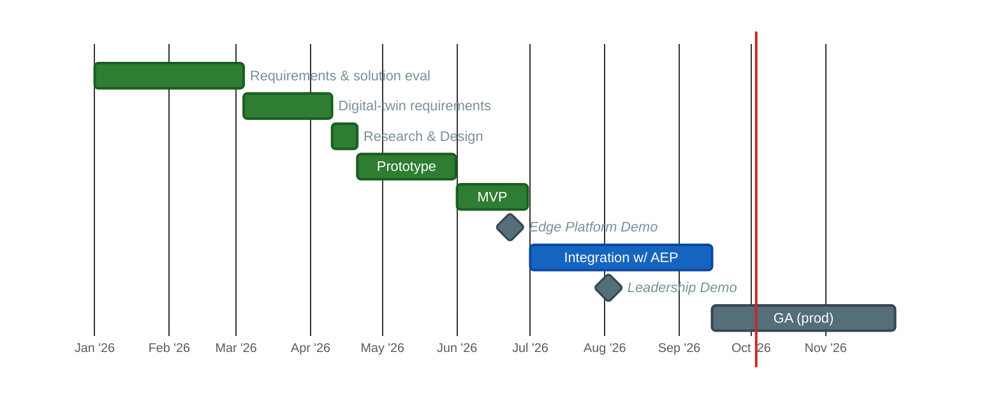

# Roadmap

Orbital — the source of truth for edge, air-gapped modular data centers.

**Phase:** MVP capabilities complete → hardening toward GA · **GA target** ~Q4 2026 *(dates indicative)*

| | |
|---|---|
| Full spike + pre-GA backlog | [`docs/planning/backlog.md`](docs/planning/backlog.md) |
| Known technical debt | [`docs/planning/debt.md`](docs/planning/debt.md) |
| Designs under investigation | [`docs/spikes/`](docs/spikes/) |
| Settled architecture per domain | [`docs/reference/`](docs/reference/) |
| Release notes | [`CHANGELOG.md`](CHANGELOG.md) — source of truth; GitHub Release bodies are generated from it |

---

## Timeline

```mermaid
%%{init: {'theme':'base', 'themeVariables': {
  'doneTaskBkgColor':'#2e7d32',   'doneTaskBorderColor':'#1b5e20',
  'activeTaskBkgColor':'#1565c0', 'activeTaskBorderColor':'#0d47a1',
  'taskBkgColor':'#546e7a',       'taskBorderColor':'#37474f',
  'taskTextColor':'#ffffff',      'taskTextDarkColor':'#ffffff',
  'taskTextLightColor':'#ffffff', 'taskTextOutsideColor':'#78909c',
  'sectionBkgColor':'transparent','altSectionBkgColor':'transparent',
  'gridColor':'#90a4ae',          'todayLineColor':'#c62828'
}}}%%
gantt
    dateFormat YYYY-MM-DD
    axisFormat %b '%y

    Requirements & solution eval :done, 2026-01-01, 2026-03-04
    Digital-twin requirements    :done, 2026-03-04, 2026-04-10
    Research & Design            :done, 2026-04-10, 2026-04-20
    Prototype                    :done, 2026-04-20, 2026-05-31
    MVP                          :done, 2026-06-01, 2026-06-30
    Edge Platform Demo           :milestone, edgeplatform, 2026-06-23, 0d
    Integration w/ AEP           :active, 2026-07-01, 2026-09-15
    Leadership Demo              :milestone, leadership, 2026-08-03, 0d
    GA (prod)                    :planned, 2026-09-15, 2026-11-30
```

*Discovery phases and their dates are from the original roadmap (`b431628`) — requirements gathering
and solution evaluation across DCIM, PLM and ITSM, then digital-twin requirements, technology
selection, and the architecture design that became the SDD.*

---

## Status

| Milestone | Status | Target |
|---|---|---|
| Core MVP — graph, API, UI | ✅ Shipped | Q2 2026 |
| Export · OCI publish · signing | ✅ Shipped | Q3 2026 |
| Backup · restore · schema versioning | ✅ Shipped | Q3 2026 |
| Orb edge service + deployment | ✅ Shipped | Q3 2026 |
| Divergence loop — edge → cloud | ✅ Shipped | Q3 2026 |
| Changeset diff — preview · guarded apply · compare | ✅ Shipped | Q3 2026 |
| Audit log — convention, rename, retention policy | ✅ Shipped | Q3 2026 |
| **Observability** — OTel, metrics, dashboards | 🟡 **In progress** | Q3–Q4 2026 |
| **Change Requests + approval engine** | 📋 Design ratified | Q4 2026 |
| Postgres migrations (Atlas) | 📋 Design complete | Q4 2026 |
| Test-suite audit | 📋 Not started | Q4 2026 |
| Provider-portable identity (OIDC `id_token`) | 📋 Not started | Q4 2026 |
| **GA hardening** | — | Q4 2026 |

*Targets are quarters, not commitments. Detailed definitions: [`docs/planning/backlog.md`](docs/planning/backlog.md).*

---

## Next up

| | |
|---|---|
| **Spike 36 — Change Requests & approval engine** | Design ratified and unblocked. Maker-checker gate enforced at orbital's write path; generic engine + per-action adapters. → [`spike-36-approval-engine.md`](docs/spikes/spike-36-approval-engine.md) |
| **Spike 27 — Atlas Postgres migrations** | Versioned migrations; ends the crashloop-on-deploy class. → [`spike-27-atlas-migrations.md`](docs/spikes/spike-27-atlas-migrations.md) |
| **Spike 23 — Audit existing tests** | Which tests guard real regressions vs which are theatre. |
| **Spike 26 — Provider-portable identity** | Move orbctl + orbital off AAD-specific claims to standard OIDC. |

---
