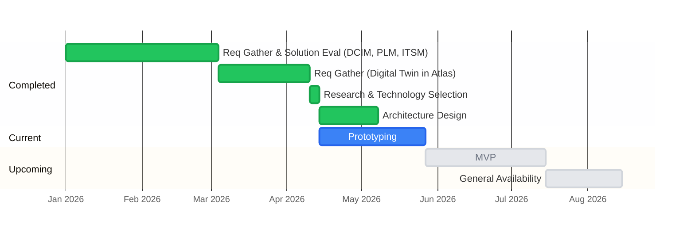

# Roadmap

## Development Timeline

```mermaid
%%{init: {'theme': 'base', 'themeVariables': {'doneTaskBkgColor': '#22c55e', 'doneTaskBorderColor': '#16a34a', 'activeTaskBkgColor': '#3b82f6', 'activeTaskBorderColor': '#2563eb', 'taskBkgColor': '#e5e7eb', 'taskBorderColor': '#d1d5db', 'taskTextColor': '#6b7280', 'taskTextDarkColor': '#fff'}}}%%
gantt
    dateFormat YYYY-MM-DD
    axisFormat %b %Y

    Section Completed
    Req Gather & Solution Eval (DCIM, PLM, ITSM)    :done, 2026-01-01, 2026-03-04
    Req Gather (Digital Twin in Atlas)              :done, 2026-03-04, 2026-04-10
    Research & Technology Selection                 :done, 2026-04-10, 2026-04-14
    Architecture Design                             :done, 2026-04-14, 2026-05-08

    Section Current
    Prototyping                   :active, 2026-04-14, 2026-05-27

    Section Upcoming
    MVP                           :2026-05-27, 2026-07-15
    General Availability          :2026-07-15, 2026-08-15
```

**Note:** All future dates are subject to change.

---

## Recent accomplishments

- **2026-08-03** — Cut colo-dev-main edge propagation ~9min→~8s (Zot mirror scoped to v70+ tag filter + CPU/worker bump + SyncLegacyCosignTags for sigs); redesigned Publish History columns — failure error moved out of the Status badge into its own column.
- **2026-07-29** — Audit-log API readied for AEP (orbital's first client): `operation_name` JSONB filter, pre-computed `changes` diff field (present iff single-entity), DGraph UIDs stripped from audit before-state, typed Swagger response + cheatsheet "Audit log" recipes.
- **2026-07-28** — Standard error envelope (`error`/`code`/`httpStatus`/`hint`) via a central Echo `ErrorHandler` + code registry, retiring Echo's `{"message"}`; Spike 31 done — inline single-entity mutations rejected `400 VARIABLE_FORM_REQUIRED` (default on, kill switch).
- **2026-07-27** — external-jwt bearer auth validated on AKS dev; fixed cluster-edit truncation (retentionDays render-struct drift); hardened all template rendering to buffer-then-write (drift fails loud, not silent); auth-mode + FIPS startup logs.
- **2026-07-23** — External-JWT auth mode (`ORBITAL_AUTH_MODE=external-jwt`) for AEP demo: validates Keycloak bearer via JWKS + `azp` trust anchor, session-cookie fallback keeps UI usable, RFC 6750 error bodies, signature-aware failure logging (identity only when authentic); deploy v0.0.24 to AKS dev.

---

## Spikes

Each spike is a question to answer. Results define the MVP.

| # | Spike | Key Question | Owner | Status | Open items |
|---|---|---|---|---|---|
| 1 | AKS deployment validation | Can we deploy orbital and DGraph on AKS and reach a working baseline? | Daniel | ✅ Done (4/20) | |
| 2 | Orb CLI structure | What is the right command structure for the orb binary? | Daniel | ✅ Done (4/22) | |
| 3 | PostgreSQL / ent data model | What is the right schema for orbital's operational data? | Daniel | ✅ Done (5/5) | |
| 4 | Web UI | Can we build the orbital management UI with HTMX and Go templates? | Daniel | ✅ Done (5/6) | |
| 5 | Authentication | How do we implement OIDC + local auth in orbital? | Daniel | ✅ Done (5/8) | |
| 6 | DGraph backup to S3 | What is the right DGraph backup strategy, including deduplication and retention? | Daniel | ✅ Done (5/9) | Dedup dropped — DGraph exports non-byte-deterministic; count-based retention only. Schedule simplified 2026-06-08: `backup_schedules` table + `GetSchedule`/`UpdateSchedule` endpoints + UI toggle dropped; `ORBITAL_BACKUP_SCHEDULE` env var is now the single source of truth for the cron spec, catch-up derives from `backup_jobs` history |
| 7 | DGraph restore from backup | How do we restore DGraph from a known-good backup? | Daniel | ✅ Done (5/14) | |
| 8 | AKS dev environment | Do we have a working, repeatable AKS dev deployment to prototype against? | Daniel | ✅ Done (5/18) | |
| 9 | Seed iDRAC and storage devices | Does the schema cover all iDRAC and storage fields we need? | Daniel | ✅ Done (5/15) | |
| 9b | Valkey cache-aside | What is the right caching strategy for read-heavy graph queries, and does orbital degrade correctly without it? | Daniel | Not started | |
| 10 | Air-gap sync round-trip | Does orbital's config export work as a complete, importable payload for orb? | — | ✅ Done | Orb loads `json.gz` into local DGraph and serves offline |
| 11 | Authorization | How do we restrict mutations to authorized roles? | — | ✅ Done (6/5) | Three-role system `readonly < dev < admin` (default readonly); `ORBITAL_ADMIN_EMAILS` bootstrap; `RequireRole` / `RequireAdmin` middleware; mutations require dev+; `/users` admin UI with last-admin guard; readonly UI gating. GraphQL endpoint consolidated to single authenticated `/graphql` (2026-06-09). Azure AD App Roles deferred. See `docs/reference/AUTH.md`. |
| 12 | Orb import API | What is the right mechanism for orb to pull a signed OCI subgraph from a registry and load it into local DGraph? | — | ✅ Done | OCI puller (oras-go v2), cosign verify, `dgraph live` subprocess, polling loop; full consumer dispatch pipeline on both `triggerImport` (OCI tag path) and `importArtifact` (direct upload) — both dispatch `ExtraLayers` to `ORB_CONSUMERS`; import history: reverse-chronological, friendly layer labels (`mediaTypeLabel`), dispatch errors in Error column, `ORB_DEV` hot-reload |
| 13 | Divergence reports (orb intake) | How does orb accept and relay divergence reports from edge components? | Daniel | ✅ Done (5/24) | `POST /api/v1/divergence` replaces pending set; `POST /api/v1/divergence/publish` writes snapshot to S3 |
| 14 | Orb deployment model | What does orb look like deployed at the edge — topology, runtime deps, air-gap constraints? | — | In progress | **Done:** local edge sim (orb DGraph + Zot ACR mirror); orb Dockerfile (unified single Dockerfile, two targets, dgraph binary baked in); orb `//go:embed` templates+static; `SubprocessBackend` replaces idle-pod `K8sBackend`; orbital `/healthz` readiness probe; `make release-check` orchestrator; kustomize overlays canonical. **Remaining:** Helm chart for orb; NetworkPolicy manifest (default-deny + allow cb-controller/cb-agent/kube-system). |
| 15 | Orb API surface & authN/Z | What endpoints does orb expose locally, who calls them, and what is the consumer auth model? | — | ✅ Decided (6/7) | MVP: no in-process auth; NetworkPolicy is the gate (default-deny + allow cb-controller/cb-agent/kube-system). NetworkPolicy manifest ships with Spike 14 Helm chart. Post-MVP: K8s ServiceAccount + TokenReview per-route. No HTTP Basic, no OIDC at the edge. See `docs/reference/ORB.md §Auth`. |
| 16 | Orb UI | Can orbital and orb share a template infrastructure while serving different nav and capability surfaces? | — | ✅ Done (5/24) | |
| 17 | ES module split of app.js | Can we split the JS monolith into per-feature ES modules with zero build step? | — | ✅ Done (6/6) | `app.js` deleted; `shared.js` + `orbital.js` + `orb.js` ES modules; conditional loading via `{{.UI.AppName}}` in `head.gohtml`; `window.*` bridge for `onclick` handlers; web dir cleanup: dead templates, dead static assets, `datatables/` rename |
| 18 | ConfigBundle bundler integration | How does orbital support downstream consumers adding layers to its OCI artifact before publish? | Daniel | ✅ Done (5/26) | Per-request bundler URLs in publish body (`bundlers` field); all-or-nothing before push; `enriched`/`bundler_error` on RegistryArtifact; retryable HTTP + size cap; Enriched column in UI; bundler unit tests; integration contract: `docs/configbundle-integration.md` — ConfigBundle implementation is in its own repo; `internal/bundler/` package (`ORBITAL_BUNDLER_TIMEOUT/MAX_ATTEMPTS/MAX_RESPONSE_BYTES`) |
| 19 | `orb scan` — Infrastructure Scanner | How does an operator seed orbital with real iDRAC/storage config from a Galleon without manual transcription? | Daniel | Post-MVP | CLI-only, stateless, operator-invoked. Scans Redfish endpoints on management LAN → GraphQL upsert mutations → human review → pipe to orbital GraphQL API. Output identical in structure to seed files. Never auto-imports. `internal/discovery/redfish/`, `internal/cli/scan/`. `internal/orb/` (server) must never import from these packages. |
| 20 | DGraph schema versioning + backup manifest | How do operators identify which schema version a backup was taken against, and confidently use drop+live load as a planned migration tool? | Daniel | ✅ Done (6/9) | `schema/VERSION` file (`v1`); backup filename `orbital-schema-v1-binary-vX-timestamp.zip`; `manifest.json` inside zip (`manifestVersion`, `createdAt`, `orbitalVersion`, `schemaVersion`); `schema_version` + `binary_version` on `backup` ent record; restore trigger returns 409 + `requiresConfirmation: true` on schema mismatch, accepts `confirmSchemaMismatch: true` to override; backup selector shows `[v1]` badge + client-side mismatch hint; schema version shown on restore page. CI predicate check deferred (no CI pipeline yet). |
| 22 | Divergence reporting end-to-end | How do field-level edge overrides surface to cloud admins, with cb-controller producing reports and orbital ingesting/resolving them? | Daniel | Phases 0+A+A.1 done; Phase B blocking | **Done:** Phase 0 (orb mapping + intake); Phase A (orbital ingestion, REST, server-rendered UI with grouped/expandable rows, MinIO integration test); Phase A.1 (Accept dispatches `update{Type}` mutation via GraphQL proxy, resolution recorded only on success). **Remaining:** Phase B in configbundle repo (cb-bundler emits `mapping.json` layer, Divergence Reporter ctrl.Runnable, `spec.takeover[]` consumption); Phase C cross-repo E2E test; Ed25519 signing deferred post-MVP. Design context: `docs/reference/SDD-CONTEXT.md §12`. |
| 21 | Observability / Monitoring integration | How does orbital produce traces, logs, and metrics into the AKS cluster's existing OTel + Mimir + Loki stack without coupling code to backends? | — | In progress (partial) | **Done:** HTTP access logs aligned to OTel HTTP server semantic conventions in orbital + orb (2026-06-09). **Remaining:** OTel SDK init, trace middleware, slog→OTel log bridge, export-pipeline spans, ServiceMonitor manifest. Design + implementation plan in `docs/reference/OBSERVABILITY.md` and `docs/reference/monitoring-stack.md`. Open: Loki tenant ID (ask platform), ServiceMonitor namespace selector. |
| 23 | Audit existing tests for value | Which tests in the repo guard real regressions vs which are theater that should be deleted? | — | Not started | Walk every `*_test.go` and Playwright spec. For each, name the regression class it catches in one sentence. Classify: **KEEP** (specific regression guard, security-critical, edge cases on pure functions, persistence round-trip); **DROP** (tautological — asserts the function returns what we just made it return; duplicates visual validation the operator does in the UI; integration tests that don't currently run due to unrelated build breaks; assertions that mostly test stdlib behavior like template parsing). Output: delete list + one-line justification each. Calibration baseline is the new test rules in CLAUDE.md (Working Style section). Triggered by 2026-06-13 session: writing tests reflexively for every behavioral change without naming the regression they guard. |
| 24 | Divergence MVCC + storage split (rejected DGraph move) | Close the report→resolve race condition by capturing ConfigItem version at intake and checking at Accept. Storage stays in PostgreSQL. | Daniel | ✅ Done (2026-06-14) | **Decision settled:** divergence/resolution stay in PostgreSQL. Graph-native move was rejected — export-pipeline contamination is the killer argument (orb shouldn't receive resolutions; stripping them at export is the same vocabulary leak just relocated). MVCC shipped: `ConfigItem.version` auto-increment in GraphQL proxy, `ifVersion` opt-in race detection, orb stamps `intended_at_version` at intake. Open: API unification (federated GraphQL) deferred — separate spike when the "thin proxy vs gateway" architecture question is settled. |
| 25 | Publish provenance & changeset diff | How do operators tell what changed between two published OCI artifacts, given orbital is intentionally not gitops? | — | Not started | **Today:** OCI digest pins the bundle, audit log records every intent mutation — both exist, not stitched on the publish history page. "What changed between v8 and v9" is answerable today only by manually time-windowing the audit log against publish timestamps. **Minimum:** enrich the publish audit event with `{oci_digest, version, audit_cursor_at_publish, entry_count}`; add a "Changes since previous publish" panel on the publish history detail page that runs the cursor-window query (cheap, indexable, monotonic). **Explicit non-goal:** do NOT log all N resource IDs per publish — the OCI artifact already IS the authoritative manifest; duplicating ~780 IDs per publish would inflate the audit log by ~285K rows/year for data that's already digest-pinned. **Reference systems for the pattern:** NetBox per-object change log, Argo CD Application sync history, Helm `helm history` + `helm diff`, Terraform Cloud plan output. All share the same shape — versioned anchor + changeset-since-previous-anchor. **Gitops critique to answer in the writeup:** (a) rollback = DGraph backup/restore tied to publish digest (we have this); (b) "diff v8..v9" = cursor-window audit query (this spike); (c) why not just use git? — intent lives in DGraph because traversal queries ("all servers in DC X with iDRAC fw < Y") are the primitive, git is bad at that shape; (d) **legit gap:** no "review changeset before Publish" approval workflow — split out as its own spike if/when scoped. Triggered by 2026-06-23 conversation. |
| 26 | Provider-portable identity: id_token as Bearer | How do we move orbctl + orbital from the AAD-specific "access_token carries identity" pattern to the standards-aligned OIDC "id_token as Bearer" pattern that works across any OIDC provider? | — | Not started | **Target outcome:** OIDC id_token-as-Bearer becomes the standard for orbctl → orbital auth. **Why it matters:** today's pattern only works because AAD v2 embeds identity claims (`name`, `oid`, `preferred_username`, `upn`) into JWT access tokens — a provider-specific convenience, not the OIDC standard. Auth0 (default config) and Okta only include `sub`; Google OAuth issues opaque access tokens with no claims at all. Pointing orbital at any of those breaks identity extraction. **Current state:** `internal/orbauth/auth.go:24` requests `api://.../user_impersonation offline_access` (no `openid`); `internal/auth/bearer.go:84-86` reads `claims.PreferredUsername` then falls back to `claims.UPN` (AAD-only). orbctl never sees or stores an id_token. **Target pattern:** orbctl requests `openid email profile offline_access`; persists `id_token` alongside the access_token; sends `id_token` as `Bearer` to orbital; orbital's bearer middleware verifies the id_token's signature + audience + standard OIDC claims (`sub`, `email`, `preferred_username`, `name`). Matches the existing UI `/auth/callback` flow (`internal/handler/oidc.go:62`, which already uses `gooidc.IDTokenVerifier`) and the kubectl / K8s API-server convention. **Scope:** `internal/orbauth/`, `internal/auth/bearer.go`, `internal/orbctl/`; migration path for existing orbctl users (next login picks up new scopes); decision on whether access_token is still useful (probably not — orbital doesn't proxy to downstream OAuth-protected APIs on behalf of the user); compat shim during transition. **Open question:** does any orbital-side code path actually need the access_token, or is it purely identity-as-claims today? Answer determines whether the access_token is dropped entirely or kept as opaque. **Triggered by 2026-06-24 conversation on provider portability.** |
| 27 | Adopt Atlas for Postgres schema migration | How does orbital handle schema evolution against legacy data — adding constraints to populated tables — without crashlooping deploys? | — | Not started | **Trigger:** v0.0.23 AKS deploy crashlooped adding an FK on `registry_artifacts.export_job_id`; long-lived DB had orphans that ent's schema-diff can't see. Fresh test DBs miss the class entirely. **Adopt Atlas** (ariga.io, ent-native): versioned SQL under `ent/migrate/migrations/`, data migrations interleaved, `atlas migrate lint` in CI. **Scope:** replace `db.Schema.Create(...)` in `cmd/orbital`; move migrations off startup (init container / `--migrate` flag); CI applies pending migrations against a redacted snapshot of AKS Postgres; drop `WithDropColumn(true)`; same for orb SQLite. **Deliverable:** ADR-014. Rejected: Liquibase/Flyway (Java tax), custom tooling (mirrors ADR-007 for DGraph). |
| 28 | In-pod bundler → orbital service-auth model | Should the co-located cb-bundler authenticate to orbital's `/graphql` via full AAD client-credentials (current), or via a loopback/localhost trust that actually realizes the "same pod simplifies auth" intent? And reconcile the contradictory docs. | — | Post-MVP | **Trigger:** external-jwt demo work (2026-07-23) broke the bundler's publish callback — external-jwt mode replaced the AAD verifier, so the bundler's AAD client-credentials token got signature-rejected. **Tactical fix shipped for demo:** dual-issuer fallback — external-jwt routes Keycloak-issued bearers to the Keycloak verifier and all others to the AAD `BearerVerifier`, restoring the documented AAD path (ADR 010). **The real decision:** our docs describe two conflicting models for the same in-pod call — **Model A (AAD client-credentials)** in `aad-bundler-role-assignment.md` + ADR 010 + `bearer.go` (what's actually built), vs **Model B (localhost bypass)** in `configbundle-integration.md:457/463/464` ("no bearer token needed — localhost bypasses auth"). Model B is only literally true in local dev (`ORBITAL_DEV=true` bypass); prod (`Dev=false`) runs Model A. **Decide:** keep AAD (IdP-consistent, survives if the sidecar assumption changes; heavier) OR adopt real loopback-trust (deletes AAD from the hot path + the App Role runbook; commits to the sidecar-invariant of `configbundle-integration.md:457`; supersedes ADR 010). **Regardless of choice: fix the doc contradiction** — 457/463/464 vs the AAD runbook cannot both stand (they already misled a review). **Deliverable:** decision + doc reconciliation; if Model B, an ADR superseding 010. Triggered by 2026-07-23 external-jwt session. |
| 29 | Publish-action metrics (success / latency / failure-stage) | What operational metrics should orbital emit around publish/export, and how do we actually collect them? | — | Not started | **Trigger:** 2026-07-27 `/metrics` review. **Current state:** orbital exposes `/metrics` (Prometheus `client_golang`, `internal/metrics/metrics.go`) with 3 HTTP-level metrics (`http_requests_total`, `http_request_duration_seconds`, `graphql_operation_errors_total`) via middleware — but (a) orbital's pod carries **no scrape annotation / ServiceMonitor** (only DGraph does), so nothing collects them, and (b) publish is an **async job**, so the HTTP metrics capture only the fast `202` trigger, not the outcome / real duration / failure-stage. Publish truth currently lives only in the `ExportJob` / `RegistryArtifact` DB rows (status, `completed_at`, digest, bytes, layers), not in metrics. **Scope:** (1) actually scrape orbital — ServiceMonitor or pod annotation (**overlaps Spike 21's ServiceMonitor item** — reconcile, don't duplicate); (2) publish domain metrics at job finalization in `publisher.go` / `export.go`: `orbital_publish_total{datacenter,result}`, `orbital_publish_duration_seconds{datacenter}`, `orbital_publish_failures_total{stage}` (bundler / sign / push) — inject via the same seam Spike 25 uses for `auditEmit`. **Decide:** metric namespace convention (`orbital_*`; existing metrics are un-prefixed) and — **reconcile with Spike 21** — Prometheus `client_golang` at `/metrics` vs OTel `MeterProvider`→Mimir (today those would be two parallel metrics stacks). **Complementary to, not a substitute for,** the `publishArtifact` audit event (Spike 25): audit = who/when (compliance), metrics = rate/latency/failure (ops). See Spike 21 for the broader OTel pipeline. |
| 31 | Reject inline single-entity mutations (server-managed metadata) | Should the proxy auto-stamp inline mutations, or require the variable form and reject inline? | Daniel | ✅ Done (2026-07-28) | **Shipped Option D — reject, don't rewrite the query string.** Guard in `graphql.go` (`rejectInlineSelectors`, default on; kill switch `ORBITAL_INLINE_SELECTOR_REJECT=false`) 400s any `update{Kind}` on a known type lacking a variable selector OR variable `set` — the shapes that silently skip `version`/`updatedBy`/`updatedAt` stamping. `VARIABLE_FORM_REQUIRED` error names the caller's type with a copy-pasteable variable-form hint (`docs/reference/ERROR-RESPONSES.md`). **Why D** over rewriting (AST parse / extract-inline→var / regex inject): every mutation flows through the load-bearing `Handle`; D only adds a rejection branch on an already-misbehaving shape, so it can't regress a working path — and our own clients (UI `configitem-editor.js`, orbctl) already use the variable form. Pass-throughs by design: bulk `in:[…]`, non-orbId filters, compound docs, inline `add(input:[…])`. Upgrade path if external inline clients appear = Option B (lift inline `set` into a synthetic variable) — folded into the "real GraphQL AST parse" tech-debt item. Triggered by the 2026-07-28 galleon-backup-svc `updatedAt` report. |
| 30 | Pre-export change preview ("dry run") | Let clients see what would change in the next bundle BEFORE clicking export/publish — preview a data center's pending changes. | — | Not started | **Idea (2026-07-28):** clients want to preview a DC's pending changes before Export. **Prospective twin of Spike 25** (retrospective — diff between two *published* artifacts): same audit-cursor-window mechanism, anchored "last publish → now" instead of "publish N-1 → N" — **unify, don't build parallel machinery.** **Three levels of dry-run, increasing cost:** (1) **Pending changeset (audit-based)** — intent mutations since last publish (entity / actor / when / before→after); cheap, reuses the audit pipeline; recommended MVP. (2) **Config payload diff** — field-level diff of the export payload vs the last published snapshot; precise, needs export-to-scratch + subgraph diff. (3) **Full bundle preview** — dry-run the whole export→bundle pipeline incl. bundler-added layers without pushing; heaviest, cross-repo (bundler). **Lean:** Level 1, **orbital-owned** (orbital owns intent + audit + export; "view my changes" is about *intent*, not deterministic bundler-layer transforms) — keep the bundler out unless previewing bundler-ADDED layers is a real need. **Open design Qs (not settled — session parked 2026-07-28):** granularity (changeset vs payload-diff vs full-bundle); surface (API endpoint for AEP / UI panel on DC-or-export page / both); baseline anchor (last published artifact for the DC; behavior when never published); orbital-only vs bundler dry-run. Note: existing `download:true` export already produces the `json.gz` without publishing — a preview could build on that. Warrants an Opus design session before code. |
| — | Schema migration | Do we need automation or is a runbook sufficient? | — | ❌ Superseded by Spike 27 | v0.0.23 failure invalidated the "runbook sufficient" decision. |

---

## What We've Built

| Spike | Completed | Summary |
|---|---|---|
| orbctl distribution | Jun 9 | Homebrew tap (`danieldn-aramada/homebrew-tools`); per-component versioning (`cli/v*` tags) — see ADR-009; pure-Go build (CGo keychain removed, ~400 lines deleted from `orbauth`); silent token refresh in `GetCredentials()`; persistent `--verbose` flag for network call logging; kubectl-style `get datacenter[s]` collapse; `bin.install "orbctl"` via brew → `orbctl login -v` |
| 17 · ES module split | Jun 6 | `app.js` monolith → `shared.js` + `orbital.js` + `orb.js` ES modules; conditional loading in `head.gohtml`; `window.*` bridge for `onclick` handlers; web dir cleanup (dead templates, dead static assets, `v2/` → `datatables/`) |
| 11 · Authorization | Jun 5 | Three-role system (`readonly/dev/admin`); `RequireRole` middleware; `/users` admin UI (server-side, button group R/D/A, last-admin guard); readonly UI gating (`CanMutate`+`AdminEmails` on layout.Base, `access-required` partial); `ORBITAL_ADMIN_EMAILS` bootstrap; device code auto-open (`verification_uri_complete`); `ORBITAL_OAUTH2_DEVICE_CODE` (orig. `ORBITAL_OIDC_DEVICE_CODE`) default `true` |
| 1 · AKS deployment | Apr 20 | Orbital + DGraph on AKS, NetworkPolicy, pod recovery validated |
| 2 · Orb CLI | Apr 22 | Single binary: `orb start` subcommand (long-running edge service) |
| 3 · PostgreSQL schema | May 5 | 9 ent tables: users, orbs, namespaces, jobs, audit log, OCI artifacts |
| 4 · Web UI | Apr 20 – May 14 | Data Centers tab (HTMX, inline edit, audit diff); Servers cross-DC DataTable + drill-down (iDRAC, Storage, Config Profile); Export, Backup, Restore, Audit Log, Signed Artifacts, Schema, Divergence pages; Playwright E2E suite |
| 5 · Authentication | May 8 | OIDC + local auth, CLI keychain, bearer token validation end-to-end |
| 6 · DGraph backup | May 9 | Async backup to Azure Blob/S3, count-based retention, presigned download; checksum dedup dropped (DGraph exports non-byte-deterministic) |
| Config Export + OCI Pipeline | May 9 – May 18 | 8 endpoints, scratch-based scoped export (dedicated scratch DGraph per job; live DGraph unaffected), oras-go v2 + cosign signing, air-gap safe OCI publish — orbital side complete |
| 7 · DGraph restore | May 14 | Full restore from backup via dgraph-live pod, validated on AKS |
| Audit Log System | May 5 – May 13 | GraphQL mutation interceptor, before-state capture, before/after field diff, three-source orbId extraction, per-entity audit tabs on DC and server views (see `docs/reference/AUDIT.md`) |
| 8 · AKS dev environment | May 18 | Deploy manifests, Helm charts, seed scripts, step-by-step deploy guide |
| 9 · Hardware Data Modeling | May 15 | 4 new iDRAC schema fields; 9 data centers modeled from real Netbox hostnames and rack topology; schema validated against live hardware |
| orbctl | May 11 | `orbctl get datacenter/datacenters`; bearer auth; macOS keychain; kubectl-style output |

*Implementation detail and dated capability log: see `## Recent accomplishments` at the top of this file.*

---

## MVP Planning

The following are not prototype questions — they are prerequisites for shipping. They will be defined in a dedicated MVP planning session, with infra team input where needed.

### Production deployment
Ingress architecture, dedicated hostnames, TLS, internal vs external load balancer. Auth/authz flows in production (OIDC issuer, token lifetimes, `ORBITAL_ADMIN_EMAILS` management; Azure AD App Roles as a future enhancement once Application Administrator access is available). Production namespace layout, resource limits, horizontal scaling. CI/CD pipeline: build, tag, push on merge to main, deploy to AKS dev on tag. (`//go:embed` for orb — done 6/9; orbital embed pending if/when needed.) Ratel access via dedicated DNS hostname with its own Istio VirtualService.

*These decisions depend on infra team input and are coupled to auth/authz and ingress architecture — not resolvable in prototype spikes alone.*

### Security & correctness hardening
Fix all critical and high security findings before any staging or production exposure. Full findings and fix order: `docs/findings/security-and-deployment-findings.md` (S.1–S.18), `docs/findings/additional-findings.md` (A.1–A.7), implementation plan: `docs/findings/maintainability.md` Phase 1.

Key items: unauthenticated `/graphql` root route, no K8s liveness/readiness probes, no CSRF on GraphQL mutations, audit actor forged by client, raw JWT logged at INFO, missing `Secure` cookie flag.

### Testing foundations
Test pyramid is substantially complete: 222 Go tests (unit + integration, `make test-unit` / `make test-integration`), 45 Playwright UI tests for orbital + orb via `make test-e2e`, and the pre-release `make release-check` flow (containers + full publish→import→restore). Remaining gaps: **CI pipeline** (GitHub Actions workflow — `.github/` exists but has no workflow files yet) and **post-deploy AKS smoke suite hookup** (`make smoke-aks` exists but currently shallow — could be expanded to run the read-only Playwright projects against the AKS deployment). DGraph client abstraction (T.1 in `docs/testing-strategy.md`) is a tech debt item, not a testing blocker.

### Performance, cost & observability
Benchmark DGraph query latency under realistic load, produce AKS node SKU cost estimate. Add Prometheus metrics endpoint, DGraph alpha scraping, Grafana dashboard, and at least one alert for error rate or memory pressure. Valkey cache-aside is post-MVP (Spike 9b) — baseline performance first.

---

## MVP Definition

> Working draft — final scope confirmed once prototype spikes complete.

### Orbital (cloud)
- ✅ GraphQL Topology API — proxy DGraph with auth and caching
- ✅ Export API — scoped `json.gz` + `schema.gz` per data center
- ✅ Backup and restore — DGraph full snapshots to Azure Blob, restore via UI; schema-versioned filenames + manifest.json (Spike 20)
- ✅ Audit log — all config mutations with actor, before/after diff
- ✅ OCI publish — signed artifacts to configured registry
- ✅ Authorization — three-role system (`readonly/dev/admin`), `ORBITAL_ADMIN_EMAILS` bootstrap, `RequireRole` middleware, admin users page, readonly UI gating (Spike 11)
- 🔲 Orb registry — register, authenticate, and revoke orbs *(post-MVP: revisit when orb onboarding is scoped)*
- ✅ Security hardening — critical/high items (S.1 Spike 11, S.2 fixed 2026-06-09, S.3 not a real finding, S.4/S.6 fixed 2026-06-09, S.5 already gone, S.13 Spike 11)
- ✅ `namespaceID` index on `ConfigItem` — `namespaceID: String! @search(by: [exact])` on the interface, backfilled, enforced at application layer on all add mutations.

### Orb (edge)
- ✅ CLI structure — `orb start` (long-running edge service)
- ✅ Local DGraph — holds intended state; served offline via orb UI
- ✅ Config import — `/import/subgraph` (direct zip) and `/import/artifact` (full OCI pipeline with consumer dispatch)
- ✅ Divergence reporting — `POST /api/v1/divergence` intake; `POST /api/v1/divergence/publish` to S3
- ✅ `//go:embed` for templates and static assets — self-contained binary for air-gap edge deployment (Spike 14, 6/9)
- ✅ K8s execution model — `SubprocessBackend` runs `dgraph live` inside the orb pod; no idle pod, no shared PVC (Spike 14, 6/9)
- ⬜ Deployment packaging — Helm chart, NetworkPolicy, orb Dockerfile with dgraph binary (Spike 14 remaining)
- ✅ API surface & authN/Z — NetworkPolicy is the gate; no in-process auth at MVP (Spike 15 decided 6/7)

### Explicitly out of scope for v1
- Network infrastructure config items (owned externally)
- PLM and ITSM integrations — vendor selection in progress
- Multi-DGraph instance per data center
- PostgreSQL backup and restore — handled out-of-band by managed PostgreSQL (Azure)

---

## Post-MVP Enhancements

| Item | Notes |
|---|---|
| SDL syntax highlighting on Schema page | Replace plain `<pre>` with Prism.js `language-graphql` highlighting on both orbital and orb schema pages. Requires downloading and serving Prism JS + CSS as static assets (we self-host all assets — no CDN). ~30 min once asset serving is scoped. |
| `orb scan` — Infrastructure Scanner (Spike 19) | Operator-invoked CLI subcommand. Scans iDRAC/Redfish endpoints on Galleon management LAN → emits JSON-wrapped GraphQL upsert mutations (identical structure to seed files) → operator reviews → pipes to orbital GraphQL API. Never auto-imports. `internal/discovery/redfish/`, `internal/cli/scan/`. |
| Divergence observation audit (forensics) | Today the ingester hard-deletes `DivergenceEntry` rows on loop closure, so "in March, rack 3 went into a bad state — what did we see and when?" is unanswerable. Action audit (who decided what) is covered by `DivergenceResolution` + `Event` log; observation audit (what value we saw, claimant, first-seen → closed-at) is not. **Order of work:** (1) check the resolution Event payload — if it snapshots `current_value`/`intent_value`/`claimant`, the gap shrinks to "heartbeat history only"; (2) if richer history is needed, soft-delete `DivergenceEntry` via a `closed_at` column (keep queries on one table, add index for cheap pruning); (3) defer retention/TTL until size becomes a real problem — instrument first. Avoid a parallel history table — schema sprawl without payoff. |
| Migrate password hashing to Argon2id | Current: bcrypt (sound, not broken). Argon2id is OWASP's current first recommendation — adds memory-hardness on top of time-hardness, making GPU/ASIC offline attacks significantly more expensive. `golang.org/x/crypto/argon2` is already an indirect dependency. Requires a migration path for existing bcrypt hashes (detect by hash prefix on login, re-hash on successful verify). |
| Migrate enum-like String fields to GraphQL enums | Current convention is `String # value1, value2` across the schema (`IPAddress.type`, `IPAddress.role`, `KubernetesCluster.cni`, `KubernetesCluster.environment`, `EksaKubernetesCluster.clusterType`, `KubernetesNode.role`). DGraph supports proper `enum` types — schema-enforced values, typed filters, real enums in codegen, self-documenting introspection. Defer until done as a single coordinated cut (half-strings-half-enums reads worse than either pure choice). Pick the wholesale moment, define enums, migrate data values, update seeds + audit `typeBeforeFields`. |
| Cap resource-tab Audit Log size | The per-resource Audit Log tab (Server, DC, Cluster) fetches every event scoped to that resource + its `data-related-orb-ids` aggregation list. For a long-lived DC with thousands of child mutations the unbounded query is a footgun (slow page, big JSON, browser jank). Add a server-side limit (e.g. last 200) + a "Show more" / link to the global Audit Log page filtered by the same orbId set. Touches `internal/handler/audit.go` query construction + the resource-tab audit panel render. |
| Swagger response-model sweep (Tier 2) | Request bodies are typed self-documenting DTOs (done 2026-07-23). Responses still use `{object} map[string]string` on ~65 `@Success`/`@Failure` annotations across 12 files — Swagger UI renders these as the useless `additionalProp1/2/3` placeholder bag, hiding the real shape (e.g. export 409 actually returns `{error, id}` with the in-progress job UUID). Replace with named response types (shared `ErrorResponse{error}`, `ConflictResponse{error,id}`, plus endpoint-specific ones). Follow CLAUDE.md's self-documenting-DTO Settled Decision. One coordinated pass + `make docs`. Prioritize orbital handlers (AEP consumes orbital) over orb. |
| Refactor bundler URL config away from `name=url` env DSL | `ORBITAL_BUNDLER_URLS=configbundle-bundler=http://...` is a custom micro-DSL packed into one env var. Adds parsing logic (`bundler.ParseSpec` in `internal/bundler/client.go`) that has already caused one bug (the startup preflight bypassed the parser and probed the raw `name=url` string as a URL — fixed but it was avoidable). Cloud-native alternatives, in order of effort: (1) one env var per bundler (`ORBITAL_BUNDLER_CONFIGBUNDLE=http://...`) — typo in one doesn't break others, each is independently queryable; (2) ConfigMap-mounted YAML/JSON (`ORBITAL_BUNDLERS_FILE=/etc/orbital/bundlers.yaml`) — structured validation, real schema; (3) K8s Service discovery via label selector (`orbital.armada.ai/role=bundler`) — fully native, bundlers self-register. Option (2) is the right MVP+1 step (keeps deployment portability — works in docker-compose and bare-metal too — without needing the DSL parser). Touches: `internal/config/config.go`, `internal/bundler/client.go`, `internal/server/server.go` (preflight), `internal/handler/oci.go` (publish), `deploy/base/deploy.yaml`. |

---

## Technical Debt

**Validation gate — before closing any item:** `go build ./...` + `make test-unit` for Go changes; `make test-integration` for anything touching PostgreSQL or DGraph; `make test-e2e` or manual browser verification for UI/JS changes; negative test (wrong config is actually rejected) for security-critical items.

> Items originally tracked in `docs/findings/maintainability.md` (May 2026 audit) have been absorbed below. That file has been deleted.

### Track A — fix now (no test harness required)

| Item | Notes |
|---|---|
| **Priority (do first) — Publish History error visibility** | On a failed publish you must scroll the table far right to read the error: `Error` and `Repository` are wide fixed-width end columns, so the failure reason sits off-screen. Hit for real **2026-08-03, ~1h before a demo** — v82's cosign-sign timed out and the error was unreadable without scrolling. Fix: cap column widths (Repository/Error `max-width` + ellipsis, full text on hover/expand) and/or a compact failure indicator on the row that's visible without scrolling (truncated error next to Status; full text in the expand row). This reconsiders the deliberate "wide end column, accept horizontal scroll" choice from the 2026-08-03 table redesign — that tradeoff fails precisely for the urgent-error case. `web/templates/orbital/pages/publish-history.gohtml` + `partials/artifacts-tbody.gohtml`. |
| Replace `title=""` tooltips with Tippy.js | 9+ usages in `divergence-reports.gohtml`, `users.gohtml`, `backup-jobs-tbody.gohtml`, `cluster-tab.gohtml`. Native browser tooltips have ~1s delay, no theming, no positioning control. Stop using `title=` for user-facing text; migrate to Tippy.js (~10KB, matches Linear/Vercel/Stripe convention). |
| Refactor bundler URL config DSL | `ORBITAL_BUNDLER_URLS=configbundle-bundler=http://...` is a custom micro-DSL in one env var; already caused one bug (preflight probed the raw `name=url` string as a URL). Better: one env var per bundler (`ORBITAL_BUNDLER_CONFIGBUNDLE=http://...`), or ConfigMap-mounted YAML for structured validation. |
| Collapse duplicate cluster backup structs | `backupKindResponse` (DGraph JSON decode) and `backupKindTab` (template view struct) are hand-synced — adding a backup field means updating both or the cluster tab truncates mid-render (the 2026-07-27 `retentionDays` "Edit button does nothing" bug). Now *caught* by `TestClusterTab_BackupWithRetentionRendersFullFragment` + buffered `renderHTML` (fails loud, not silent), but the drift is still possible. Eliminate it: render the template off the query struct directly (supply `DomID` via a method or embedding) so a new field lands in exactly one place. `internal/handler/cluster.go`. |
| Unify `/graphql` proxy-guard error envelope | **Deferred — build only when a client needs it.** The `/graphql` endpoint exposes two error shapes: orbital's proxy guards (403 role, 409 MVCC, and the planned inline-selector 400) return the REST `errorResponse` body (`error`/`code`/`httpStatus`/`hint`), while DGraph's native GraphQL `errors[]` passes through untouched — so a caller gets one or the other depending on who rejected. Unification = wrap proxy-guard rejections in a synthetic `errors: [{ message, extensions: { code, httpStatus, hint } }]` so `/graphql` speaks one shape (REST endpoints keep `errorResponse`). Cheap because `code` spellings already match Apollo's (`FORBIDDEN`, `BAD_USER_INPUT`) — no code strings change, only the wrapper — but touches existing 403/409 behavior + orbctl parsing + e2e assertions, so don't do it speculatively. Full context + migration seam in `docs/reference/ERROR-RESPONSES.md` § "Deferred: envelope unification". |
| Replace hand-rolled GraphQL request parsing with a real AST parse | **Address soon — we're paying "worst of both worlds" today.** The `/graphql` proxy understands mutations via regex + string matching (`knownMutationRe`, `extractOperations`, `mutationOpRe`, the comment/string-stripping used against comment-smuggling, and now the Spike 31 inline-selector guard). That's parser-level *fragility* (comment smuggling, inline vs variable, false-trigger edge cases) without parser-level *correctness* — a hand-rolled partial parser. A real GraphQL AST parse (e.g. `gqlparser`, needs dependency sign-off) would strengthen **authz and stamping together** and remove the inline-selector constraint entirely (it could safely lift an inline `set` into a synthetic variable and inject — Spike 31's Option B). Not MVP-urgent — every real caller uses the variable form — but this is the principled fix the regex approach keeps gesturing at. Revisit when the mutation surface grows, the authz layer fights the regex again, or an external caller genuinely needs inline. Touches the load-bearing `Handle` path — do it deliberately, with the Spike-31 test suite as the regression net. |

### Audit backlog — May 2026 audit, triaged 2026-07-23

> Open items from `docs/findings/additional-findings.md` + `docs/findings/security-and-deployment-findings.md`, each verified against current code and absorbed here; both files deleted. The security audit's two **Critical** findings (unauthenticated `/graphql` → full mutation surface; missing readiness probe) and "RBAC defined but not enforced" were already **FIXED** (Spike 11 + the single authenticated `/graphql` group + `/healthz` probe) — not carried over. **No item below is an OSS release-blocker.**

| Item | Notes |
|---|---|
| OIDC config leaks real prod identifiers | Remove real Azure AD tenant + app-ID defaults; add fail-on-default-when-`!Dev` assertions (mirror the HMAC check) — `config.go:55-66,121`. (A.1) |
| Rate limiting absent | Per-IP on `/graphql`, tighter on `/user/login` (credential stuffing) — `server.go`. (S.12) |
| No request body size limit | `middleware.BodyLimit`; unbounded `io.ReadAll` at `graphql.go:89` = memory-exhaustion DoS. (S.7) |
| OIDC-unreachable degrades to no-auth | Fail startup instead of Warn + nil `apiAuth` — an air-gap deploy can boot unauthenticated — `server.go:144-158`. (S.16, security-relevant) |
| No audit on destructive deletes | Add audit events to `BackupHandler.Delete` (`backup.go:509`) and `OCI.DeleteArtifact` (`oci.go:188`). (S.10) |
| MVCC silent-pass on bad version type | `toFloat64` → `(float64, ok)`; unparseable version = 409, not silent pass — `graphql.go:173,623-634`. (A.3) |
| OIDC nonce + constant-time state | Add `nonce` binding; `subtle.ConstantTimeCompare` for state — `oidc.go:95`. (S.14, S.15) |
| Export/restore job-creation TOCTOU | Serialize (mutex or unique partial index); concurrent triggers both pass the pending-job check → scratch-DGraph corruption — `export.go:216-230`. (S.8) |
| Async jobs orphaned on shutdown | Track goroutines (WaitGroup + cancellable ctx); SIGTERM mid-restore can leave DGraph wiped — `server.go`, `restore.go:286`. (S.9) |
| Orb registration not unique | Unique indexes on `datacenter_id` + `public_key` — `ent/schema/orb.go`. (S.11) |
| Job-status columns unindexed | `index.Fields("status")` on ExportJob/Backup/RestoreJob; conflict queries are full table scans. (A.7) |
| Backup zip in `/tmp`, defer-only cleanup | Write to a controlled dir + orphan reaper — `backup.go:627-631`. (A.2) |
| Export scratch-dir leak | `defer os.RemoveAll(jobScratchDir)` after MkdirAll — `export.go:900`. (A.4) |
| `orb scan` fabricates success | Return "not implemented" instead of hardcoded "Found 3 BMC interfaces" until Spike 2 real discovery — `scan.go:16`. (A.6) |
| GET `/export/jobs` writes to DB | Move `StatusStale` marking out of the List handler (HTTP-safety violation; also swallows the write error) — `export.go:255-262`. (S.18) |
| OCI push/sign dual credential stacks | Unify ORAS + go-containerregistry creds, or document the coupling — `publisher.go:316-318,371-373`. (A.5) |
| DGraph query string interpolation | Parameterize interpolated queries (`%q`-quoted, low practical risk) — `export.go:963,1049,1223`. (S.17) |
| Orbital templates not embedded | orbital handlers still `ParseFiles` from disk; orb already embeds. Deployment note, non-security — `web/embed.go`. (D.1) |

### Track B — DGraph client interface first (requires 15–20 min Opus design session before Sonnet implements)

| Item | Notes |
|---|---|
| DGraph client abstraction | 22+ raw `http.Post` calls across 7 handler files, no timeouts, no connection pooling. Extract `internal/dgraph/client.go`. **Interface shape is a design decision** (transport-level vs. semantic-level) with long-term consequences — do NOT implement on Sonnet without a settled design. This is the primary unlock for Go integration testing. |
| `internal/handler/` god package | ~3,500 lines mixing HTTP routing, business logic, DGraph calls, and file I/O. Decompose post-MVP in three incremental steps: (1) extract `internal/storage/` blob abstraction, (2) extract `internal/export/` domain logic, (3) extract `internal/backup/` domain logic. Each step makes the extracted package independently testable. Do NOT start before the MVP feature cut. |

### Architecture — requires design discussion before any code

| Item | Notes |
|---|---|
| Orbital HA — pervasive single-replica assumptions | Deployed as `replicas: 1` with `strategy: Recreate`. Several subsystems assume single-leader: divergence ingester (`lastIngestedByDC` is in-memory), backup scheduler (cron double-fires across replicas), publish-history ingester. Going HA requires holistic redesign — leader election, per-subsystem advisory locks, or a dedicated ingest deployment. **Do NOT scale past `replicas: 1`** until resolved; double-ingestion corrupts divergence state. |
| Auto-apply DGraph GraphQL schema on startup (kill the manual schema-deploy step) | Today orbital does NOT apply `schema.graphql` to DGraph on boot, so a schema-bumping image deploy silently drifts until someone manually POSTs to `/admin/schema` — the 2026-07-27 AKS burn (v0.0.25 queried `retentionDays`, DGraph still v3 → every cluster 404'd). **Proposed fix (mine, not yet researched): orbital applies the schema additively on startup**, mirroring what it already does for PostgreSQL via ent auto-migrate — makes `schema.graphql:6`'s existing (currently false) "applied on startup" claim true, and removes the deploy-runbook step. Conventional shape for schema-as-code; DGraph has no SQL-migration-framework equivalent (Atlas/goose are relational). **Design points before code:** (1) re-scopes the "schema migration automation out of MVP" settled decision — additive SDL apply is arguably the ent-auto-migrate analog, not a migration tool; (2) blue-green — apply to active/blue on boot (scratch already gets it via export); (3) additive-only guard (schema rules already forbid destructive changes); (4) multi-replica racing is harmless (DGraph serializes) but confirm; (5) **fix the `schema.graphql:6` vs `DGRAPH.md` doc contradiction** whichever way this lands. Alternatives: kustomize initContainer, or GitOps PreSync Job. Consider grounding with standards-research first. Triggered by the 2026-07-27 cluster-404 burn. |

### Done

| Item | |
|---|---|
| ~~Stuck-job reaper on startup~~ | ✅ Fixed 2026-06-29. `internal/handler/reaper.go` — `ReconcileStaleJobs` sweeps all three job tables on startup; pending/running rows → failed with "interrupted: server restarted". |
| ~~Session store created per-request~~ | ✅ Fixed 2026-06-29. `auth.NewSessionKeys()` builds the `sessions.CookieStore` once; `config.SessionKeys()` returns a cached copy; nil guard in each auth function preserves backward compat with test literals. |
| ~~OCI push rollback on signing failure~~ | ✅ Fixed 2026-06-29. `publisher.deleteManifest()` called when `sign` fails after `pushArtifact` succeeds; log warning if delete also fails so operators have the digest. |
| ~~ent edge `RegistryArtifact` → `ExportJob`~~ | ✅ Fixed 2026-06-29. Added `edge.From("export_job"...)` on `RegistryArtifact` and `edge.To("registry_artifacts"...)` on `ExportJob`; `go generate ./ent` re-ran. |
| ~~Name orbctl GraphQL operations~~ | ✅ Fixed 2026-06-29. Named all 8 anonymous query sites across `get_configitem.go`, `get_server.go`, `get_dc.go`. |
| ~~Cap resource-tab Audit Log at 200 rows~~ | ✅ Fixed 2026-06-29. DC/Server/Cluster audit tabs now fetch `limit=200`; "Showing last N of M" + "View all in Audit Log →" link shown when capped. |
| ~~Reload buttons hang on failure~~ | ✅ Fixed 2026-06-29. `error.dt` guard on cluster/DC/server/audit-log DataTable reload buttons; `reloadClusterFragment` shows inline error instead of swallowing; orb divergence refresh shows error instead of leaving skeleton. |
| ~~Collapse parallel ConfigItem tab handlers (DC, Server)~~ | ✅ Done 2026-06-25 (ADR 011). `DataCenterHandler` and `ServerHandler` use injected `actions` resolver; orb's `dcTab`/`srvTab` and all parallel structs/queries deleted from `internal/orbserver/`. |
| ~~Async goroutine timeouts~~ | ✅ Fixed 2026-06-29. `ORBITAL_EXPORT_TIMEOUT` (30m), `ORBITAL_BACKUP_TIMEOUT` (30m), `ORBITAL_OCI_PUBLISH_TIMEOUT` (10m). All three goroutines previously used `context.Background()` with no deadline. |
| ~~Prod HMAC key safety check~~ | ✅ Fixed 2026-06-29. `config.New()` returns startup error if `ORBITAL_SESSION_HMAC_KEY` is the default value when `ORBITAL_DEV=false`. |
| ~~Restore checksum verification~~ | ✅ Fixed 2026-06-29. SHA-256 hash of downloaded zip verified against `bk.Checksum` before `extractBackupZip` and before `drop_all` (point of no return). |
| ~~Backup retention orphan S3 objects~~ | ✅ Fixed 2026-06-29. S3 delete failure now skips the DB delete so the record is not orphaned. Previously the DB row was deleted regardless of S3 outcome. |
| ~~Dev-mode artificial sleeps~~ | ✅ Fixed 2026-06-29. Removed `time.Sleep(150ms)` from `datacenter.go` and `server.go` tab handlers. |
| ~~No delete button for export jobs in UI~~ | ✅ Already present in `partials/export-jobs-tbody.gohtml`; `deleteExportJob()` wired in `orbital.js`. |
| ~~`web/static/app.js` monolith~~ | ✅ Done (Spike 17, Jun 6). Replaced with `shared.js` + `orbital.js` + `orb.js` ES modules. |
| ~~Export API uses DGraph UID instead of orbId~~ | ✅ Fixed 2026-06-02. |
| ~~Backup/restore API alignment~~ | ✅ Fixed 2026-06-02. |
| ~~`//go:embed` for orb templates and static assets~~ | ✅ Done (Spike 14, Jun 9). |

---

## External Integration Dependencies

| System | Role | Status |
|---|---|---|
| **Atlas UI** | Digital twin — queries orbital via GraphQL to visualize topology | Integration approach defined |
| **PLM** | Bill of materials for hardware — orbital may query to enrich config items | Vendor evaluation in progress |
| **ITSM** | Links support tickets to config changes | Vendor evaluation in progress |
