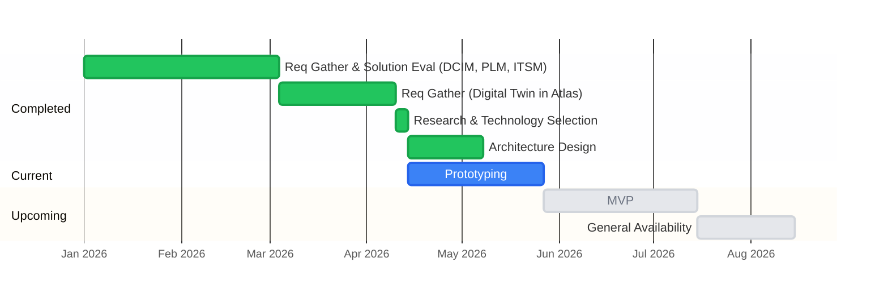

# Roadmap

## Development Timeline

```mermaid
%%{init: {'theme': 'base', 'themeVariables': {'doneTaskBkgColor': '#22c55e', 'doneTaskBorderColor': '#16a34a', 'activeTaskBkgColor': '#3b82f6', 'activeTaskBorderColor': '#2563eb', 'taskBkgColor': '#e5e7eb', 'taskBorderColor': '#d1d5db', 'taskTextColor': '#6b7280', 'taskTextDarkColor': '#fff'}}}%%
gantt
    dateFormat YYYY-MM-DD
    axisFormat %b %Y

    Section Completed
    Req Gather & Solution Eval (DCIM, PLM, ITSM)    :done, 2026-01-01, 2026-03-04
    Req Gather (Digital Twin in Atlas)              :done, 2026-03-04, 2026-04-10
    Research & Technology Selection                 :done, 2026-04-10, 2026-04-14
    Architecture Design                             :done, 2026-04-14, 2026-05-08

    Section Current
    Prototyping                   :active, 2026-04-14, 2026-05-27

    Section Upcoming
    MVP                           :2026-05-27, 2026-07-15
    General Availability          :2026-07-15, 2026-08-15
```

**Note:** All future dates are subject to change.

---

## Recent accomplishments

One line per day, newest first. Capability-level summary; implementation detail is in commit history.

- **2026-06-15** — Divergence model simplified: removed `propagated_at` tracking end-to-end (schema column, ingester loop closure, `?propagated` API filter, PATCH-for-recovery endpoint, "pending propagation" UI badge, cb-bundler's `propagated=false` filter); resolution rows now bound 1:1 with active entries — ingester deletes both together on loop closure; re-overriding after Reject creates a fresh divergence with no inherited state (closes the "rejected (pending propagation)" stuck-row bug). cb-controller release-on-omit: full-release case (all server claims released) now drops the `f:spec` claim too by omitting `spec` from the release Apply when newSpec is empty — `local:admin` disappears from `managedFields` entirely. Orb status page: hydrates `lastImport` from import-history.json at startup (no more "—" after restart); "New version available" notice moved above status grid with link to `/import` (not direct trigger). Orb layers-modal: per-layer Dispatch column showing status code + consumer name. Orbital signed-artifacts: Reload button uses canonical skeleton + min-delay refresh pattern. Integration test suite restored: four build breaks fixed (`h.Accept`→`PutResolution`, `handler.NewOCI` signature, DC seed `version` field, stale skip comment); new `TestList_ActionFilter_PartitionsIgnoreFromAcceptReject` pins the cb-bundler contract that Ignore rows never leak into accept|reject results. ROADMAP gains post-MVP "Divergence observation audit (forensics)" entry — soft-delete path for "in March, rack 3 went into a bad state — what did we see and when?"
- **2026-06-14** — Divergence MVP closed end-to-end. **MVCC**: `ConfigItem.version: Int!` with server-side auto-increment in GraphQL proxy (proxy injects `set.version = before+1` on update; `version: 1` on add; explicit caller values preserved); `ifVersion` is opt-in race detection; orb (read-only DGraph) stamps `intended_at_version` into each report at intake — orbital no longer post-hoc queries DGraph at ingest; two-layer stale detection (version-primary, value-fallback) in divergence-reports UI; admin `DELETE /api/v1/divergences/:id` dismisses stale rows with `dismissDivergence` audit; REST flattened to 5 endpoints under `/api/v1/divergences`; seed backfilled `version: 1` across ~1900 entities. **cb-controller rewrite**: single `POST /dispatch` (content-routed), per-CR ConfigMap for mapping (auto-GC'd via OwnerReference), event-driven debounced reporter (5s default, env-configurable), content-hash dedup — cb session shipped Phase 1. **Producer attribution**: orbital writes `com.armada.orbital.producer` per-layer OCI annotation at push time; `ORBITAL_BUNDLER_URLS` extended to `name=url` (e.g. `configbundle-bundler=…`); orb reads annotation into `LayerRecord.Producer`; both orb and orbital UIs show producer label, "(unannotated)" fallback for legacy. **Consumer-centric `ORB_CONSUMERS`**: `{name, url}` instead of `{mediaType, url}`; broadcast dispatch with `Content-Type` header; consumer-side routing; 415 collapsing; deterministic layer ordering (manifest before mapping). **Orb resilience**: 4-attempt 409 retry on dispatch covers async-CR-apply race; `/divergence` refresh button with skeleton + 500ms min-delay. **Orbital UX**: publish modal progress stepper (Bundling → Pushing → Signing → result) via 200ms HTMX polling on artifact status; edit-modal errors now a prominent Bulma notification + path-aware GraphQL error formatting; `gqlSurfaceErrors`/`gqlErrorMessage` helper for read-only query failures (silent-no-data → visible toast). **Hygiene**: REST route audit-log moved under `/api/v1` group; conventional `DELETE /api/v1/config-items/:type/:id` shape + Swagger annotations; orb's `/divergence` HX-Request fragment endpoint; `make e2e-divergence` covers the whole pipeline; six done plan docs deleted; `feedback_orb_vs_orbital_vocabulary` memory superseded by producer-annotation model. **Audit pipeline generalization**: `extractOperations` now scans mutation body only (operation-name no longer matched as a phantom op) — fixes `addIdracSettings` co-logged with `UpdateIdracSettings`; before-fetch is now generic (derives type from mutation body + variables) with a small `beforeFetchOverrides` map for compound/nested cases (replaces `singleEntityTypes` allowlist); `buildDiffHTML` is fully data-driven (no `resourceType` gate); divergence resolution audit details now include `intendedValue`, `overrideValue`, `typeName`; `RequireRole` returns disambiguated Forbidden messages. **UI/API gate parity**: divergence-reports `CanResolve` widened from admin-only to `RoleAtLeast(role, RoleDev)` to match the API. **Orbital UX polish**: edit-modal errors render in a Bulma notification at the bottom of the modal body (visible without scroll) + idrac-only edits no longer declare orphan `$updatedBy`/`$updatedAt`; divergence resolution submit banner is now persistent and failed rows are marked red inline with the error in a tooltip; publish modal stepper reads bundler name from `ORBITAL_BUNDLER_URLS`; navbar tagline is `[]string` rendered as two lines (`Graph-native source of truth` / `for modular data centers`) with `pr-5` on the brand when no tagline; navbar-brand `min-width: 10.5rem` removed. **Orb UX**: Test Connection button on `/divergence` (HTMX fragment via `POST /api/v1/divergence/test-connection`, reuses orbital's S3 ping pattern); import-history table joined the per-table `vertical-align: middle` override (`#import-history-table`). **cb-controller takeover release pass shipped (parallel repo)**: stale `local:admin` claims on accept- and reject-resolved fields are released via SSA-as-manager (release-on-omit; K8s "transferring ownership between managers" protocol); Ignore preserves; ADR-008; the parallel mapping-409/status-race fix that motivated the handoff was independently completed by the cb session (RetryOnConflict wrapped on consume status update, mapping ConfigMap write, and reconciler ObservedGeneration); full round-trip verified live.
- **2026-06-12** — Spike 22 divergence reporting Phases A + A.1 closed: orbital S3 poller, REST handlers, server-rendered UI with grouped expandable rows, Accept dispatches `update{Type}` mutation via GraphQL proxy. Type carried orb→orbital through mapping; `seed-divergence-s3.sh` for manual exercise. Inventory page refetches on focus. AWS SDK checksum warnings silenced (`WhenRequired`). Env var renamed `INGEST_INTERVAL` → `POLL_INTERVAL`; poller defaults on in dev (10s), AKS overlay 15s. ROADMAP slim (Gantt first; Spikes 11/14/21/22 paragraphs → Done/Remaining).
- **2026-06-11** — Spike 22 design + Phase 0: orb-as-relay transport, mapping layer keyed by bundle digest, single-call intake (orb translates internally).
- **2026-06-10** — Unified release pipeline (single Dockerfile, image-based `make release-check`); CLI renamed `orbital-cli` → `orbctl`; AKS-dev cookie unblocked over HTTP; dev-only test backends removed; edge sim self-contained.
- **2026-06-09** — Spike 20 schema versioning done (manifest, restore-mismatch 409); Spike 14 progress (orb `//go:embed`, `SubprocessBackend`); GraphQL moved to `/graphql`; security S.4 + S.6 fixed.
- **2026-06-08** — Edge sim landed (orb DGraph + local Zot mirror of ACR); HTMX publish modal; CLI distributed via Homebrew.
- **2026-06-07** — Enricher renamed → bundler; per-component versioning (`v*`, `cli/v*`, `orb/v*`).
- **2026-06-05** — Spike 11 authorization done (readonly / dev / admin roles, users page); backup scheduler simplified to single cron env var.
- **2026-06-04** — Device-code SSO for the CLI; Kustomize overlays.
- **2026-06-02** — Audit categories aligned to CloudTrail; local `SubprocessRestoreBackend`; export API on `orbId`; canonical `actorFromContext`.
- **2026-05-27** — Subgraph import from Zot landed.
- **2026-05-24** — ConfigBundle integration contract; divergence report store.
- **2026-05-21** — Orb UI shipped.
- **2026-05-20** — Integration + e2e test foundations.
- **2026-05-18** — Spike 8 AKS dev environment fully operational.

---

## Spikes

Each spike is a question to answer. Results define the MVP.

| # | Spike | Key Question | Owner | Status | Open items |
|---|---|---|---|---|---|
| 1 | AKS deployment validation | Can we deploy orbital and DGraph on AKS and reach a working baseline? | Daniel | ✅ Done (4/20) | |
| 2 | Orb CLI structure | What is the right command structure for the orb binary? | Daniel | ✅ Done (4/22) | |
| 3 | PostgreSQL / ent data model | What is the right schema for orbital's operational data? | Daniel | ✅ Done (5/5) | |
| 4 | Web UI | Can we build the orbital management UI with HTMX and Go templates? | Daniel | ✅ Done (5/6) | |
| 5 | Authentication | How do we implement OIDC + local auth in orbital? | Daniel | ✅ Done (5/8) | |
| 6 | DGraph backup to S3 | What is the right DGraph backup strategy, including deduplication and retention? | Daniel | ✅ Done (5/9) | Dedup dropped — DGraph exports non-byte-deterministic; count-based retention only. Schedule simplified 2026-06-08: `backup_schedules` table + `GetSchedule`/`UpdateSchedule` endpoints + UI toggle dropped; `ORBITAL_BACKUP_SCHEDULE` env var is now the single source of truth for the cron spec, catch-up derives from `backup_jobs` history |
| 7 | DGraph restore from backup | How do we restore DGraph from a known-good backup? | Daniel | ✅ Done (5/14) | |
| 8 | AKS dev environment | Do we have a working, repeatable AKS dev deployment to prototype against? | Daniel | ✅ Done (5/18) | |
| 9 | Seed iDRAC and storage devices | Does the schema cover all iDRAC and storage fields we need? | Daniel | ✅ Done (5/15) | |
| 9b | Valkey cache-aside | What is the right caching strategy for read-heavy graph queries, and does orbital degrade correctly without it? | Daniel | Not started | |
| 10 | Air-gap sync round-trip | Does orbital's config export work as a complete, importable payload for orb? | — | ✅ Done | Orb loads `json.gz` into local DGraph and serves offline |
| 11 | Authorization | How do we restrict mutations to authorized roles? | — | ✅ Done (6/5) | Three-role system `readonly < dev < admin` (default readonly); `ORBITAL_ADMIN_EMAILS` bootstrap; `RequireRole` / `RequireAdmin` middleware; mutations require dev+; `/users` admin UI with last-admin guard; readonly UI gating. GraphQL endpoint consolidated to single authenticated `/graphql` (2026-06-09). Azure AD App Roles deferred. See `docs/reference/AUTH.md`. |
| 12 | Orb import API | What is the right mechanism for orb to pull a signed OCI subgraph from a registry and load it into local DGraph? | — | ✅ Done | OCI puller (oras-go v2), cosign verify, `dgraph live` subprocess, polling loop; full consumer dispatch pipeline on both `triggerImport` (OCI tag path) and `importArtifact` (direct upload) — both dispatch `ExtraLayers` to `ORB_CONSUMERS`; import history: reverse-chronological, friendly layer labels (`mediaTypeLabel`), dispatch errors in Error column, `ORB_DEV` hot-reload |
| 13 | Divergence reports (orb intake) | How does orb accept and relay divergence reports from edge components? | Daniel | ✅ Done (5/24) | `POST /api/v1/divergence` replaces pending set; `POST /api/v1/divergence/publish` writes snapshot to S3 |
| 14 | Orb deployment model | What does orb look like deployed at the edge — topology, runtime deps, air-gap constraints? | — | In progress | **Done:** local edge sim (orb DGraph + Zot ACR mirror); orb Dockerfile (unified single Dockerfile, two targets, dgraph binary baked in); orb `//go:embed` templates+static; `SubprocessBackend` replaces idle-pod `K8sBackend`; orbital `/healthz` readiness probe; `make release-check` orchestrator; kustomize overlays canonical. **Remaining:** Helm chart for orb; NetworkPolicy manifest (default-deny + allow cb-controller/cb-agent/kube-system). |
| 15 | Orb API surface & authN/Z | What endpoints does orb expose locally, who calls them, and what is the consumer auth model? | — | ✅ Decided (6/7) | MVP: no in-process auth; NetworkPolicy is the gate (default-deny + allow cb-controller/cb-agent/kube-system). NetworkPolicy manifest ships with Spike 14 Helm chart. Post-MVP: K8s ServiceAccount + TokenReview per-route. No HTTP Basic, no OIDC at the edge. See `docs/reference/ORB.md §Auth`. |
| 16 | Orb UI | Can orbital and orb share a template infrastructure while serving different nav and capability surfaces? | — | ✅ Done (5/24) | |
| 17 | ES module split of app.js | Can we split the JS monolith into per-feature ES modules with zero build step? | — | ✅ Done (6/6) | `app.js` deleted; `shared.js` + `orbital.js` + `orb.js` ES modules; conditional loading via `{{.UI.AppName}}` in `head.gohtml`; `window.*` bridge for `onclick` handlers; web dir cleanup: dead templates, dead static assets, `datatables/` rename |
| 18 | ConfigBundle bundler integration | How does orbital support downstream consumers adding layers to its OCI artifact before publish? | Daniel | ✅ Done (5/26) | Per-request bundler URLs in publish body (`bundlers` field); all-or-nothing before push; `enriched`/`bundler_error` on RegistryArtifact; retryable HTTP + size cap; Enriched column in UI; bundler unit tests; integration contract: `docs/configbundle-integration.md` — ConfigBundle implementation is in its own repo; `internal/bundler/` package (`ORBITAL_BUNDLER_TIMEOUT/MAX_ATTEMPTS/MAX_RESPONSE_BYTES`) |
| 19 | `orb scan` — Infrastructure Scanner | How does an operator seed orbital with real iDRAC/storage config from a Galleon without manual transcription? | Daniel | Post-MVP | CLI-only, stateless, operator-invoked. Scans Redfish endpoints on management LAN → GraphQL upsert mutations → human review → pipe to orbital GraphQL API. Output identical in structure to seed files. Never auto-imports. `internal/discovery/redfish/`, `internal/cli/scan/`. `internal/orb/` (server) must never import from these packages. |
| 20 | DGraph schema versioning + backup manifest | How do operators identify which schema version a backup was taken against, and confidently use drop+live load as a planned migration tool? | Daniel | ✅ Done (6/9) | `schema/VERSION` file (`v1`); backup filename `orbital-schema-v1-binary-vX-timestamp.zip`; `manifest.json` inside zip (`manifestVersion`, `createdAt`, `orbitalVersion`, `schemaVersion`); `schema_version` + `binary_version` on `backup` ent record; restore trigger returns 409 + `requiresConfirmation: true` on schema mismatch, accepts `confirmSchemaMismatch: true` to override; backup selector shows `[v1]` badge + client-side mismatch hint; schema version shown on restore page. CI predicate check deferred (no CI pipeline yet). |
| 22 | Divergence reporting end-to-end | How do field-level edge overrides surface to cloud admins, with cb-controller producing reports and orbital ingesting/resolving them? | Daniel | Phases 0+A+A.1 done; Phase B blocking | **Done:** Phase 0 (orb mapping + intake); Phase A (orbital ingestion, REST, server-rendered UI with grouped/expandable rows, MinIO integration test); Phase A.1 (Accept dispatches `update{Type}` mutation via GraphQL proxy, resolution recorded only on success). **Remaining:** Phase B in configbundle repo (cb-bundler emits `mapping.json` layer, Divergence Reporter ctrl.Runnable, `spec.takeover[]` consumption); Phase C cross-repo E2E test; Ed25519 signing deferred post-MVP. Design context: `docs/reference/SDD-CONTEXT.md §12`. |
| 21 | Observability / Monitoring integration | How does orbital produce traces, logs, and metrics into the AKS cluster's existing OTel + Mimir + Loki stack without coupling code to backends? | — | In progress (partial) | **Done:** HTTP access logs aligned to OTel HTTP server semantic conventions in orbital + orb (2026-06-09). **Remaining:** OTel SDK init, trace middleware, slog→OTel log bridge, export-pipeline spans, ServiceMonitor manifest. Design + implementation plan in `docs/decisions/008-observability.md` and `docs/findings/monitoring-stack.md`. Open: Loki tenant ID (ask platform), ServiceMonitor namespace selector. |
| 23 | Audit existing tests for value | Which tests in the repo guard real regressions vs which are theater that should be deleted? | — | Not started | Walk every `*_test.go` and Playwright spec. For each, name the regression class it catches in one sentence. Classify: **KEEP** (specific regression guard, security-critical, edge cases on pure functions, persistence round-trip); **DROP** (tautological — asserts the function returns what we just made it return; duplicates visual validation the operator does in the UI; integration tests that don't currently run due to unrelated build breaks; assertions that mostly test stdlib behavior like template parsing). Output: delete list + one-line justification each. Calibration baseline is the new test rules in CLAUDE.md (Working Style section). Triggered by 2026-06-13 session: writing tests reflexively for every behavioral change without naming the regression they guard. |
| 24 | Divergence MVCC + storage split (rejected DGraph move) | Close the report→resolve race condition by capturing ConfigItem version at intake and checking at Accept. Storage stays in PostgreSQL. | Daniel | ✅ Done (2026-06-14) | **Decision settled:** divergence/resolution stay in PostgreSQL. Graph-native move was rejected — export-pipeline contamination is the killer argument (orb shouldn't receive resolutions; stripping them at export is the same vocabulary leak just relocated). MVCC shipped: `ConfigItem.version` auto-increment in GraphQL proxy, `ifVersion` opt-in race detection, orb stamps `intended_at_version` at intake. Open: API unification (federated GraphQL) deferred — separate spike when the "thin proxy vs gateway" architecture question is settled. |
| — | Schema migration | Do we need automation or is a runbook sufficient? | — | ❌ Out of scope | |

---

## What We've Built

| Spike | Completed | Summary |
|---|---|---|
| orbctl distribution | Jun 9 | Homebrew tap (`danieldn-aramada/homebrew-tools`); per-component versioning (`cli/v*` tags) — see ADR-009; pure-Go build (CGo keychain removed, ~400 lines deleted from `orbauth`); silent token refresh in `GetCredentials()`; persistent `--verbose` flag for network call logging; kubectl-style `get datacenter[s]` collapse; `bin.install "orbctl"` via brew → `orbctl login -v` |
| 17 · ES module split | Jun 6 | `app.js` monolith → `shared.js` + `orbital.js` + `orb.js` ES modules; conditional loading in `head.gohtml`; `window.*` bridge for `onclick` handlers; web dir cleanup (dead templates, dead static assets, `v2/` → `datatables/`) |
| 11 · Authorization | Jun 5 | Three-role system (`readonly/dev/admin`); `RequireRole` middleware; `/users` admin UI (server-side, button group R/D/A, last-admin guard); readonly UI gating (`CanMutate`+`AdminEmails` on layout.Base, `access-required` partial); `ORBITAL_ADMIN_EMAILS` bootstrap; device code auto-open (`verification_uri_complete`); `ORBITAL_OIDC_DEVICE_CODE` default `true` |
| 1 · AKS deployment | Apr 20 | Orbital + DGraph on AKS, NetworkPolicy, pod recovery validated |
| 2 · Orb CLI | Apr 22 | Single binary: `orb start` subcommand (long-running edge service) |
| 3 · PostgreSQL schema | May 5 | 9 ent tables: users, orbs, namespaces, jobs, audit log, OCI artifacts |
| 4 · Web UI | Apr 20 – May 14 | Data Centers tab (HTMX, inline edit, audit diff); Servers cross-DC DataTable + drill-down (iDRAC, Storage, Config Profile); Export, Backup, Restore, Audit Log, Signed Artifacts, Schema, Divergence pages; Playwright E2E suite |
| 5 · Authentication | May 8 | OIDC + local auth, CLI keychain, bearer token validation end-to-end |
| 6 · DGraph backup | May 9 | Async backup to Azure Blob/S3, count-based retention, presigned download; checksum dedup dropped (DGraph exports non-byte-deterministic) |
| Config Export + OCI Pipeline | May 9 – May 18 | 8 endpoints, scratch-based scoped export (dedicated scratch DGraph per job; live DGraph unaffected), oras-go v2 + cosign signing, air-gap safe OCI publish — orbital side complete |
| 7 · DGraph restore | May 14 | Full restore from backup via dgraph-live pod, validated on AKS |
| Audit Log System | May 5 – May 13 | GraphQL mutation interceptor, before-state capture, before/after field diff, three-source orbId extraction, per-entity audit tabs on DC and server views, ADR (`docs/decisions/001-mutation-audit-recording.md`) |
| 8 · AKS dev environment | May 18 | Deploy manifests, Helm charts, seed scripts, step-by-step deploy guide |
| 9 · Hardware Data Modeling | May 15 | 4 new iDRAC schema fields; 9 data centers modeled from real Netbox hostnames and rack topology; schema validated against live hardware |
| orbctl | May 11 | `orbctl get datacenter/datacenters`; bearer auth; macOS keychain; kubectl-style output |

*Implementation detail and dated capability log: see `## Recent accomplishments` at the top of this file.*

---

## MVP Planning

The following are not prototype questions — they are prerequisites for shipping. They will be defined in a dedicated MVP planning session, with infra team input where needed.

### Production deployment
Ingress architecture, dedicated hostnames, TLS, internal vs external load balancer. Auth/authz flows in production (OIDC issuer, token lifetimes, `ORBITAL_ADMIN_EMAILS` management; Azure AD App Roles as a future enhancement once Application Administrator access is available). Production namespace layout, resource limits, horizontal scaling. CI/CD pipeline: build, tag, push on merge to main, deploy to AKS dev on tag. (`//go:embed` for orb — done 6/9; orbital embed pending if/when needed.) Ratel access via dedicated DNS hostname with its own Istio VirtualService.

*These decisions depend on infra team input and are coupled to auth/authz and ingress architecture — not resolvable in prototype spikes alone.*

### Security & correctness hardening
Fix all critical and high security findings before any staging or production exposure. Full findings and fix order: `docs/findings/security-and-deployment-findings.md` (S.1–S.18), `docs/findings/additional-findings.md` (A.1–A.7), implementation plan: `docs/findings/maintainability.md` Phase 1.

Key items: unauthenticated `/graphql` root route, no K8s liveness/readiness probes, no CSRF on GraphQL mutations, audit actor forged by client, raw JWT logged at INFO, missing `Secure` cookie flag.

### Testing foundations
Test pyramid is substantially complete: 222 Go tests (unit + integration, `make test-unit` / `make test-integration`), 45 Playwright UI tests for orbital + orb via `make test-e2e`, and the pre-release `make release-check` flow (containers + full publish→import→restore). Remaining gaps: **CI pipeline** (GitHub Actions workflow — `.github/` exists but has no workflow files yet) and **post-deploy AKS smoke suite hookup** (`make smoke-aks` exists but currently shallow — could be expanded to run the read-only Playwright projects against the AKS deployment). DGraph client abstraction (T.1 in `docs/testing-strategy.md`) is a tech debt item, not a testing blocker.

### Performance, cost & observability
Benchmark DGraph query latency under realistic load, produce AKS node SKU cost estimate. Add Prometheus metrics endpoint, DGraph alpha scraping, Grafana dashboard, and at least one alert for error rate or memory pressure. Valkey cache-aside is post-MVP (Spike 9b) — baseline performance first.

---

## MVP Definition

> Working draft — final scope confirmed once prototype spikes complete.

### Orbital (cloud)
- ✅ GraphQL Topology API — proxy DGraph with auth and caching
- ✅ Export API — scoped `json.gz` + `schema.gz` per data center
- ✅ Backup and restore — DGraph full snapshots to Azure Blob, restore via UI; schema-versioned filenames + manifest.json (Spike 20)
- ✅ Audit log — all config mutations with actor, before/after diff
- ✅ OCI publish — signed artifacts to configured registry
- ✅ Authorization — three-role system (`readonly/dev/admin`), `ORBITAL_ADMIN_EMAILS` bootstrap, `RequireRole` middleware, admin users page, readonly UI gating (Spike 11)
- 🔲 Orb registry — register, authenticate, and revoke orbs *(post-MVP: revisit when orb onboarding is scoped)*
- ✅ Security hardening — critical/high items (S.1 Spike 11, S.2 fixed 2026-06-09, S.3 not a real finding, S.4/S.6 fixed 2026-06-09, S.5 already gone, S.13 Spike 11)
- ✅ `namespaceID` index on `ConfigItem` — `namespaceID: String! @search(by: [exact])` on the interface, backfilled, enforced at application layer on all add mutations.

### Orb (edge)
- ✅ CLI structure — `orb start` (long-running edge service)
- ✅ Local DGraph — holds intended state; served offline via orb UI
- ✅ Config import — `/import/subgraph` (direct zip) and `/import/artifact` (full OCI pipeline with consumer dispatch)
- ✅ Divergence reporting — `POST /api/v1/divergence` intake; `POST /api/v1/divergence/publish` to S3
- ✅ `//go:embed` for templates and static assets — self-contained binary for air-gap edge deployment (Spike 14, 6/9)
- ✅ K8s execution model — `SubprocessBackend` runs `dgraph live` inside the orb pod; no idle pod, no shared PVC (Spike 14, 6/9)
- ⬜ Deployment packaging — Helm chart, NetworkPolicy, orb Dockerfile with dgraph binary (Spike 14 remaining)
- ✅ API surface & authN/Z — NetworkPolicy is the gate; no in-process auth at MVP (Spike 15 decided 6/7)

### Explicitly out of scope for v1
- Network infrastructure config items (owned externally)
- PLM and ITSM integrations — vendor selection in progress
- Multi-DGraph instance per data center
- PostgreSQL backup and restore — handled out-of-band by managed PostgreSQL (Azure)

---

## Post-MVP Enhancements

| Item | Notes |
|---|---|
| SDL syntax highlighting on Schema page | Replace plain `<pre>` with Prism.js `language-graphql` highlighting on both orbital and orb schema pages. Requires downloading and serving Prism JS + CSS as static assets (we self-host all assets — no CDN). ~30 min once asset serving is scoped. |
| `orb scan` — Infrastructure Scanner (Spike 19) | Operator-invoked CLI subcommand. Scans iDRAC/Redfish endpoints on Galleon management LAN → emits JSON-wrapped GraphQL upsert mutations (identical structure to seed files) → operator reviews → pipes to orbital GraphQL API. Never auto-imports. `internal/discovery/redfish/`, `internal/cli/scan/`. |
| Divergence observation audit (forensics) | Today the ingester hard-deletes `DivergenceEntry` rows on loop closure, so "in March, rack 3 went into a bad state — what did we see and when?" is unanswerable. Action audit (who decided what) is covered by `DivergenceResolution` + `Event` log; observation audit (what value we saw, claimant, first-seen → closed-at) is not. **Order of work:** (1) check the resolution Event payload — if it snapshots `current_value`/`intent_value`/`claimant`, the gap shrinks to "heartbeat history only"; (2) if richer history is needed, soft-delete `DivergenceEntry` via a `closed_at` column (keep queries on one table, add index for cheap pruning); (3) defer retention/TTL until size becomes a real problem — instrument first. Avoid a parallel history table — schema sprawl without payoff. |
| Migrate password hashing to Argon2id | Current: bcrypt (sound, not broken). Argon2id is OWASP's current first recommendation — adds memory-hardness on top of time-hardness, making GPU/ASIC offline attacks significantly more expensive. `golang.org/x/crypto/argon2` is already an indirect dependency. Requires a migration path for existing bcrypt hashes (detect by hash prefix on login, re-hash on successful verify). |

---

## Technical Debt

| Item | Notes |
|---|---|
| `//go:embed` for orb templates and static assets | Orb reads templates from disk at runtime. Replace with `//go:embed` for a self-contained binary — required for air-gap edge deployment. Orbital (containerized AKS) does not need this. Scoped to Spike 14. |
| DGraph client abstraction | 22+ raw `http.Post` calls across 7 handler files, no timeouts, no pooling. Extract `internal/dgraph/client.go`. Prerequisite for testing. See `docs/findings/maintainability.md` item 2.1. |
| `internal/handler/` god package | 3,560 lines mixing HTTP, business logic, DGraph calls, file I/O. Decompose post-MVP. See `docs/findings/maintainability.md` item 5.4. |
| ~~`web/static/app.js` monolith~~ | ✅ Done (Spike 17, Jun 6). Replaced with `shared.js` + `orbital.js` + `orb.js` ES modules. |
| ~~Export API uses DGraph UID instead of orbId~~ | ✅ Fixed 2026-06-02. `POST /api/v1/export` now accepts `{"orbId": "..."}` in the body. `fetchDCInfo` queries by orbId. UI select uses `dc.orbId`. |
| ~~Backup/restore API alignment~~ | ✅ Fixed 2026-06-02. Routes renamed to match export convention: `POST /api/v1/backup`, `GET /api/v1/backup/jobs`, `GET /api/v1/backup/jobs/:jobId`, `GET /api/v1/backup/jobs/:jobId/download`, `DELETE /api/v1/backup/jobs/:jobId`, `POST /api/v1/backup/test-connection`, `POST /api/v1/restore`, `GET /api/v1/restore/jobs`, `GET /api/v1/restore/jobs/:jobId`. |
| No delete button for export jobs in UI | `DELETE /api/v1/export/jobs/:jobId` exists but is API-only. Add a delete (trash) button to each row in the export jobs table on the Export page. |
| Name every client-originated GraphQL operation | Spike-worthy follow-up. Anonymous shorthand queries (`{ queryFoo { ... } }`) leave `graphql.operation.name` empty in access logs, defeating per-operation observability/cost attribution. Three web queries fixed 2026-06-15 (`LoadInventory`/`LoadDataCenters`/`LoadServers`); orbctl still has ~5 anonymous `query($ns: String!) { ... }` sites in `internal/orbctl/get_configitem.go`, `get_server.go`, `get_dc.go`. Sweep them and add a lint/test that fails CI on any client `query`/`mutation` literal lacking an operation name. Follows GraphQL community convention (Apollo, GitHub, Hasura all recommend named operations). |
| Quick wins (independent, any time) | `docs/findings/maintainability.md` items 3.1–3.7, 4.1, 4.2, 4.4 — none are blocking, all improve correctness or reduce duplication. |

---

## External Integration Dependencies

| System | Role | Status |
|---|---|---|
| **Atlas UI** | Digital twin — queries orbital via GraphQL to visualize topology | Integration approach defined |
| **PLM** | Bill of materials for hardware — orbital may query to enrich config items | Vendor evaluation in progress |
| **ITSM** | Links support tickets to config changes | Vendor evaluation in progress |
