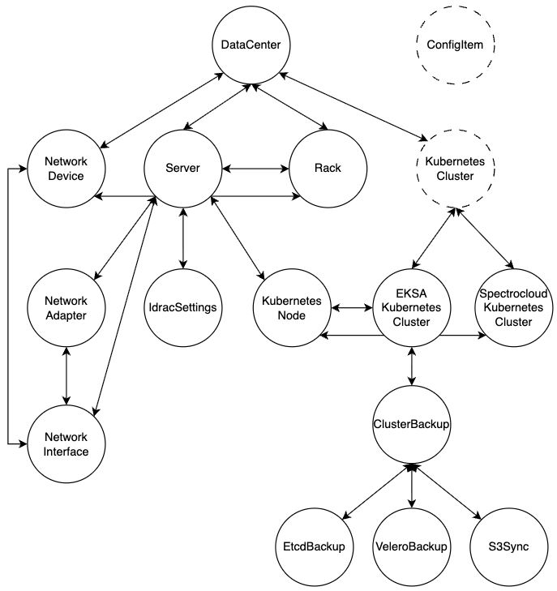

# Orbital API Cheatsheet

Copy-paste GraphQL + REST for backend services talking to Orbital on **AKS dev** (external-jwt mode). Deeper context lives in `docs/reference/`.

## Setup

- Base URL (AKS dev): `http://ilb.devnew.armada.internal/orbital`
  - GraphQL: `/graphql`
  - REST: `/api/v1`
  - Swagger — authoritative reference for every REST endpoint's params (types, required/optional): `$ORBITAL_URL/swagger/index.html`
- `orbId` = `namespace:name` — the stable key (don't cache DGraph UIDs)
- Auth: every request needs `Authorization: Bearer <token>`
  - AEP / Keycloak: forward the user's bearer token

```bash
export ORBITAL_URL=http://ilb.devnew.armada.internal/orbital
export TOKEN=<your bearer token>

# smoke test — lists data centers; confirms your token + connectivity
curl -s -X POST $ORBITAL_URL/graphql -H "Authorization: Bearer $TOKEN" -H "Content-Type: application/json" \
-d '{"query":"query { queryDataCenter { orbId name } }"}' | jq .
```

**Reads** send only `query`. **Mutations** send two fields — `query` **and** `variables`: the `query` holds the operation with `$orbId`/`$set` placeholders; `variables` holds the values. Always put `orbId` (and the `set` payload) in **`variables`**, never inline in the query. A single-entity `update{Kind}` with an inline `orbId` or `set` is **rejected with `400 VARIABLE_FORM_REQUIRED`** — orbital stamps `version`/`updatedAt`/`updatedBy` into a variable `set` resolved via a variable `orbId`, and can't do that against inline literals. Reads with inline filters are fine.

The `-d` body is JSON and may span multiple lines for readability — only the `query` string stays on one line. A mutation's returned entity confirms the write: the server stamps `updatedAt`/`updatedBy` (**no milliseconds**) and bumps `version`.

---

## Example schema 

Focused on iDRAC settings and backup config, not the full schema.

<p align="center"></p>

## Data centers

### Look up a data center by asset ID
```graphql
query { queryDataCenter(filter: { assetDataV2: { regexp: "/<asset_id>/" } }) { orbId name assetDataV2 } }
```

## Servers

### List servers in a data center
```graphql
query {
  getDataCenter(orbId: "houston:houston-galleon") {
    servers { orbId name hostname model serviceTag rackPosition }
  }
}
```

### Fetch a server's iDRAC settings — by server orbId
```graphql
query {
  getServer(orbId: "houston:BB52FZ3") {
    orbId name
    idracSettings {
      orbId sshEnabled ipmiEnabled dhcpEnabled racadmEnabled
    }
  }
}
```

### Update iDRAC settings — by the `idracSettings.orbId` from the fetch above
query
```graphql
mutation UpdateIdracSettings($orbId: String!, $set: IdracSettingsPatch!) {
  updateIdracSettings(input: { filter: { orbId: { eq: $orbId } }, set: $set }) { numUids }
}
```
variables
```json
{ "orbId": "houston:BB52FZ3-idrac", "set": { "sshEnabled": false } }
```

## Clusters

### List EKSA clusters in a data center
```graphql
query {
  getDataCenter(orbId: "houston:houston-galleon") {
    kubernetesClusters {
      ... on EksaKubernetesCluster { orbId name clusterType provider }
    }
  }
}
```

### Fetch a cluster's backup config — by cluster orbId
```graphql
query {
  getEksaKubernetesCluster(orbId: "colo:dev-main") {
    backup {
      orbId
      etcd   { orbId schedule enabled location retentionDays }
      velero { orbId schedule enabled location retentionDays }
    }
  }
}
```

### Update a backup config — by the `etcd`/`velero` orbId from the fetch above
query
```graphql
mutation UpdateEtcdBackup($orbId: String!, $set: EtcdBackupPatch!) {
  updateEtcdBackup(input: { filter: { orbId: { eq: $orbId } }, set: $set }) { numUids }
}
```
variables
```json
{ "orbId": "colo:dev-main-etcd-backup", "set": { "schedule": "0 */6 * * *", "retentionDays": 7 } }
```

Example using curl
```bash
curl -s -X POST $ORBITAL_URL/graphql -H "Authorization: Bearer $TOKEN" -H "Content-Type: application/json" \
-d '{
  "query": "mutation UpdateVeleroBackup($orbId: String!, $set: VeleroBackupPatch!) { updateVeleroBackup(input: { filter: { orbId: { eq: $orbId } }, set: $set }) { numUids veleroBackup { orbId retentionDays version updatedAt updatedBy } } }",
  "variables": { "orbId": "colo:dev-main-velero-backup", "set": { "retentionDays": 14 } }
}' | jq .
```
Response
```json
{
  "data": {
    "updateVeleroBackup": {
      "numUids": 1,
      "veleroBackup": [
        {
          "orbId": "colo:dev-main-velero-backup",
          "retentionDays": 14,
          "version": 30,
          "updatedAt": "2026-07-28T19:13:50Z",
          "updatedBy": "daniel.nguyen@armada.ai"
        }
      ]
    }
  }
}
```
`updatedAt` has no milliseconds and `updatedBy` is the authenticated caller — both server-stamped (the client never sent them).

## Audit log (REST)

Every intent mutation is recorded as an immutable audit event. Read them at `GET /api/v1/audit-log` (JSON). Events are written by orbital as a side effect of the mutation.

Filter by the resource's `orbId`. For example, to see the trail for the velero backup edits:
```bash
curl -s "$ORBITAL_URL/api/v1/audit-log?orbId=colo:dev-main-velero-backup&operation_name=updateVeleroBackup&limit=50" \
  -H "Authorization: Bearer $TOKEN" | jq .
```
Example response
```json
{
  "events": [
    {
      "id": "e671bfb1-88b8-4af1-881d-9a268b39150c",
      "operations": [
        "updateVeleroBackup"
      ],
      "resourceTypes": [
        "VeleroBackup"
      ],
      "resourceIds": [
        "colo:dev-main-velero-backup"
      ],
      "actor": "admin@armada.ai",
      "timestamp": "2026-07-29T19:40:50Z",
      ... 
      "changes": [
        {
          "field": "retentionDays",
          "before": 14,
          "after": 13
        }
      ]
    }
  ],
  "total": 37
}
```

All filters are **optional** and **combinable** — omit them all for the full log (newest first)
- `orbId=colo:dev-main-velero-backup` — events touching a resource (repeatable, max 32)
- `operation_name=updateVeleroBackup` — one operation (must match a value in the event's `operations` array, e.g. `updateVeleroBackup`)
- `namespace=colo` — everything under a data center (`colo:*`)
- `since` / `until` — RFC3339 window; `limit` / `offset` — pagination (`limit` ≤ 500)

### Response shape + rendering a diff
```json
{
  "events": [
    {
      "id": "3d6bb15f-8c4c-45f0-8a6c-939b6f9cc512",
      "timestamp": "2026-07-28T19:13:50Z",
      "actor": "asharma@armada.ai",
      "operations": ["updateVeleroBackup"],
      "resourceTypes": ["VeleroBackup"],
      "resourceIds": ["colo:dev-main-velero-backup"],
      "eventCategory": "data",
      "changes": [ { "field": "retentionDays", "before": 7, "after": 15 } ],
      "details": { "operationName": "UpdateVeleroBackup", "before": { … }, "variables": { "set": { … } } }
    }
  ],
  "total": 42
}
```
Diff can be rendered via `changes`. Each entry is `{ field, before, after }` with raw typed values (numbers, bools, strings). 

`changes` is present only for a clean single-entity update. It is omitted for bulk adds, creates, and multi-operation events (which have no single before/after). Its presence is the signal — no need to inspect `operations` or `before`:

```js
if (event.changes) event.changes.forEach(c => renderRow(c.field, c.before, c.after))
else               renderSummary(event.operations, event.resourceIds)   // no field diff available
```

The raw `details` (`before` + `variables.set`) is always included if you'd rather compute the diff yourself — but `changes` already does it, matching exactly what orbital's own UI renders. 


## Export + publish a data center (REST)
```bash
# trigger (download:false = export + publish to OCI)
curl -s -X POST $ORBITAL_URL/api/v1/export -H "Authorization: Bearer $TOKEN" -H "Content-Type: application/json" \
  -d '{"orbId":"houston:houston-galleon"}'

# poll
curl -s $ORBITAL_URL/api/v1/export/jobs/<jobId> -H "Authorization: Bearer $TOKEN" | jq '{status, phase, published}'
```
