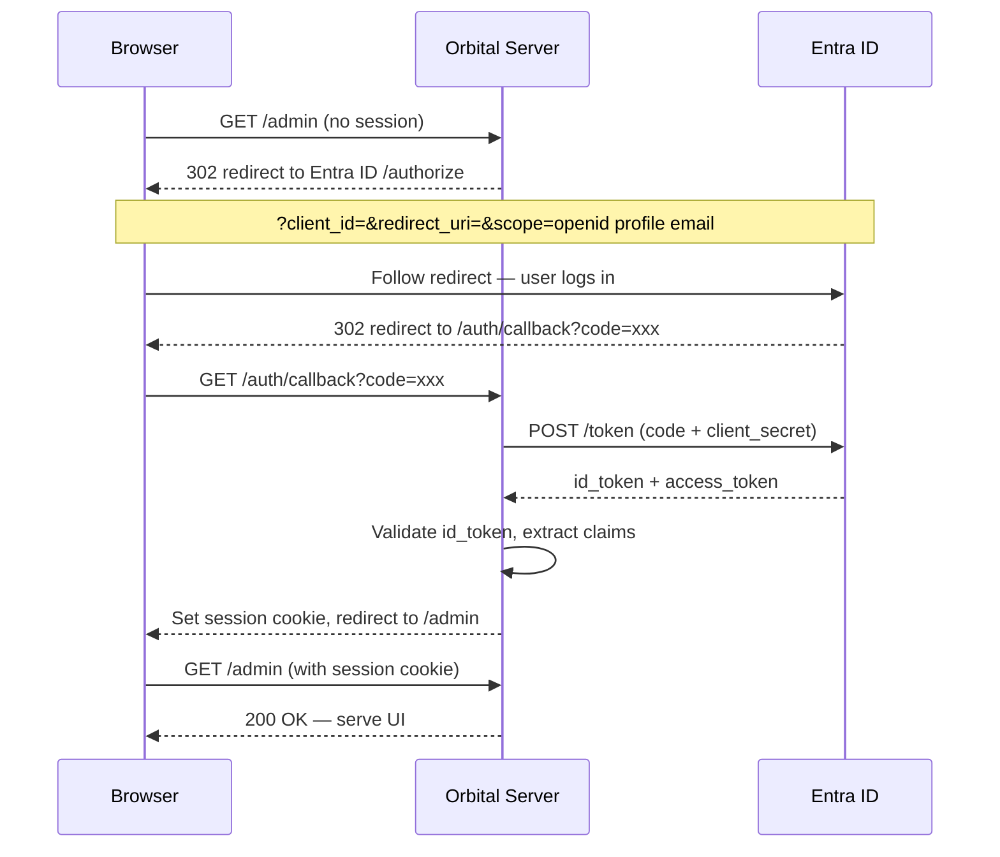
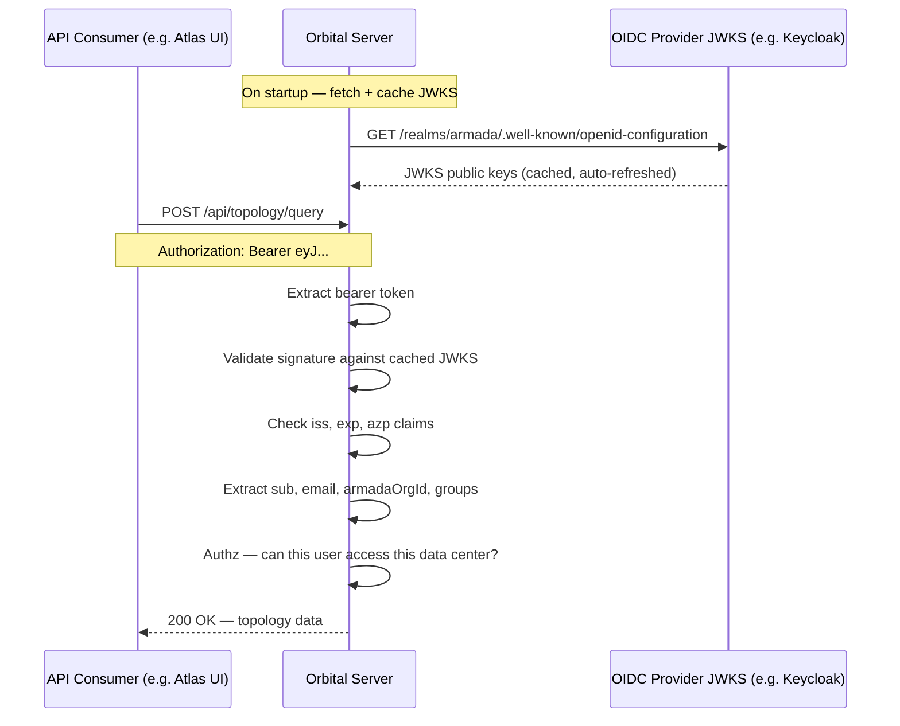
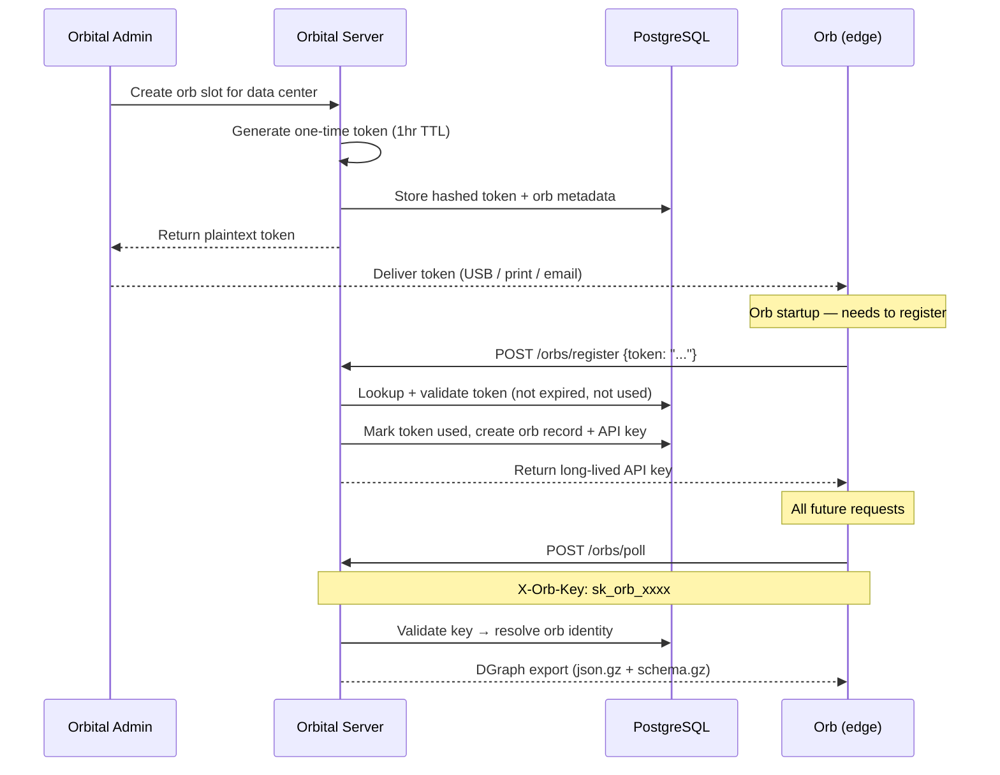

# Authentication

> **WIP** — Not yet implemented 

Orbital has three distinct authentication flows depending on the caller:

| Flow | Caller | Mechanism |
|---|---|---|
| 1 | Orbital admin UI | Entra ID OIDC — browser-based login, session cookie |
| 2 | API consumers (e.g. Atlas UI) | JWT bearer token — orbital as resource server, any OIDC-compliant IdP |
| 3 | Orb (edge service) | Long-lived opaque API key — air-gap safe, no external IdP |

---

## Flow 1: Admin UI — Entra ID OIDC

---

## Flow 2: API Consumer → Orbital API — JWT Bearer

---

## Flow 3: Orb → Orbital — Long-lived API Key

