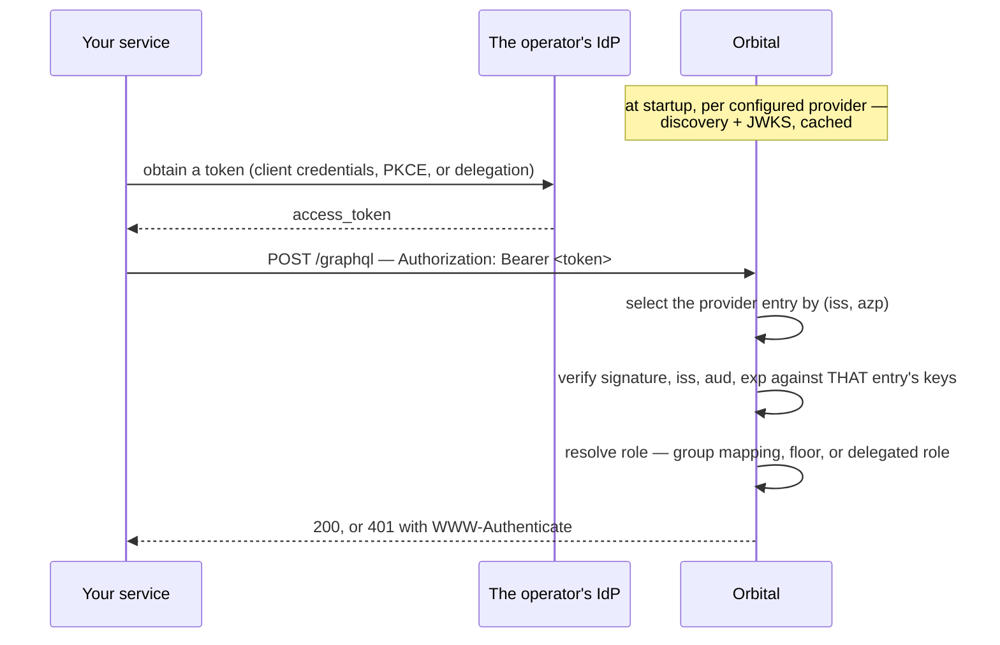

# Authenticating to Orbital

Read this before: integrating a service, script or UI with orbital's API.
The internal design lives in [`reference/AUTH.md`](reference/AUTH.md) — this
document is what an integrator needs and nothing more.

**Orbital is an OAuth resource server.** It verifies bearer tokens issued by an
identity provider its operator configured; it issues none of its own and has no
API login flow. So you do not get a token *from* orbital — you get one from the
IdP it trusts, and present it.

Orb does not authenticate to orbital at all: edge-to-cloud traffic flows through
an OCI registry and object storage, never HTTP calls into orbital.

---

## What to ask the orbital operator for

Orbital trusts a **list** of providers, each entry pinned to one
`(issuer, client)` pair. Before you can call anything, you need to know which
entry is yours:

| | Why you need it |
|---|---|
| **Issuer URL** | whose tokens orbital trusts — everything else is discovered from `<issuer>/.well-known/openid-configuration` |
| **Client id to authenticate as** | orbital matches your token's `azp` against the entry's `clientID`. **A token from an unlisted client is refused before any role logic runs** — no error will tell you which client is expected |
| **Required audience** | your token's `aud` must contain it. Keycloak's stock `aud: account` is deliberately not accepted, so the operator usually adds an audience mapper |
| **Which groups map to which role** | if your entry uses group mapping, a token carrying no mapped group is **denied**, not downgraded |

If you are a service rather than a human, say so — machine callers and
user-bearing callers are configured differently (see below).

## Getting a token

Standard OIDC against the operator's IdP. Any conformant library works; orbital
never sees the exchange, only the resulting token.

- **A service with no user behind it** — client credentials. Orbital treats it as
  an *app principal*: no user row, no group mapping, and **dev-equivalent access
  on every mutating route**. Your client id must be listed, which is the gate.
- **Your backend acting for its own users** — the operator can mark your entry as
  delegated: every valid token receives one configured role and no user row is
  created. Orbital records your client as `acting_client` on audit events, so the
  log distinguishes "your service acting as someone" from that person acting
  directly.
- **A human calling directly** — authorization code + PKCE. The role comes from
  the group claim at every sign-in.


```mermaid
sequenceDiagram
    participant C as Your service
    participant I as The operator's IdP
    participant O as Orbital

    Note over O: at startup, per configured provider —<br/>discovery + JWKS, cached
    C->>I: obtain a token (client credentials, PKCE, or delegation)
    I-->>C: access_token
    C->>O: POST /graphql — Authorization: Bearer <token>
    O->>O: select the provider entry by (iss, azp)
    O->>O: verify signature, iss, aud, exp against THAT entry's keys
    O->>O: resolve role — group mapping, floor, or delegated role
    O-->>C: 200, or 401 with WWW-Authenticate
```

Then:

```bash
curl -H "Authorization: Bearer $TOKEN" \
     -H "Content-Type: application/json" \
     -d '{"query":"{ queryNamespace { name } }"}' \
     https://<orbital-host>/graphql
```

## What you get, and what you can do with it

Roles are orbital's, never the provider's — an IdP asserts identity and group
membership, and the operator's mapping decides what that is worth.

| Role | Can |
|---|---|
| `readonly` | read everything: `GET` endpoints, GraphQL queries |
| `dev` | the above plus mutations |
| `admin` | the above plus user and policy administration |

Reads pass for any authenticated caller; mutating methods require `dev` or
above. How you get a role depends on the entry:

- **group mapping** — re-derived at every sign-in; most privileged matching group
  wins; **no match is a refusal** (`NO_ROLE_MAPPED`) unless the operator
  configured a floor.
- **a default role** — you are created with it on first call, and an admin can
  change it afterwards without the next sign-in reverting it.
- **delegated** — one fixed role for every token from your client.

A role set by a provider is read-only in orbital's UI, so ask the operator to
change the group rather than the user.

## Errors you will actually hit

| What you see | What it means |
|---|---|
| `401` + `WWW-Authenticate: Bearer error="invalid_token"` | signature, issuer, audience or expiry failed — or your `azp` matches no configured entry. Deliberately not specific: the server does not tell an unauthenticated caller what it trusts. Ask the operator to check their logs, which name the reason |
| `403` | authenticated but below the required role |
| `NO_ROLE_MAPPED` | valid token, but no group in it maps to a role |
| `IDENTITY_CONFLICT` | that email already belongs to a local account or another provider. Orbital keys users by email today, so one address cannot be shared across providers |

The full registry is in [`reference/ERROR-RESPONSES.md`](reference/ERROR-RESPONSES.md).

**Bearer callers never need a CSRF token.** Orbital requires one on
state-changing calls authenticated by *session cookie* — a cookie is attached by
the browser whether or not the user intended the call. A bearer token is not
ambient, so the requirement does not apply to you.

## The CLI

`orbctl` is **under redesign and its login flow does not work** against current
deployments — it builds Entra URLs by string concatenation, which no other
provider answers. Do not build on it. Use a bearer token as above; if you want a
CLI in the meantime, a token in a shell variable plus `curl` is the supported
path.
