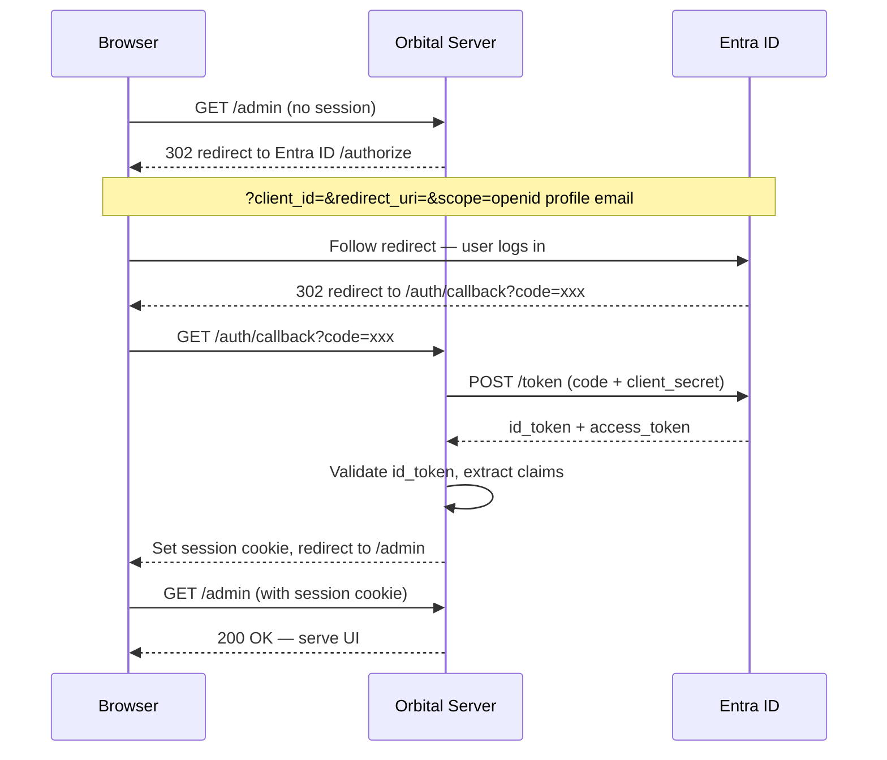
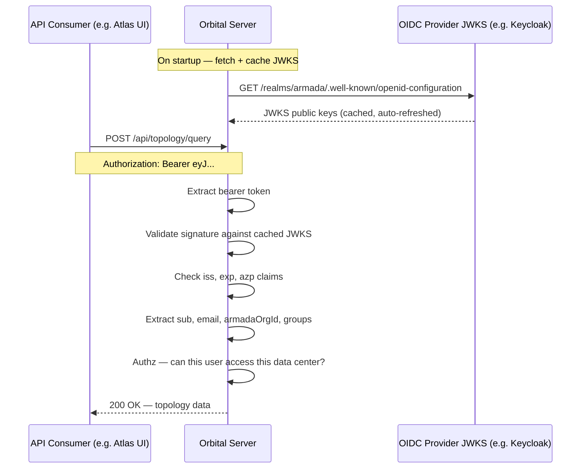

# Authentication

Orbital has two authentication flows depending on the caller:

| Flow | Caller | Mechanism |
|---|---|---|
| 1 | Orbital admin UI | Entra ID OIDC — browser-based login, session cookie |
| 2 | API consumers (services, scripts, third-party UIs) | JWT bearer token — orbital as resource server, any OIDC-compliant IdP |

Orb does not authenticate to orbital — by design, orb never calls orbital directly. Edge-to-cloud and cloud-to-edge communication flows through OCI registry and object storage, not HTTP APIs on orbital.

---

## Flow 1: Admin UI — Entra ID OIDC


```mermaid
sequenceDiagram
    participant B as Browser
    participant O as Orbital Server
    participant E as Entra ID

    B->>O: GET /admin (no session)
    O-->>B: 302 redirect to Entra ID /authorize
    Note over B,E: ?client_id=&redirect_uri=&scope=openid profile email
    B->>E: Follow redirect — user logs in
    E-->>B: 302 redirect to /auth/callback?code=xxx
    B->>O: GET /auth/callback?code=xxx
    O->>E: POST /token (code + client_secret)
    E-->>O: id_token + access_token
    O->>O: Validate id_token, extract claims
    O-->>B: Set session cookie, redirect to /admin
    B->>O: GET /admin (with session cookie)
    O-->>B: 200 OK — serve UI
```

---

## Flow 2: API Consumer → Orbital API — JWT Bearer


```mermaid
sequenceDiagram
    participant A as API Consumer (e.g. Atlas UI)
    participant O as Orbital Server
    participant K as OIDC Provider JWKS (e.g. Keycloak)

    Note over O: On startup — fetch + cache JWKS
    O->>K: GET /realms/armada/.well-known/openid-configuration
    K-->>O: JWKS public keys (cached, auto-refreshed)

    A->>O: POST /api/topology/query
    Note over A,O: Authorization: Bearer eyJ...
    O->>O: Extract bearer token
    O->>O: Validate signature against cached JWKS
    O->>O: Check iss, exp, azp claims
    O->>O: Extract sub, email, armadaOrgId, groups
    O->>O: Authz — can this user access this data center?
    O-->>A: 200 OK — topology data
```

---

## Developer quickstart — calling orbital from your own code

Two paths depending on whether you're hacking on a script or building a service.

### Install the orbital CLI (macOS)

```bash
brew tap danieldn-aramada/tools
brew install orbital
orbital --version
```

Or as a one-liner without the explicit tap step:

```bash
brew install danieldn-aramada/tools/orbital
```

Updates:

```bash
brew update
brew upgrade orbital
```

### Path A — ad-hoc curl / scripting

Use the CLI to get an access token via PKCE. One interactive login; pass `-v` to print the token as an exportable shell variable.

```bash
# One-time interactive login (opens browser, redirects to localhost)
orbital login -v

# Output ends with:
#   export ORBITAL_TOKEN=eyJ0eXAiOi...
# Paste that line into your shell, then:

curl -H "Authorization: Bearer $ORBITAL_TOKEN" \
     -H "Content-Type: application/json" \
     -d '{"query":"{ queryNamespace { name } }"}' \
     https://<orbital-host>/api/v1/graphql
```

Even faster — eval directly so `ORBITAL_TOKEN` is set in your current shell:

```bash
eval "$(orbital login -v | grep '^  export ')"
```

Access tokens last ~1 hour. If you keep working through `orbital`'s own subcommands (`orbital get`, `orbital patch`, …), expiry is invisible — they silently refresh from your cached refresh token. The only case where you re-run `orbital login -v` is when you've copied the raw token into a shell variable (or another tool) and that copy has gone stale. Refresh tokens last ~90 days idle; until then `orbital login -v` returns silently without re-opening the browser.

Fine for poking, scripting, demos. Not for long-running services — see Path B for the MSAL-based pattern that handles refresh inside your own service.

### Path B — long-running service

Register your own Entra ID (Azure AD) App Registration, then use MSAL (or any OIDC library — every language has one). MSAL caches and refreshes tokens internally; your code never checks expiry.

| Language | Library |
|---|---|
| Go     | `github.com/AzureAD/microsoft-authentication-library-for-go` |
| Node   | `@azure/msal-node` |
| Python | `msal` |
| .NET   | `Microsoft.Identity.Client` |
| Java   | `com.microsoft.azure:msal4j` |

**Configuration values to request from the orbital team:**

```
Tenant ID:         <Entra ID tenant GUID>
Orbital client ID: <orbital app client GUID>
Scope:             api://<orbital-client-id>/user_impersonation
                   (fallback: api://<orbital-client-id>/.default)
API endpoint:      https://<orbital-host>/api/v1/graphql
Auth header:       Authorization: Bearer <access_token>
```

**Go example (On-Behalf-Of — frontend → your backend → orbital):**

```go
import (
    "context"
    "net/http"
    "strings"
    "github.com/AzureAD/microsoft-authentication-library-for-go/apps/confidential"
)

func NewOrbitalClient(tenantID, clientID, clientSecret, orbitalClientID string) (confidential.Client, string, error) {
    cred, err := confidential.NewCredFromSecret(clientSecret)
    if err != nil {
        return confidential.Client{}, "", err
    }
    app, err := confidential.New(
        "https://login.microsoftonline.com/"+tenantID,
        clientID,
        cred,
    )
    return app, "api://" + orbitalClientID + "/user_impersonation", err
}

func CallOrbital(ctx context.Context, app confidential.Client, scope, inboundUserToken, baseURL, query string) (*http.Response, error) {
    // MSAL caches + refreshes automatically — call this on every request.
    result, err := app.AcquireTokenOnBehalfOf(ctx, inboundUserToken, []string{scope})
    if err != nil {
        return nil, err
    }
    req, _ := http.NewRequestWithContext(ctx, "POST", baseURL+"/api/v1/graphql", strings.NewReader(query))
    req.Header.Set("Authorization", "Bearer "+result.AccessToken)
    req.Header.Set("Content-Type", "application/json")
    return http.DefaultClient.Do(req)
}
```

Notice what's not there: no expiry check, no manual refresh, no token storage. `AcquireTokenOnBehalfOf` does all of it. For persistence across restarts, implement `cache.ExportReplace` and pass it as `confidential.WithCache(...)` — one extra option, no other code changes.

**First call provisions you in orbital's user table as `readonly`.** Mutating calls (POST/PUT/PATCH/DELETE) require `dev` or `admin` — ask an orbital admin to promote your account via `/users` after your first sign-in.
