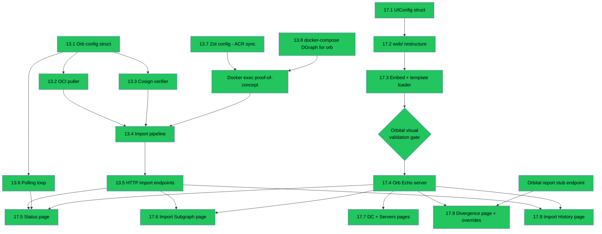

# Spike 13 + 17 — Execution Guide

**Read before starting any session:** `docs/claude/SPIKE_13_17_PLAN.md` contains the full design, OCI naming convention, API contracts, data structures, and known implementation risks. This document is the *execution wrapper* — session boundaries, entry/exit criteria, and handoff notes.

---

## Dependency Graph



---

## Sessions

### Session A — Spike 13 Foundations
**Touches existing orbital code:** No. All new files.

**Entry criteria:** None. Start immediately.

**Read first:** `docs/claude/SPIKE_13_17_PLAN.md` — Tasks 13.1, 13.2, 13.3, 13.7, 13.8 and Known Implementation Risks 2 (cosign API) and 1 (docker exec — read it but don't implement yet, that's Session B).

**Tasks in order:**

1. **13.8** — Add to `deploy/local/docker-compose.yml`:
   - `dgraph-orb-zero` service: image `dgraph/dgraph:latest`, ports `5082:5080` (HTTP) `6082:6080` (gRPC), command `dgraph zero --my=dgraph-orb-zero:5080`
   - `dgraph-orb-alpha` service: ports `8082:8080` (HTTP/GraphQL) `9082:9080` (gRPC), depends on `dgraph-orb-zero`
   - Named volume `orb-import-scratch` mounted at `/tmp/orb-import` on `dgraph-orb-alpha`
   - `orb` service: `build: .` (or `image: orbital:local`), mounts `docker.sock` at `/var/run/docker.sock`, mounts `orb-import-scratch` at `/tmp/orb-import`, env vars from `ORB_*` prefix
   - Add `Makefile` target `run-orb` that starts the orb service

2. **13.7** — Update `deploy/local/zot-config.json`:
   - Add `extensions.sync` block with ACR as upstream, `onDemand: false`, `syncInterval: "30s"` (check Zot v2 docs for exact field name — may be `interval` not `syncInterval`)
   - Add `deploy/local/zot-credentials.json` (gitignored): `{"armadaeksatest.azurecr.io": {"username": "armadaeksatest", "password": ""}}`
   - Mount credentials file into Zot container in docker-compose
   - Document in `deploy/local/README.md` (or existing deploy guide) that `zot-credentials.json` must be populated before running

3. **13.1** — Create `internal/orbconfig/config.go` with the struct defined in SPIKE_13_17_PLAN.md. Use `github.com/kelseyhightower/envconfig` (already a dependency). Include `New() (*Config, error)` constructor.

4. **13.2** — Create `internal/oci/puller.go`. Implement `ListTags` and `Pull` using `oras-go/v2` (already a dependency). Follow the `newRepo()` pattern from `publisher.go` exactly — same auth and `PlainHTTP` handling. `Pull` must return the manifest digest (needed for cosign verification in 13.3).

5. **13.3** — Create `internal/oci/verifier.go`. **Do not copy from publisher.go** — the verification API is completely different. See Known Implementation Risk 2 in SPIKE_13_17_PLAN.md for the exact `cosign.VerifyImageSignatures` + `CheckOpts` call. Skip verification (log warning) if `PublicKeyPath` is empty.

**Exit criteria:**
- `docker compose -f deploy/local/docker-compose.yml up -d` starts dgraph-orb-zero, dgraph-orb-alpha, and Zot without errors
- `http://localhost:8082` responds (orb's DGraph GraphQL endpoint)
- Unit tests for `puller.go` pass (can use a mock or table-driven tests against a real local Zot if available)
- `internal/orbconfig` compiles cleanly
- No changes to any existing orbital Go files
- **`make test-unit` passes** — confirms no regression in existing orbital code

---

### Session B — Import Pipeline
**Touches existing orbital code:** No. All new files.

**Entry criteria:** Session A exit criteria met. `dgraph-orb-alpha` reachable at `localhost:8082`.

**Read first:** `docs/claude/SPIKE_13_17_PLAN.md` — Tasks 13.4, 13.5, 13.6 and Known Implementation Risk 1 (Docker exec approach — full detail).

**Tasks in order:**

1. **Docker exec proof-of-concept** — Before writing the real import pipeline, validate the Docker exec approach works:
   - Add `github.com/docker/docker/client` dependency
   - Write a standalone test or `cmd/orb/main.go` spike that: connects to Docker socket, finds container named `dgraph-orb-alpha`, execs `echo hello` inside it, streams output to stdout
   - Confirm it works when orb runs as a docker-compose service with `docker.sock` mounted
   - **Do not proceed to 13.4 until this passes**

2. **13.4** — Create `internal/orb/importer.go`. Full sequence: drop_all → apply schema → write `data.json.gz` to shared scratch volume → exec `dgraph live -f /tmp/orb-import/data.json.gz -a dgraph-orb-alpha:9080` inside `dgraph-orb-alpha` container → record import in history file. See SPIKE_13_17_PLAN.md for `ImportMeta` struct and `overrides.json` — **on import, clear `overrides.json`** (new import resets all local overrides; warn the user in the UI if overrides exist before importing).

3. **13.5** — Add HTTP endpoints to orb's server (stub the server in `internal/orbserver/server.go` — just enough Echo setup to register routes; full server build is Session D):
   - `POST /api/v1/import` — async, returns `{"status": "started"}`
   - `GET /api/v1/import/status` — returns current state: `idle | running | done | failed`, `currentVersion`, `availableVersion`, `lastImport`
   - `GET /api/v1/import/tags` — calls `oci.ListTags`, returns tag list with annotations
   - `GET /api/v1/import/history` — reads history JSON file

4. **13.6** — Add polling loop to orb startup. Background goroutine, interval from config (`ORB_POLL_INTERVAL`, default `60s`). Calls `oci.ListTags`, compares latest against `currentVersion`. Sets `availableVersion` in shared state when newer found.

**End-to-end validation (do this before declaring Session B done):**
- Orbital must have a published artifact for a DC in ACR (use existing export + publish flow)
- Start local stack including Zot — wait 30s for Zot to mirror
- `curl localhost:8010/api/v1/import/tags` — should return at least one tag
- `curl -X POST localhost:8010/api/v1/import -d '{"tag":"latest"}'`
- `curl localhost:8010/api/v1/import/status` — eventually shows `done`
- `curl localhost:8082/graphql` with a query for the imported DC — data should be there

**Exit criteria:**
- End-to-end validation passes
- Import history file written to `ORB_DATA_DIR`
- No changes to any existing orbital Go files
- **`make test-unit` passes** — confirms no regression in existing orbital code

---

### Session C — Template Restructure
**Touches existing orbital code:** Yes — every handler and template file. **High blast radius. Do this in isolation.**

**Entry criteria:** Sessions A and B do not need to be complete. This session is independent. But do it as a standalone focused session — do not mix with any other work.

**Read first:** `docs/claude/SPIKE_13_17_PLAN.md` — Tasks 17.1, 17.2, 17.3 and Known Implementation Risks 3 (template naming) and 5 (standalone PR).

**Tasks in order:**

1. **17.1** — Create `internal/page/ui.go` with `UIConfig` and `NavItem` structs (defined in SPIKE_13_17_PLAN.md). Thread `UIConfig` into every orbital page data struct that currently carries `BasePath` or `Version` directly — consolidate those fields into `UIConfig`. Build orbital's `UIConfig` in a shared helper:
   ```go
   func OrbitalUI(basePath, version string, activeNav string) UIConfig
   ```

2. **17.2** — Restructure `web/` directory. Move files according to the table in SPIKE_13_17_PLAN.md. New structure:
   ```
   web/shared/static/           ← move from web/static/
   web/shared/templates/layouts/
   web/shared/templates/components/   ← toast, hint-banner, todo-toast
   web/shared/templates/pages/        ← datacenter-detail, server-detail, server-table
   web/shared/templates/partials/     ← shared HTMX fragments
   web/orbital/templates/components/  ← navbar.gohtml
   web/orbital/templates/pages/       ← all orbital-only pages
   web/orbital/templates/partials/    ← orbital-specific fragments
   web/orb/templates/components/      ← placeholder navbar.gohtml (minimal — orb nav built Session D)
   web/orb/templates/pages/           ← empty for now
   ```
   Update all `{{template "name" .}}` calls — verify every referenced name has a matching `{{define "name"}}`. Update static asset paths.

3. **17.3** — Update `//go:embed` directives. For orbital: `//go:embed web/shared web/orbital`. Template loader merges both trees into one `*template.Template` set. Log all registered template names at startup via `t.DefinedTemplates()` at debug level. Update all handler `render()` calls if template name paths changed.

**Validation gate — do not exit this session until ALL of these pass:**
- `make run-orbital` starts without errors
- Template names logged at startup include all expected names (check against list of all `.gohtml` files)
- Navigate every orbital page: Data Centers, DC detail (all tabs), Servers, server detail (all tabs), Export, Backup, Restore, Audit Log, Signed Artifacts, Schema, Divergence Reports
- Every page renders visually identically to before the restructure — no blank sections, no missing navbar items, no broken styles
- **`make test-unit` passes** — no regressions from path/embed changes
- **`make test-e2e` passes** — confirms orbital UI is functionally intact after restructure

**Exit criteria:** All validation gate items pass. Orbital is confirmed clean.

---

### Session D — Orb Server + Import UI
**Touches existing orbital code:** Minimal (static assets served from shared path).

**Entry criteria:** Session B exit criteria met (import API working). Session C exit criteria met (orbital clean after restructure).

**Read first:** `docs/claude/SPIKE_13_17_PLAN.md` — Tasks 17.4, 17.5, 17.6.

**Tasks in order:**

1. **17.4** — Build out `internal/orbserver/server.go`. Full Echo setup mirroring `internal/server/server.go`. Register all orb routes (listed in SPIKE_13_17_PLAN.md). Load templates from `web/shared` + `web/orb` embed FS. Build orb's `UIConfig` helper:
   ```go
   func OrbUI(basePath, version, dcName string, activeNav string) UIConfig
   ```
   Orb nav items: Status, Data Center, Servers, Divergence, Import History. Wire `cmd/orb/main.go` → `orb start` subcommand → start orbserver.

2. **17.5** — Status/Dashboard page (`web/orb/templates/pages/status.gohtml`). Reads from `GET /api/v1/import/status`. HTMX auto-refresh every 30s on the status panel. Shows: DC name, registry URL, current version, last import time, connection state. If `availableVersion != currentVersion`, show "New version available: vN" with "Import now" button that posts to `/api/v1/import`.

3. **17.6** — Import Subgraph page (`web/orb/templates/pages/import-subgraph.gohtml`). Two sections: available tags table (fetched from `/api/v1/import/tags` — shows tag, created timestamp, DC, export job ID) and import progress panel (same async polling pattern as orbital's export/backup pages). Each tag row has an "Import" button. Signature verification result shown inline.

**Exit criteria:**
- `make run-orb` (docker-compose) starts orb server at `localhost:8010`
- Status page loads and shows current import state
- Import Subgraph page lists available tags from Zot
- Triggering an import shows progress and completes successfully
- After import, status page shows the new `currentVersion`
- **`make test-unit` passes**

---

### Session E — Config Pages, Divergence, History
**Touches existing orbital code:** Yes — adds one stub endpoint to orbital (`POST /api/v1/reports`).

**Entry criteria:** Session C exit criteria met (templates restructured). Session D exit criteria met (orb server running). Session B exit criteria met (import working, data in orb's DGraph).

**Read first:** `docs/claude/SPIKE_13_17_PLAN.md` — Tasks 17.7, 17.8, 17.9 and the divergence model section. Also read `docs/claude/CMDB_CONTEXT.md` divergence model section — critical for getting 17.8 right.

**Tasks in order:**

1. **Orbital stub** — Add `POST /api/v1/reports` to orbital that accepts the divergence report payload and returns `{"reportId": "<uuid>"}`. Log the received payload. This stubs Spike 14's full divergence handling so the demo round-trip completes.

2. **17.7** — DC detail and Servers pages on orb. Handlers query orb's local DGraph using the same GraphQL queries as orbital. Pass `UIConfig{EditMode: "override"}`. In `app.js`, save handler checks `window.ORBITAL_CONFIG.editMode` — if `"override"`, call `POST /api/v1/overrides` instead of the GraphQL mutation. Add `POST /api/v1/overrides` endpoint to orb: reads current field value from DGraph (this is `intentValue`), checks `overrides.json` to preserve original `intentValue` if field already overridden, writes new value to DGraph, updates `overrides.json`. Overridden fields shown with a visual indicator (small "overridden" badge or different field colour) — orb fetches `GET /api/v1/overrides` on page load to know which fields to mark.

3. **17.8** — Divergence page (`web/orb/templates/pages/divergence.gohtml`). Reads `GET /api/v1/overrides`. Table columns: Type, Name, Field, Intent Value, Local Value, Overridden By, Since. "Publish Report" button posts to `POST /api/v1/divergence/publish` which calls orbital's `POST /api/v1/reports`. Show success with report ID returned.

4. **17.9** — Import History page (`web/orb/templates/pages/import-history.gohtml`). Simple DataTable. Reads `GET /api/v1/import/history`. Columns: Imported (timestamp), Version, DC, Signature, Status.

**Full demo validation (run the complete demo script from SPIKE_13_17_PLAN.md):**
1. Orbital: browse DCs
2. Orbital: export Colo → publish to ACR
3. Wait ~30s for Zot mirror
4. Orb status: "New version available"
5. Orb import: pull, verify, load
6. Orb DC/Servers: browse config
7. Orb Servers: override a field → "Override" button
8. Orb Divergence: override appears in table
9. Orb: publish report
10. Orbital: stub logs received report

**Exit criteria:**
- All 10 demo steps complete without errors
- Overridden fields visually marked on server detail page
- Divergence page accurately reflects `overrides.json`
- Report publish returns success and orbital logs the payload
- **`make test-unit` passes**
- **`make test-e2e` passes** (orbital side)
- Spikes 13 and 17 marked ✅ Done in ROADMAP.md

---

## Summary

| Session | Depends on | Risk | Est. scope |
|---|---|---|---|
| A — Spike 13 foundations | Nothing | Low | Medium |
| B — Import pipeline | A | Medium (Docker exec) | Medium |
| C — Template restructure | Nothing | High (touches all orbital) | Large |
| D — Orb server + import UI | B + C | Low | Medium |
| E — Config pages + divergence | B + C + D | Low | Medium |

**Recommended order:** A → C → B → D → E

Start with A (safe, no risk to existing code). While A is fresh context, pivot to C (template restructure — do it while the codebase context is warm from Session A). Then B (import pipeline, builds on A). Then D and E sequentially.
