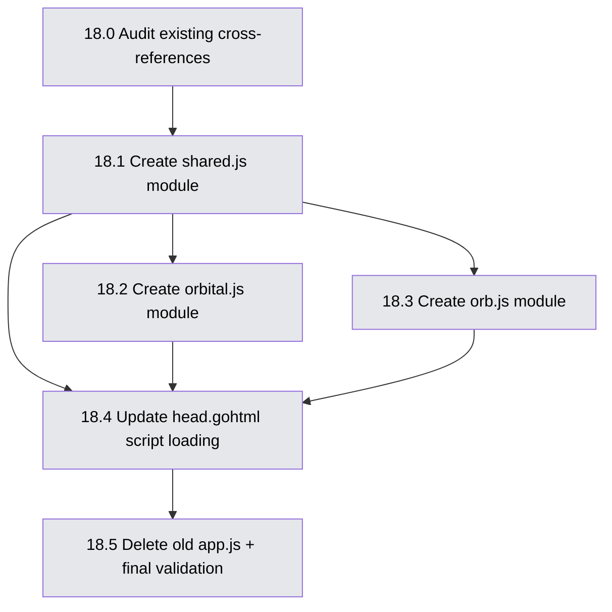

# Spike 18 — ES Module Split of app.js

**Key Question:** Can we split the 2,529-line `app.js` monolith into per-feature ES modules with zero build step, maintaining full browser compatibility and HTMX integration?

**Read before starting any session:** This document contains the full execution plan — module boundaries, dependency graph, session boundaries, entry/exit criteria, and risks. Read the entire document before starting Session 1.

---

## Clarifying Questions (answer before Sonnet starts)

These questions have design implications. Answer them here before implementation begins.

### Q1: Where should `BASE` and `ORBITAL_CONFIG` live? ✅ Settled

**Decision: Keep the inline `<script>` tags. No change.**

Validated by Opus: inline config injection is standard practice in server-rendered HTMX stacks and explicitly aligned with HTMX's Locality of Behaviour principle. HTMX does not condemn inline scripts — it actively endorses them for config bootstrapping. The values must come from Go templates regardless (only way to get `BasePath` into JS). A `config.js` wrapper adds a file and an import for zero functional gain. The only argument against inline scripts (CSP `script-src 'unsafe-inline'`) does not apply to this internal enterprise tool.

### Q2: Should this be one session or two?

The split is mechanical but touches every template that uses `onclick="globalFunction()"`. The proposed plan uses 4 sessions:
1. Shared utilities module (no template changes)
2. Orbital-specific module (orbital template changes)
3. Orb-specific module (orb template changes)
4. Cleanup and validation

**Is 4 sessions right, or should it be compressed to 2-3?**

### Q3: Should `graphql.js` be a separate module? ✅ Settled

**Decision: Fold GraphQL code into `orbital.js`. No separate `graphql.js`.**

Validated by Opus: all 5 GraphQL call sites in `app.js` are orbital-only. Confirmed zero GraphQL browser calls in orb — orb templates have no `/graphql` references, orb's Go server does not register a `/graphql` route, and orb uses REST endpoints (`/api/v1/overrides`, `/api/v1/import`) with Go handlers talking to DGraph internally. The original assumption ("orb might use GraphQL") is false.

### Q4: How should `openModal` / `closeModal` / `closeAllModals` be handled?

These are currently defined **inline** in `web/orbital/templates/components/login-modal.gohtml` (lines 70-83), not in `app.js`. They are referenced by `app.js` in the `addEventListeners()` function (lines 1270, 1278, 1307).

**Options:**
- **(a)** Move them into `shared.js` as exports (they are generic modal helpers)
- **(b)** Leave them inline (they are tightly coupled to the Bulma modal pattern the login modal uses)
- **(c)** Move them into `shared.js` AND clean up the inline scripts (login-modal, todo-toast, report-issue-modal) — full consolidation

Recommendation: **(a)** as part of this spike, defer **(c)** for a separate cleanup spike.

### Q5: What about `onclick="globalFunction()"` in templates?

There are ~30 `onclick` references across templates pointing to functions in `app.js`. ES modules do not expose functions to the global scope by default.

**Options:**
- **(a)** Keep all `onclick`-referenced functions on `window.*` — each module explicitly assigns: `window.handleOrbImport = handleOrbImport`
- **(b)** Replace `onclick` with `data-*` attributes and delegated event listeners (cleaner, but more template changes)
- **(c)** Hybrid: use `window.*` bridge for now, migrate to delegated listeners incrementally

Recommendation: **(a)** for this spike — minimal blast radius. The `onclick` pattern works fine and is used consistently. A migration to delegated listeners can be a separate effort.

---

## Module Boundaries

Based on the section banners in `app.js`, here are the natural cut points:

### `shared.js` — Shared utilities (both orbital and orb)

| Lines | Section | Functions |
|---|---|---|
| 1-177 | Tab management | `TabItem`, `loadTab`, `unloadTab`, `deleteTab`, `saveTab`, `closeTab`, `getTabStorageKey`, `setCurrentTab`, `removeCurrentTab`, `replaceCurrentTab`, `getCurrentTab`, `activateTab`, `displayTabContent`, `changeTabs` |
| 178-216 | Timestamps | `formatTimestamp`, `relativeTime`, `renderTimestamps` |
| 219-329 | Server events DataTable | `serverTables`, `initServerEventsTable`, `openServerTab` |
| 333-339 | Todo toast click handler | delegated click listener |
| 343-530 | Skeletons + helpers | `showDatacenterSkeleton`, `showServerSkeleton`, `fetchWithMinDelay`, `initDcDetailTabs`, `dtWrapLengthSelect`, `initServerDetailTabs` |
| 573-584 | Server drill-down | delegated dblclick listener |
| 743-758 | Hint banners | DOMContentLoaded guard |
| 1252-1425 | Shared listeners | `addEventListeners()` — modal triggers, tab listeners, menu accordion, afterSwap handler |
| 1807-1842 | Timestamp rendering on HTMX swap | afterSwap listener |
| 2428-2436 | Logout clear | DOMContentLoaded guard |

### `orbital.js` — Orbital-only features

| Lines | Section | Functions |
|---|---|---|
| 586-625 | DC tab loading | `loadDataCenterTab` |
| 626-741 | Inventory page | `inventoryFetch`, DOMContentLoaded DataTable init |
| 760-981 | Data Centers page | DOMContentLoaded DataTable init, DC tab management |
| 855-1066 | Servers page | DOMContentLoaded DataTable init, server tab management |
| 1077-1250 | Backups | `formatBytes`, `renderBackups`, `loadBackups`, `triggerBackup`, `pollBackup`, `downloadBackup`, delete modal, DOMContentLoaded |
| 1427-1461 | Export page | `handleExportSubmit`, DOMContentLoaded |
| 1463-1627 | Export functions | `pollExportStatus`, `showExportStatus`, `loadExportJobsTable`, `exportJobStatusBadge`, `publishExportJob`, `pollPublishJob`, `deleteExportJob`, `fmtTime` |
| 1628-1780 | Edge delivery | `loadArtifactsTable`, `artifactStatusBadge`, `testOCIConnection`, `_showPublicKey`, `togglePublicKey`, `copyPublicKey`, `downloadPublicKey`, `copyVerifyCmd` |
| 1782-1805 | Backup connection test | `testBackupConnection` |
| 1844-1965 | DC edit modal | `dcEditors`, GraphQL mutation handler |
| 1967-2028 | Tab reloads | DC reload + server reload click handlers |
| 2030-2166 | Server edit modal | `srvEditors`, GraphQL mutation handler |
| 2168-2292 | Audit log | `formatGQL`, `renderPayload`, DOMContentLoaded DataTable init |
| 2294-2426 | Restore | `restoreJobLogStore`, `loadRestoreJobs`, `loadRestoreBackupSelect`, `triggerRestore`, `pollRestore`, restore log modal |
| 983-1066 | Server tab helpers | `saveServerTab`, `deleteServerTab`, `loadServerListTab`, window.load tab restore |

### `orb.js` — Orb-only features

| Lines | Section | Functions |
|---|---|---|
| 2438-2529 | Orb import | `handleOrbImport`, `handleOrbImportLatest`, `pollOrbImport`, `orbShowImportStatus`, `loadOrbTags`, DOMContentLoaded |
| 2531-2574 | Orb DC override modal | `openOrbDCOverrideModal`, `closeOrbDCOverrideModal`, DOMContentLoaded |
| 2576-2632 | Orb server override modal | `openOrbSrvOverrideModal`, `closeOrbSrvOverrideModal`, DOMContentLoaded |
| 2634-2664 | Orb divergence publish | DOMContentLoaded |

---

## Dependency Graph



---

## Sessions

### Session 1 — Shared Module Foundation

**Touches existing code:** Yes — `head.gohtml` (script tag change), `app.js` (extracting shared code).

**Entry criteria:** Clarifying questions Q1-Q5 answered above.

**Tasks in order:**

1. **18.0 — Audit cross-references.** Before moving any code, build a reference map:
   - List every function in `app.js` that is called from a template `onclick` attribute
   - List every function in `app.js` that is called from another section (cross-section calls)
   - List every `window.*` assignment
   - List every global variable (`BASE`, `serverTables`, `dcEditors`, `srvEditors`, etc.)
   - Output: a comment block at the top of `shared.js` documenting the public API

2. **18.1 — Create `web/shared/static/shared.js`** as an ES module (`export function ...`):
   - Extract all functions from the "shared" boundary table above
   - Export functions that are called by `orbital.js`, `orb.js`, or templates
   - Keep `const BASE = window.ORBITAL_BASE || ''` as a module-level constant, export it
   - For functions referenced by `onclick` in templates: assign to `window.*` at module bottom
   - `DOMContentLoaded` guards: modules with `defer` or `type="module"` already fire after DOM parse — the guards still work but are redundant. Keep them for safety in Session 1; can remove in a cleanup pass.
   - Do NOT delete anything from `app.js` yet — both files can coexist during development

3. **18.4 partial — Add `shared.js` to `head.gohtml`:**
   ```html
   <script type="module" src="{{.BasePath}}/static/shared.js?v={{.Version}}"></script>
   ```
   Place it after the existing `app.js` line (both load for now — shared.js is additive, app.js still has all code).

4. **Verify:** `make run-orbital`, navigate every page. No console errors. All functionality works. `make test-e2e` passes.

**Exit criteria:**
- `shared.js` exists and loads without errors
- No duplicate function definitions conflict (module scope isolates)
- `make test-e2e` passes
- `make test-unit` passes (Go side unaffected)

---

### Session 2 — Orbital Module + Remove Shared Code from app.js

**Touches existing code:** Yes — `app.js` (deleting extracted sections), `head.gohtml`.

**Entry criteria:** Session 1 exit criteria met.

**Tasks in order:**

1. **18.2 — Create `web/shared/static/orbital.js`** as an ES module:
   - `import { BASE, renderTimestamps, ... } from './shared.js'`
   - Extract all functions from the "orbital" boundary table
   - For functions referenced by `onclick` in orbital templates: assign to `window.*`
   - Handle `dcEditors` and `srvEditors` — these are `Map()` instances used by the DC/server edit modals. Keep as module-level variables. `window.dcEditors` assignment (line 1846) is needed because server reload handlers reference it — keep the `window.*` bridge.

2. **Add `orbital.js` to `head.gohtml`:**
   ```html
   <script type="module" src="{{.BasePath}}/static/orbital.js?v={{.Version}}"></script>
   ```

3. **Remove extracted code from `app.js`.** After this step, `app.js` should only contain:
   - The orb-specific sections (lines 2438-2664)
   - Any remaining shared code not yet moved (should be none if Session 1 was complete)

4. **Verify:** `make run-orbital`, navigate every page. `make test-e2e` passes.

**Exit criteria:**
- `orbital.js` loads and all orbital pages work
- `app.js` is reduced to orb-only code
- No console errors on any orbital page
- `make test-e2e` passes
- `make test-unit` passes

---

### Session 3 — Orb Module + Remove app.js

**Touches existing code:** Yes — `app.js` (final deletion), `head.gohtml`, orb templates.

**Entry criteria:** Session 2 exit criteria met.

**Tasks in order:**

1. **18.3 — Create `web/shared/static/orb.js`** as an ES module:
   - `import { BASE } from './shared.js'`
   - Extract all functions from the "orb" boundary table
   - For functions referenced by `onclick` in orb templates: assign to `window.*`
   - Functions needing `window.*`: `handleOrbImport`, `handleOrbImportLatest`, `loadOrbTags`, `openOrbDCOverrideModal`, `closeOrbDCOverrideModal`, `openOrbSrvOverrideModal`, `closeOrbSrvOverrideModal`

2. **18.4 complete — Conditional script loading in `head.gohtml`:**

   The key decision: **both orbital and orb share the same `head.gohtml`** (via `web/shared/templates/layouts/`). We need orbital to load `orbital.js` and orb to load `orb.js`.

   **Approach:** Use `UIConfig.EditMode` (already available in templates) as the discriminator:
   ```html
   <script type="module" src="{{.BasePath}}/static/shared.js?v={{.Version}}"></script>
   {{if eq .UI.EditMode "intent"}}
   <script type="module" src="{{.BasePath}}/static/orbital.js?v={{.Version}}"></script>
   {{else}}
   <script type="module" src="{{.BasePath}}/static/orb.js?v={{.Version}}"></script>
   {{end}}
   ```

   Alternatively, add a `JsModules []string` field to `UIConfig` and iterate — more flexible but over-engineered for two binaries.

3. **18.5 — Delete `app.js`.** Remove the `<script src="app.js">` line from `head.gohtml`. Delete the file.

4. **Verify both binaries:**
   - `make run-orbital` — navigate every orbital page, no console errors
   - `make run-orb` (or equivalent) — navigate every orb page, no console errors
   - `make test-e2e` passes (orbital)

**Exit criteria:**
- `app.js` is deleted
- `shared.js` + `orbital.js` loaded by orbital
- `shared.js` + `orb.js` loaded by orb
- No console errors on any page in either binary
- `make test-e2e` passes
- `make test-unit` passes

---

### Session 4 — Cleanup and Documentation

**Touches existing code:** Minimal — docs only, possibly minor code cleanup.

**Entry criteria:** Session 3 exit criteria met.

**Tasks in order:**

1. **Update `docs/claude/UI.md`:**
   - Change "All JavaScript goes in `web/static/app.js`" to describe the new module structure
   - Document the `window.*` bridge pattern for `onclick` references
   - Document the conditional loading pattern in `head.gohtml`
   - Document which functions are exported from each module

2. **Update `CLAUDE.md`:**
   - Update repository structure to show new JS files
   - Update the tech debt entry for `app.js` monolith (mark as resolved)
   - Add settled decision: "JS split into ES modules — shared.js / orbital.js / orb.js. No bundler."

3. **Optional cleanup (only if time permits):**
   - Remove redundant `DOMContentLoaded` guards inside modules (modules already defer)
   - Consolidate the inline `<script>` blocks in `login-modal.gohtml`, `todo-toast.gohtml`, `report-issue-modal.gohtml` into `shared.js`

**Exit criteria:**
- Documentation updated
- `make test-e2e` passes
- `make test-unit` passes

---

## Risks

### R1: Module execution order vs regular scripts

`<script type="module">` is deferred by default — it executes after DOM parse but potentially after other deferred scripts. The current `app.js` loads as a regular script (blocking). When we switch to modules:
- All `DOMContentLoaded` listeners will still fire correctly (modules run before the event if loaded in `<head>`)
- **But:** inline `onclick` handlers that call module-exported functions may fail if the module hasn't executed yet. This is why the `window.*` bridge must be assigned at module top level, not inside a `DOMContentLoaded` callback.

**Mitigation:** In Session 1 testing, verify all `onclick` handlers work. If timing issues appear, add `async` to force immediate execution (though this sacrifices ordering guarantees).

### R2: Cross-module function calls

Several orbital functions call shared functions directly (e.g., `renderTimestamps`, `initDcDetailTabs`, `initServerDetailTabs`, `activateTab`, `displayTabContent`). These must be properly imported.

**Identified cross-references:**
- `orbital.js` imports from `shared.js`: `BASE`, `renderTimestamps`, `initDcDetailTabs`, `initServerDetailTabs`, `showDatacenterSkeleton`, `showServerSkeleton`, `fetchWithMinDelay`, `dtWrapLengthSelect`, `activateTab`, `displayTabContent`, `setCurrentTab`, `loadTab`, `saveTab`, `deleteTab`, `closeTab`, `replaceCurrentTab`, `getCurrentTab`, `initServerEventsTable`, `openServerTab`, `formatTimestamp`
- `orb.js` imports from `shared.js`: `BASE`
- Templates call via `onclick`: `handleOrbImport`, `handleOrbImportLatest`, `loadOrbTags`, `closeOrbDCOverrideModal`, `closeOrbSrvOverrideModal`, `triggerBackup`, `testBackupConnection`, `testOCIConnection`, `togglePublicKey`, `copyPublicKey`, `downloadPublicKey`, `copyVerifyCmd`, `loadArtifactsTable`, `downloadBackup`, `openDeleteModal`, `closeDeleteModal`, `handleExportSubmit`, `publishExportJob`, `deleteExportJob`, `openReportIssueModal` (in navbar)

### R3: jQuery + DataTables in module scope

`$` (jQuery) and `DataTable` are loaded as regular scripts before the modules. They will be available as globals. No issue expected, but verify in Session 1.

### R4: `addEventListeners()` is dead code

The function `addEventListeners()` (line 1254) is **defined but never called** — confirmed by searching the entire codebase. All listeners inside it (modal triggers via `.js-modal-trigger`, tab keyboard navigation, menu accordion via `.app-menu-link`, notification dismiss, afterSwap handler for server detail tabs) are never registered.

**Impact:** This is ~170 lines of dead code. The app works without it, which means either: (a) the functionality was superseded by other listeners, or (b) these features are silently broken and nobody noticed.

**Action:** Do not extract this function into `shared.js`. Instead, flag it during Session 1 audit and either delete it (if the features work through other code paths) or fix the call site (if features are broken). This is an opportunity to clean up dead code during the split.

### R5: Existing inline scripts in templates

Several templates have inline `<script>` blocks that define functions (`openModal`, `closeModal`, `closeAllModals` in `login-modal.gohtml`; `displayTodoToast` in `todo-toast.gohtml`; `openReportIssueModal` in `report-issue-modal.gohtml`). These are on `window` scope implicitly. The module split does not affect them, but they represent technical debt that should eventually be consolidated.

---

## File inventory (final state)

```
web/shared/static/
  shared.js          ← NEW — ~800 lines, shared utilities
  orbital.js         ← NEW — ~1400 lines, orbital-only features
  orb.js             ← NEW — ~230 lines, orb-only features
  app.js             ← DELETED
```

---

## Testing strategy

Every session gate requires:
1. `make test-unit` — Go tests unaffected
2. `make test-e2e` — Playwright tests cover orbital pages end-to-end
3. Manual verification: open browser devtools console, navigate every page, confirm zero JS errors
4. For orb (no e2e tests yet): manual `make run-orb` and navigate all 7 orb pages
