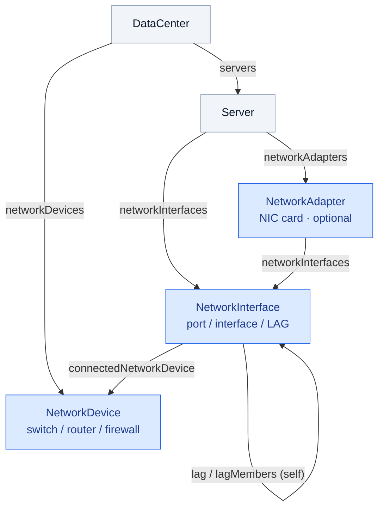

# Design Proposal: Network topology (NICs, ports, switches) in orbital

**Status:** Design record. Reflects decisions through 2026-08-10. Network types (`NetworkAdapter` / `NetworkInterface` / `NetworkDevice`) are in `schema/schema.graphql` and seeded for the Colo reference (`CFRHDX3`).

**Scope:** Server network hardware (NIC cards, ports, MACs) and server↔switch adjacency, modeled as **design intent** in orbital's DGraph. Reverses the settled decision *"Network infrastructure config items are out of v1 scope"* for this server-side + first-hop-switch slice only. Still **excluded**: IPAM (pools/subnets/allocation/overlap), switch internal config, VLAN databases, routing, fabric interior.

---

## 1. Guiding principle — schema vs. source (the decision that shapes everything)

Two layers, held strictly apart:

- **Schema design = generic, vendor-agnostic, follows upstream standards.** Orbital is a general config-management product; an adopter may not run NetBox — or Redfish, or anything we use. The node types/names must stand on their own.
  - **Name each node after the standard whose *scope* matches it** (settled 2026-08-11). Whole-domain concepts — the **interface**, which exists on servers *and* switches *and* the BMC — follow **NetBox/DCIM** (`Interface` → orbital `NetworkInterface`). Server-only hardware FRUs — the **NIC card** — follow **Redfish/DMTF** (`NetworkAdapter`), the same standard behind orbital's `StorageController`. A MAC-bearing entity is an *interface*, not a *port* (Redfish puts the MAC on `EthernetInterface`, not `Port`) — the rename `NetworkPort → NetworkInterface` reflects that.
  - The switch follows the generic **DCIM "device + role"** abstraction — Redfish does not model switches at all (it is a *server* management standard).
- **Data sourcing = whatever an adopter actually has.** For us today: **NetBox supplies the values; Redfish cross-checks / enriches.** Orbital is the system of record. NetBox is an *input to reconcile from*, not the authority — it is inconsistent (see §4).

**The rule:** the schema carries the full generic shape; each field is populated from whichever source is authoritative for it; **structure a source lacks stays empty — never fabricated.** Example: NetBox is flat (`Device → Interface`, no NIC-card entity). When sourcing from NetBox only, `NetworkAdapter` is simply **absent** — you do *not* synthesize it by parsing interface names. Redfish, which has the card authoritatively, fills it.

---

## 2. Node types

| Node | Follows | Notes |
|---|---|---|
| `NetworkAdapter` | Redfish/DMTF `NetworkAdapter` | Physical NIC-card FRU. **Server-only** (switches have no adapter abstraction). **Optional** — filled from Redfish; absent for flat-only sources *and* for the BMC (a Manager, not a card — its identity is `IdracSettings`). |
| `NetworkInterface` | NetBox/DCIM `Interface` (whole-domain) | The MAC-bearing interface — server NIC, switch port, LAG, **or BMC/iDRAC**. Owner = `Server` **XOR** `NetworkDevice`. `networkAdapter` optional (null for LAGs, switch ports, and the BMC). `mgmtOnly: true` marks the management plane (mirrors NetBox `interface.mgmt_only`). Collapses Redfish `Port` ⇄ `EthernetInterface` (1:1; breaks only under NPAR/shared-LOM — not this fleet). |
| `NetworkDevice` | Generic DCIM device + role | Minimal identity anchor for **network gear** (switch/router/firewall/sd-wan), role-differentiated. Values from NetBox. `macAddress` is the device MAC. |

**Link aggregation (bonds / LAGs) — modeled as design intent.** Bonding *can be* a design decision ("these two NICs shall be LACP-bonded to the ToR pair"), so it belongs in the intent store. Following NetBox's convention (and OpenConfig / IEEE 802.1AX): a LAG **is an interface with member interfaces**, not a separate entity. So a bond is a `NetworkInterface` (`portType: "LAG"`, no adapter, logical) whose physical members reference it via a self-referential `lag` edge (mirrors NetBox `interface.lag`; same pattern as `EksaKubernetesCluster.managementCluster`/`workloadClusters`). Sourced from NetBox where authored; whether the OS *realizes* the bond stays observed/runtime, outside our sourcing.

**Deliberately NOT modeled:**

- **`NetworkSwitchMember` (VC/FPC)** — no vendor-agnostic convention exists (Juniper VC / Cisco StackWise / Arista MLAG are all vendor-specific), Redfish doesn't model switches, and VC-vs-modular-chassis failure domains are **unverifiable** from server-side data. The FPC signal survives losslessly inside `connectedNetworkDevicePort` (`"xe-1/0/28"`); parse it at query time if a redundancy check ever needs it.
- **Switch-port nodes** — the remote port is a string label on `NetworkInterface`, not a node. Blast radius traverses `NetworkDevice → NetworkInterface → Server` without them.
- **IPAM, cable inventory, NPAR** — deferred. NPAR is a documented future extension (insert a Redfish `NetworkDeviceFunction` level between port and its functions if partitioning is ever enabled; capable but not enabled on examined hardware).
- **`MACAddress` as a node** (settled 2026-08-11) — a MAC is an intrinsic 1:1 attribute of its interface (burned-in, no roles, no other referrers), so it's an **indexed field** (`macAddress @search`), not a node. Contrast `IPAddress`, which *is* a node because many config items reference one reassignable, role-bearing IP — *fan-out* justifies a node; uniqueness alone does not. The cross-source join is a seed-time field-match, not a graph hop. Promote later only if multi/reassignable MACs per interface appear (NetBox 4.2+ pattern).

**Graph shape (rooted at `DataCenter`):**



Blue nodes are new; grey are existing. A `NetworkInterface` attaches to its `Server` directly (always) and to a `NetworkAdapter` when a source provides the card (optional); the `lag` self-edge groups member ports into a bond.

---

## 3. Adjacency naming

How the conventional sources name "the switch a server port connects to":

- NetBox: `cable` / `link_peer` / **`connected_endpoints`** (a *list* — see note)
- LLDP (IEEE 802.1AB — the discovery mechanism): **`neighbor`**
- Redfish: LLDP `neighbor` / remote

The field is **design-intent about a cabled connection** (not observed link state), so the DCIM cabling convention fits best: **`connectedNetworkDevice` / `connectedNetworkDevicePort`** (mirrors NetBox `connected_endpoints`). Vendor-agnostic and unambiguous. *Alternative:* `neighborSwitch` (LLDP's term) if a discovery-flavored name is preferred.

**Singular, despite NetBox's plural.** NetBox renamed `connected_endpoint` → `connected_endpoints` (a list) to support cable-path *tracing* through patch panels / breakout cables. A single physical NIC port is point-to-point — it cables to exactly one switch port — so `connectedNetworkDevice` stays singular. Breakouts (one QSFP → N SFP), if they ever appear, are modeled as separate `NetworkInterface`s, each with its own singular `connectedNetworkDevice`.

---

## 4. Sourcing reality (from the live investigation, 2026-08-10)

Investigated the Colo R650 (`eksa-control-04`, iDRAC `10.20.21.44`, serviceTag `CFRHDX3`) against NetBox (`ilb.devnew.armada.internal`). **Every join between Redfish observation and NetBox intent resolved exactly:**

| Join | Redfish / LLDP (observed) | NetBox (design intent) |
|---|---|---|
| NIC MAC | `14:23:F2:30:8F:B0` (+3 more) | interface `IntN1P1` on dev 24 "Sabey Compute Server 3" |
| Cabling (port name) | LLDP `xe-1/0/28` | cable #22 → `xe-1/0/28` |
| Switch identity | LLDP chassis MAC `48:5A:0D:3E:16:20` | `jsrv` on dev 7 `Colo_TOR_Switch (Backup)` — EX4650-48Y, serial `XH3123021901` |

**But NetBox is inconsistent.** Colo (site 4) is fully populated; Demo Galleon 2 (site 5) had empty interface MACs and switches with no interfaces. There are also **multiple NetBox instances (dev / prod).** Consequences:

- Reconciliation is **per-DC and manual** (maintainer + assistant, data center by data center).
- **Join caveat:** orbital servers are keyed by `serviceTag`, but NetBox devices have **blank serials** → there is no `serviceTag ↔ device` join. Use per-port **MAC** (or the iDRAC/oob MAC) as the reconciliation key.
- Where NetBox is thin, **Redfish fills the gap** (NetBox's custom-field schema — `mac_address`, `serial`, `sku`, `bmc_ip`… — is built to receive Redfish data but is currently null).
- **Source `NetworkDevice` nodes from NetBox's site device-inventory, NOT from server-cable far-ends** (2026-08-11 burn). Enumerate `/dcim/devices?site_id=<n>` filtered to network roles (`tor`, `frw`→"firewall", router/core/…). Cable-derivation only ever finds server-adjacent ToRs — it **misses** OOB switches (BMC-cabled) and firewalls (ToR-cabled), and **imports phantom cross-site devices** from one bad server cable. Colo (site 4) = **4 Junipers**: 2× EX4650 ToR, EX2300 OOB switch, SRX1500 firewall. Adjacency edges still derive from cabling/LLDP but only link to a device that's in the inventory.

---

## 5. Schema

Lives in **`schema/schema.graphql`** 

- **`NetworkAdapter`** — the physical NIC card (a FRU: model / manufacturer / serial / part). Optional, Redfish-authoritative.
- **`NetworkInterface`** — a port/interface, physical *or* a logical LAG. Carries the `macAddress` (the cross-source join key), `linkSpeedMbps` (the **negotiated** link speed from Redfish, null when down), the `connectedNetworkDevice` / `connectedNetworkDevicePort` adjacency, and the `lag` / `lagMembers` self-edge for bonds.
- **`NetworkDevice`** — a minimal network-gear identity anchor (`model` / `serial` / `role` / `macAddress`), role-differentiated (switch/router/firewall/sd-wan). Values from NetBox; not an editable config item.
- **New edges on existing types** — `Server.networkAdapters`, `Server.networkInterfaces`, `DataCenter.networkDevices`.

**orbId** follows the platform convention **`<namespace>:<kind>-<natural-key>`** (see CLAUDE.md Settled Decisions + `docs/reference/DGRAPH.md`): `colo:network-adapter-CFRHDX3-NIC.Integrated.1` (adapter, key = owner serviceTag + FQDD), `colo:network-interface-CFRHDX3-NIC.Integrated.1-1` (interface, same), `colo:network-device-XH3123021901` (device, key = serial). `macAddress` is the cross-source reconciliation key regardless of orbId.

### Example: a bonded pair (LAG + physical members)

A LAG is just a `NetworkInterface` with `portType: "LAG"`, no `networkAdapter`, and a `lagMembers` list that fills itself from whichever ports set `lag` to it — **you only ever set `lag` on the members, never `lagMembers` directly.** Below: the Colo R650 `CFRHDX3` with its two 25G ports bonded.

**LAG `NetworkInterface`** (`bond0`):

```
orbId:               "colo:CFRHDX3-bond0"
name:                "bond0"
portType:            "LAG"
linkSpeedMbps:       20000          # aggregate of member negotiated speeds (2 × 10G here) — earns its keep on a LAG
macAddress:          null           # a bond's MAC is inherited at runtime, not design intent
networkAdapter:      null           # logical — no physical card
connectedNetworkDevice: null   # optional; members carry the physical device-port links
connectedNetworkDevicePort: null
lag:                 null           # it is the PARENT, not a member
lagMembers:          [ NIC.Integrated.1-1, NIC.Slot.1-1 ]   # auto (@hasInverse) — never set directly
server:              → "colo:CFRHDX3"
```

**Physical `NetworkInterface`** (a member — real media, points up via `lag`):

```
orbId:               "colo:network-interface-CFRHDX3-NIC.Integrated.1-1"
name:                "NIC.Integrated.1-1"
portType:            "Ethernet"
macAddress:          "14:23:F2:30:8F:B0"
linkSpeedMbps:       10000          # negotiated — a 25G-rated port linked at 10G
networkAdapter:      → "colo:network-adapter-CFRHDX3-NIC.Integrated.1"
connectedNetworkDevice: → "colo:network-device-XH3123021901"
connectedNetworkDevicePort: "xe-1/0/28"
lag:                 → "colo:CFRHDX3-bond0"
server:              → "colo:CFRHDX3"
```

(The second member `NIC.Slot.1-1` is the same shape: `macAddress 14:23:F2:AC:50:F0`, `connectedNetworkDevicePort "xe-0/0/4"`, `lag → colo:CFRHDX3-bond0`.)

As seed GraphQL (edges are nested `orbId` refs — create the LAG before its members):

```graphql
{ orbId: "colo:CFRHDX3-bond0", name: "bond0", namespace: "colo", version: 1,
  portType: "LAG", linkSpeedMbps: 20000, server: { orbId: "colo:CFRHDX3" } }

{ orbId: "colo:network-interface-CFRHDX3-NIC.Integrated.1-1", name: "NIC.Integrated.1-1", namespace: "colo", version: 1,
  macAddress: "14:23:F2:30:8F:B0", portType: "Ethernet", linkSpeedMbps: 10000,
  server: { orbId: "colo:CFRHDX3" },
  networkAdapter: { orbId: "colo:network-adapter-CFRHDX3-NIC.Integrated.1" },
  connectedNetworkDevice: { orbId: "colo:network-device-XH3123021901" }, connectedNetworkDevicePort: "xe-1/0/28",
  lag: { orbId: "colo:CFRHDX3-bond0" } }
```

---

## 6. Anchor queries (validated against the final schema)

1. **Which servers share a device / blast radius** — start at the network device: `NetworkDevice → networkInterfaceConnectedNetworkDevice → server (→ kubernetesNode → cluster)`. Clean traversal; complete at the leaf/ToR layer (no fabric interior modeled, by design).
2. **Cabling / redundancy validation** — compare intended `connectedNetworkDevice` / `connectedNetworkDevicePort` against the Redfish LLDP observation. Bond membership is now **declared intent** (`lagMembers`), so the check asserts *"the intended LAG's member ports land on ≥2 distinct switches"* — no need to guess which ports are bonded. Two caveats remain: (a) VC (real redundancy) vs. modular chassis (fake) is indistinguishable without switch-plane data, so it reports *likely* not proven redundancy; (b) whether the OS **realizes** the intended bond is runtime/observed, outside our sourcing. State both wherever the check is built.
3. **Provisioning lookup** — `macAddress` is `@search(by:[hash])`: `queryNetworkInterface(filter:{macAddress:{eq:...}}) → server`. No MAC node required.

---

## 7. Open items / risks

- **Redundancy heuristic caveat** (§6) — must be stated wherever the check is implemented.
- **Seed reconciliation** — per-DC, MAC-keyed (serviceTag ↔ NetBox device has no join). Start with `CFRHDX3` (NetBox dev 24 / Colo) as the reference pattern, expand across Colo, then other DCs. Account for multiple NetBox instances (dev / prod).
- **`NetworkDevice` generalization — DONE.** Switches, routers, firewalls, and SD-WAN are modeled as one `NetworkDevice` + `role` (superseding the switch-only `NetworkSwitch`). Only `role: "tor"` is seeded so far (the Colo ToRs); other roles get added as they're sourced from NetBox.
- **XE9680 / GPU spot-check** — only an R650 was examined; RoCE/IB ports may differ (`portType` future-proofs it). Re-validate before GA.
- **NPAR** — not modeled (capable, not enabled on examined hardware); future `NetworkDeviceFunction` level if enabled.
- **Documentation on acceptance** — record the scoped reversal of "network out of scope" + these conventions in `docs/reference/DGRAPH.md`; register `NetworkAdapter` / `NetworkInterface` as editable config items per `docs/playbooks/add-configitem.md`, but **not** `NetworkDevice` (identity anchor, like `IPAddress` — no editor).

---

## 8. Fabric extension — device↔device topology (schema landed; discovery/seed = Spike 32)

**Context.** orbital's network schema is now an **API contract**: the network team's edge clients *discover* devices, cloud clients *mutate* topology (replacing manual NetBox). A complete twin — and their clients — need the **fabric interior**: switch↔switch links, switch-side ports. §1–§7 only cover the server side + first hop.

**The gap it closed.** `NetworkInterface.server: Server!` was required → every port had to belong to a Server → a switch (`NetworkDevice`, not `Server`) couldn't own ports → no link whose *both* ends are network gear. The switch side of a cable was only a string.

**Schema (landed in v5, applies clean).** The chain `NetworkDevice ↔ NetworkInterface ↔(cable)↔ NetworkInterface ↔ NetworkAdapter ↔ Server`:
- `NetworkInterface.server` relaxed `Server!`→optional; `+networkDevice: NetworkDevice` (a switch owns its ports); `+NetworkDevice.networkInterfaces` inverse. **Owner = `server` XOR `networkDevice`** — DGraph can't enforce XOR, so it's app-checked.
- `+NetworkInterface.connectedNetworkInterface: NetworkInterface` — the **canonical** cabling model (both ends real ports; set on both ends); works for server-NIC↔switch AND switch↔switch. `connectedNetworkDevice`(+string) stays **transitionally** (what the server-side seed populates today; derivable via `connectedNetworkInterface.networkDevice`; retired once switch ports are seeded).
- **Reuse, not a new node** — one `NetworkInterface` concept for both sides; LAG (`lag`/`lagMembers`) works on the switch side for free.

**Decisions (orbital owns the contract — settled):**
- Cabling is an **edge**, not a `Cable` node — no cable media / length in v1 (clean v2 add if ever needed).
- Switch-port `orbId` = `colo:network-interface-<serial>-<portName>` (`portName` may contain `/`, e.g. `xe-0/0/47`).
- VLAN / L2 / IP / IPAM / MTU / VRF stay **OUT** (external-owned, not populated in colo).
- **Management plane (BMC/iDRAC)** (settled + **landed 2026-08-11**) — the BMC is a `NetworkInterface` with **`mgmtOnly: true`** (mirrors NetBox `mgmt_only`; `portType` stays `Ethernet` — that's media type, not role), `macAddress = oobMAC`, owned by `server`, **no `networkAdapter`** (the BMC is a Redfish *Manager*, not a NIC-card FRU — sourced from `Managers/iDRAC.Embedded.1/EthernetInterfaces/NIC.1`, joined by MAC, never by name). **Done this pass:** schema `mgmtOnly` field; 46 BMC interfaces seeded (`colo:<tag>-iDRAC`, mac = `oobMAC`); server NICs-tab renders it as a flat row with a `mgmt` tag; `OOB_SW1.role` corrected `tor`→`mgmt`. **Deferred (Phase B):** the `connectedNetworkInterface` cable iDRAC→OOB. Do NOT keep the BMC as a scalar with a separate `oobPort` edge; it fragments the model.
- **"Uplink" is derived, not stored** (settled 2026-08-11) — link direction is a **read-time label** computed from the `role` at each end of `connectedNetworkInterface` (TOR→firewall = uplink; server→TOR = host/downlink; **TOR↔TOR = peer/VCP, NOT an uplink**). No `isUplink` field: it's lossy (can't express the VCP peer case) and NetBox exposes interface *type*, not link direction — a stored flag forces discovery clients to compute what NetBox never gave them. Add an **optional** `NetworkInterface.linkRole` (`uplink|downlink|peer|host|management`) **only** if operators must *assert* a direction role-hierarchy can't derive (e.g. primary vs backup uplink); topology queries never depend on it.

**Deferred to Spike 32 (server-side data NICs + BMC interfaces are populated; the *fabric* — switch-owned ports + all cabling — is not):**
1. **Switch/cable discovery** — a NetBox pass (switches don't speak Redfish): `/dcim/interfaces` → switch `NetworkInterface`s owned by `networkDevice`; `/dcim/cables` → resolve **both** terminations to orbital port `orbId`s and set `connectedNetworkInterface` on both ends. Resolution: **switch end** → construct `network-interface-<serial>-<name>`; **server end** → **join by MAC** (orbital keys server ports by Redfish FQDD, not NetBox name). **Includes the management plane** — iDRAC/IPMI → OOB_SW1 cables resolve the server end via `oobMAC` to the server's BMC `NetworkInterface`.
2. Colo switch-port + cable **seed**.
3. **UI** — switch ports + fabric links on the `NetworkDevice` detail.
4. **Mutation/upsert** verification (idempotent re-push).

**NetBox → orbital (fabric additions):** `interface` on a device → `NetworkInterface` owned by `networkDevice`; `interface.lag` (`ae0`) → `NetworkInterface.lag`; `cable` (both terminations) → `NetworkInterface.connectedNetworkInterface` (both ends).

**Colo fabric to seed (from NetBox):** `TOR-Primary xe-0/0/47 ↔ SRX xe-0/0/17` (cable 569, the `ae0` uplink); `TOR6 ↔ TOR7` VCP inter-member links; server↔ToR links join by NIC MAC.

**Fabric roles (colo, confirmed against NetBox 2026-08-11).** Three devices, two planes: **TOR Primary/Backup** (EX4650 virtual chassis) = *data* plane (server NICs); **OOB_SW1** (EX2300) = *management* plane, aggregating every server's iDRAC/BMC (**38 cables**); **SRX1** (SRX1500) = **firewall / edge gateway**, uplinking **both** TORs *and* the OOB switch (the pod's north-south front door). So the "device↔device gap" is really **one interconnect layer** with two sub-parts, both the same `connectedNetworkInterface` primitive: **BMC↔device** (iDRAC→OOB, management plane) and **device↔device** (OOB↔SRX↔TOR uplinks + TOR↔TOR VCP peer links). Seeding only the data plane leaves OOB_SW1 a node with no edges — the switch whose whole job is iDRAC aggregation would be invisible in the twin.
