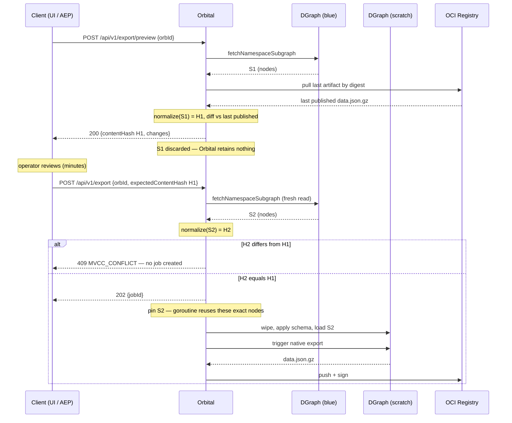

# OCI, Export, Backup & Restore Reference

Read this before: export job work, OCI publish/signing, backup/restore, Swagger annotations.

## Settled Decisions

- **Do NOT clean up job-owned files with `defer os.RemoveAll`.** *(Moved here from `debt.md` 2026-09-15 — it was an implementation note on an open row, which is the wrong place for a standing rule.)* Per-job scratch dirs under `h.scratchExportDir` (`export.go:948`) are created and never removed, and the obvious fix is the wrong one: a deferred delete runs on paths that outlive the job, and it contradicts the "no automatic cleanup of job-owned files" decision — artifacts are removed on an explicit delete, never on the way out of a function. Use an orphan reaper on a controlled directory instead.

- **Orbital is the sole OCI producer** — no downstream system needs registry write credentials. Orbital calls bundlers, bundles all layers, signs once, pushes once. ConfigBundle is a bundler — it queries Orbital's GraphQL and returns layers; it never pushes directly to ACR.
- **Bundler URLs are per-request, not server-side config** — callers supply `{"bundlers": ["url"]}` in the publish request body. A future migration to named server-side bundlers is tracked in a code comment in `publisher.go`. Do not pre-emptively add server-side bundler config.
- **Bundling is all-or-nothing** — if any bundler fails (non-2xx, timeout, size exceeded), the publish job fails and nothing is pushed to ACR. No partial pushes. Clients can retry without bundlers for a raw-export-only artifact.
- **OCI annotation carries orbId, not DGraph UID** — `com.armada.orbital.datacenter-id` is set from `export_jobs.datacenter_orb_id`. DGraph UIDs (`0x...`) must never appear in OCI artifact annotations. Fix at the source in orbital's publisher — not with compensating post-import DGraph queries in orb.
- **Export trigger is `POST /api/v1/export` with `{"orbId":"..."}` in the request body** — not a path segment. `fetchDCInfo` queries DGraph by orbId (`getDataCenter(orbId: $orbId)`), never by DGraph UID. The UID is internal and unstable.
- **Export jobs show `createdBy` (email), not `startedAt`** — `createdBy` populated from `actorFromContext` at job creation. `startedAt` removed from API response and UI; remains on ent schema for internal tracking only.
- **`RestoreBackend` has one implementation: `SubprocessRestoreBackend`** — runs `dgraph live` as a subprocess via `exec.CommandContext`. No `ORBITAL_RESTORE_BACKEND` env var, no idle pod, no shared PVC, no RBAC. The dgraph binary version in the Dockerfile must match the DGraph Alpha version deployed — rebuild orbital if you upgrade Alpha.
- **Backup checksum dedup was dropped — rely on retention only** — DGraph's JSON export is not byte-deterministic (same data → different bytes across runs). SHA-256 differs on every run even with no data changes. Do not re-implement checksum-based dedup. `ORBITAL_BACKUP_RETENTION_COUNT` is the correct bound on storage growth.
- **Backup retention is count-based; `skipped` status reserved for future** — do not repurpose `skipped` for dedup. Each completed backup has a unique S3 key, so pruning the DB record + S3 object together never orphans another record.
- **`ORBITAL_BACKUP_SCHEDULE` is a cron expression** — standard 5-field spec (e.g. `"0 0 * * *"`). Empty = no schedule on startup (local dev default). Validated via `robfig/cron/v3`. `ORBITAL_BACKUP_RETENTION_DAYS` default is 14 (not 30).
- **Layer ordering follows OCI Image Spec semantics: position 0 is the base, subsequent positions stack on top.** Orbital's manifest layout: position 0 = `data.json.gz`, position 1 = `schema.gz`, positions 2+ = bundler-produced layers in the order the bundlers returned them. `buildLayerMeta` in `publisher.go` produces this order; the courier zip filename convention (`layer-<position>-<producer>.<ext>`) mirrors it; the layers modal UI reverses ONLY for display (topmost of the stack shown at the top of the table, base at the bottom — matches a stack-diagram mental model) but shows the OCI position in a `#` column so cross-referencing with the manifest and the zip filename is one glance. Do NOT invent alternative orderings — the OCI position is the single source of truth across `oras manifest fetch`, the layers modal, and the courier zip.

## Export job lifecycle

`pending → running → completed → stale`

- **Stale detection** — on export job list page load, orbital checks scratch file existence for each completed job and marks stale if missing.
- **Delete** removes the PostgreSQL record, export zip, and the job's scratch directory.
- **Export and publish are separate actions** — publish never happens automatically on export. Publish button appears on completed jobs. Re-publishing is allowed and creates a new `registry_artifacts` row (full audit trail).
- **Globally serialized** — scratch DGraph is shared state; only one export job may be pending or running at a time. Returns 409 if another is in progress. The check-then-create window runs under an advisory lock so this holds across replicas, not just within one process — see § Job leases.

## Job leases — how export, backup and restore stay correct at N replicas

*(Settled 2026-09-16. `internal/handler/joblease.go` + `reaper.go`; pinned by `joblease_integration_test.go`.)*

**Every job is claimed before it runs, and the claimant proves it is still alive.** Nothing here depends on how many replicas exist — that is the point.

| Step | Mechanism |
|---|---|
| **Claim** | `UPDATE … WHERE id=$1 AND status='pending'`, setting `locked_by` + `heartbeat_at`. PostgreSQL row-locks, so exactly one runner changes a row and the rest get zero. A runner that does not win **must not execute the job**. |
| **Heartbeat** | Refreshed on a ticker (`ORBITAL_JOB_HEARTBEAT_INTERVAL`, 10s) while the job runs. |
| **Fence** | Every heartbeat and terminal write carries `AND locked_by = <me>`. A runner that stalled, was reaped, and woke up updates zero rows — it learns it was superseded, cancels its context and aborts rather than writing to the same scratch DGraph as its replacement. |
| **Reap** | A ticker fails jobs whose heartbeat is older than `ORBITAL_JOB_STALE_AFTER` (60s). |

**Two primitives, deliberately not interchangeable.** An *advisory lock* answers "may I act right now" — short-lived, transaction-scoped; it guards job admission and the reaper sweep. A *lease* answers "is the runner that claimed this still alive". A lock cannot answer the second: one held by a partitioned node is indistinguishable from one held by a working node, and PostgreSQL will not notice the dead connection until TCP keepalives fire — **7200s by default on Linux**. A lease that must be renewed fails *closed* on a partition; a held connection fails *open*.

**Do NOT replace the lease with a session-scoped `pg_advisory_lock` held for the job's duration.** It looks attractive — no columns, no reaper, no threshold to tune, auto-release on death — and it is wrong for exactly the keepalive reason above, in precisely the failure mode it would exist to handle. It also pins one of ten pool connections per running job and breaks behind a transaction-mode pooler.

### The three durations

`ORBITAL_JOB_HEARTBEAT_INTERVAL` (10s) · `ORBITAL_JOB_STALE_AFTER` (60s) · `ORBITAL_JOB_ORPHAN_GRACE` (1h)

**The staleness threshold does not need to exceed job duration.** That is the whole difference between a refreshed heartbeat and a static claim timestamp — a three-hour restore heartbeating every 10s is provably alive throughout. Getting this backwards produces an hour-long admission block after every crash. Reference points: controller-runtime's Lease is 15s duration / 10s renew deadline; River's leadership TTL is 5s. Orbital goes wider because the cost is asymmetric — a controller losing leadership re-elects, a false reap kills a live restore mid-`drop_all`.

**`ORBITAL_JOB_ORPHAN_GRACE` applies only to jobs with NO heartbeat at all** and must stay much longer than `STALE_AFTER`. Under a rolling update a job started by the outgoing pod is genuinely still running while the incoming pod's reaper is live; reaping those on the short threshold kills real work. One-time condition — after the first deploy carrying leases, no job is created without a heartbeat.

### Column names are borrowed, not invented

`locked_by` is delayed_job's column (2008) and the most recognisable holder name in job schemas; Oban and River spell it `attempted_by`, the Kubernetes Lease calls it `holderIdentity`. Upstream's `locked_at`/`attempted_at` is **static claim time**, which orbital already has as `started_at` — hence the honest name `heartbeat_at` for the refreshed value.

**`locked_by` format is `<hostname>_<uuid>`** — controller-runtime's lease-holder format. **Never a bare hostname**: a pod that restarts in place reuses its name, so a zombie from the previous process would match and the fence would silently stop fencing. Never a bare UUID either — an operator reading a reaped job needs to know which pod to look at, which is why the reaper's error message names it.

**Orbital fences; River does not.** River's rescuer reschedules a stuck job "potentially alongside an existing execution attempt", because it assumes idempotent jobs. Orbital's restore runs `drop_all`. That assumption does not transfer, so `locked_by` is a real fencing token here, not only a visibility column.

### No audit event

The reaper writes none. Per `AUDIT.md` § Row admission, technical failures are not audited, and `markFailed` — the path the reaper replaces — writes none either. **The job row is the durable record**: `status`, `error` and `locked_by`, readable at `GET /api/v1/export/jobs/:id`.

### Do not adopt a job framework yet

*Evaluated 2026-09-16. Re-open only on a named trigger.*

- **River** (Go + Postgres) is the correct *next* step if the workload grows — same DB, same process, no new infrastructure, air-gap preserved. Not now: orbital's jobs are domain records served directly as public API objects rather than queue entries; there is no concurrency to manage (one scratch DGraph serialises everything); and it is still 0.x and brings its own migrations. If ever adopted it must land **after** Atlas migrations, never alongside.
- **Temporal** is disqualified, and not on technical merit. It is a four-service cluster plus its own datastore plus Elasticsearch for visibility — the largest operational component in a product that ships to air-gapped environments and is built to compose with an adopter's stack rather than impose on it. This does not soften as orbital grows.
- **Triggers to revisit:** River, when job types pass ~8 or users (not operators) enqueue work at rate. Temporal, when workflows run for hours across services with real sagas or durable timers. **Neither trigger is "we want HA."**

## Export preview — `POST /api/v1/export/preview`

Synchronous, read-only, no job created: returns the **desired-state delta** between the DC's current subgraph (blue) and its last published artifact (pulled by OCI digest). The `terraform plan` / `helm diff` step for publish — orbital's UI opens it as the confirm gate on Publish, and any client can call it the same way.

**It is a desired-state delta, NOT an apply-forecast.** Orbital is intent-only and never in the reconciliation path; the edge controller decides what actually gets applied. Say "changes vs last published artifact" — never "will be applied / will create / will destroy." The response carries a `disclaimer` field saying so; keep it surfaced in any UI.

**Three states for the published side, and the distinction is load-bearing:**

| `lastPublishedVersion.state` | Meaning | Response |
|---|---|---|
| `published` | prior artifact found and pulled | the diff |
| `first_export` | no completed artifact for this DC | every entity is `added` — a legitimate full-add |
| `unavailable` | a completed artifact EXISTS but its bytes couldn't be fetched (registry down, digest GC'd, creds unset) | **200** with `retrievable:false` + `reason`, and **`changes` empty** |

`unavailable` must **never** render as a full-add — that would tell an operator they're re-adding the whole data center when in fact orbital just couldn't read the published side. The two are distinguished by a cheap PostgreSQL check (does a completed row exist?) that never depends on the registry.

**Response shape is FLAT** — `changes[]` has one entry per changed entity (`orbId`, `type`, `change`, `fields[]`), so `len(changes)` always equals the summary counts. It was briefly a nested tree with owner pointers; both were removed 2026-08-24. **Orbital is API-first: its own UI must be a thin renderer, so anything the UI displays an upstream client can display with the same ease.** Client-side logic in orbital's UI is a signal the API isn't carrying its weight.

**The diff source is a content-diff of graph snapshots — NEVER the audit log.** This gets proposed repeatedly; it is wrong for four reasons: (1) the audit log is an event *stream*, so five edits to one field report five changes instead of one net change — and can't cancel an edit against its own reversal; (2) it records mutation *input* (`{operationName, query, variables}`), not before→after state; (3) **a `dropAll` restore writes zero audit rows** — the single operation that changes published content the most would show an empty window, telling the operator "nothing changed" right before they publish a wholesale-different graph; (4) same blind spot for `make seed` and any direct DQL write. Audit answers *who/when* (compliance); only a snapshot content-diff answers *what is the net difference*. Normalization rules: `DGRAPH.md` § "Comparing two graph snapshots".

**Precedent** (this shape is conventional, not invented): `terraform plan` and the `helm diff` plugin (diff last-deployed vs pending); Argo CD `ignoreDifferences` (excluding server-managed churn fields is mandatory, not optional); Kubernetes strategic-merge `patchMergeKey` (match by stable key, not position); RFC 8785 JCS (canonicalize before hashing); OCI digest pinning (immutable baseline reference).

**Reverting a previewed change is the CLIENT's job — orbital exposes no revert endpoint.** The preview response already carries each changed field's prior value in `changes[].fields[].before`, so "discard this change before publishing" is just writing that value back via the existing `update{Type}` GraphQL mutation. It reuses the proven mutation + authz + audit path, and it is correctly indistinguishable from any other intent edit — because it *is* one. **A batch `POST /api/v1/export/revert` was designed and rejected (2026-08-25):** its only real advantage was atomic multi-node revert, but a partial revert is harmless here (nothing has shipped — the operator re-previews and sees what remains), and the `expectedContentHash` guard below already guarantees they publish exactly what they last reviewed. Do not add a revert endpoint without a demonstrated need for transactional semantics.

## Compare two published artifacts — `GET /api/v1/export/compare?from={id}&to={id}`

Read-only diff between **any two published artifacts of the same data center** — the forensic question ("we shipped v7, v5 was fine, what moved?"), distinct from the per-publish record. Both sides are pulled by immutable digest and run through the **same** normalizer (both are DGraph native exports), which makes this strictly simpler than the preview, where a native export must reconcile against a live DQL result. Registered on the readonly API group: a diff is a read.

**Sides are `from` and `to`, never "baseline".** POSIX `diff from-file to-file`; `git diff <from>..<to>`. Direction is then unambiguous: `fields[].before` is the value in `from`, `after` is the value in `to`. Document-level `from`/`to` over field-level `before`/`after` mirrors git layering file-level `a`/`b` over line-level `-`/`+`. The **preview** keeps its descriptive `lastPublishedVersion` / `current` instead — its two sides are *not* symmetric (an immutable artifact vs live mutable state), so naming them for what they are beats a generic pair.

**Guards:** both artifacts must belong to the same DC (**400** otherwise — every orbId would differ and the diff would report the whole graph as removed+added); each must have a digest (**400** if it never completed a publish); missing artifact **404**; an unretrievable or unparseable side is **502**. Note this is deliberately *stricter* than the preview: the preview degrades an unretrievable side to a `200` with a state flag because it still has a current-state story to tell, whereas a comparison with a missing side has nothing to return.

**This does NOT replace the "Changes since…" panel on the publish-history page.** That panel time-windows the audit log and is fast (one indexed query vs two OCI pulls) — it answers *who did what during this publish*, which a content diff cannot. Keep both; they answer different questions. ⚠️ But note the panel's audit source is blind to `dropAll` restores, seeds, and direct DQL, so its heading claims more authority than the data supports — consider relabelling it "Activity in this window" rather than presenting it as the changeset.

## Guarded Apply — `expectedContentHash` (optimistic concurrency)

`POST /api/v1/export` accepts an **optional** `expectedContentHash`. Pass the `current.contentHash` from a prior `POST /api/v1/export/preview` and the export **409s** if the DC's desired state changed in the review→Apply gap (another operator edited intent). Omit it for last-writer-wins — the default, so existing API callers are unaffected. Orbital's UI always sends it; on 409 it re-opens the preview with the fresh diff.

This is the **ETag / `If-Match` pattern** (RFC 9110) with the validator carried in the request body rather than a header, because the guarded resource (the DC's desired state) is not the URL being POSTed to. Closest precedent: GitHub's Contents API, which takes the current blob `sha` in the body and rejects a mismatch. Also the shape of `terraform plan -out` → `apply` refusing a stale saved plan.

**Orbital is stateless between the two calls — this is the load-bearing property.** Preview reads the subgraph, hashes it, returns the hash, and **discards everything**; the hash lives only in the client. There is no server-side snapshot, no session, no TTL, no eviction, and no replica affinity — orbital recomputes the hash from scratch on the apply and compares. A review started against one pod applies cleanly against another, and a hash taken before an orbital restart is still valid after it. Do NOT "improve" this by stashing the previewed snapshot server-side under a token: that trades a self-describing 32-byte value for megabytes of per-review state plus expiry and affinity problems.

**What gets hashed — and where scratch fits.** `fetchNamespaceSubgraph` reads **blue**; that result (the `nodes` slice) is what the hash covers. **Scratch is downstream of it** — a serialization mechanism, not a source of truth: the export wipes scratch, loads `nodes` into it, and runs a native DGraph export to produce `data.json.gz`. So the hash gates the pipeline's *input*; everything after it is derived from data already verified. Scratch is wiped at the start of every export and holds nothing between runs.

**Do NOT try to hash the exported artifact instead** — DGraph's native export is not byte-deterministic (the same finding that killed checksum-based backup dedup, see § Backup). The same graph can serialize to different bytes, so an output hash would produce constant false conflicts. Hashing the normalized graph model is stable by construction.

The preview **never touches scratch** — it reads blue and stops, so it takes no scratch lock and never contends with a running export.

**Pinning — why the export uses the verified bytes.** The guard's read (`S2`) happens in `Trigger`; without pinning, `doExport` would issue a *third* read in the goroutine, leaving a millisecond-wide window where the published artifact could contain an unreviewed change. So when `expectedContentHash` is supplied, `Trigger` hands its already-fetched `S2` to `runExport`, and `doExport` uses those nodes instead of re-fetching. That makes **shipped == reviewed** structurally true, and it *removes* a query rather than adding one. Unguarded callers keep the old behavior (goroutine fetches its own snapshot) so their trigger stays fast.

**Multi-writer clients MUST send it.** It is optional at the protocol level only for back-compat (orbctl, scripts, single-operator flows). Any surface where several people can edit intent concurrently — orbital's own UI, AEP — is expected to send it on every apply.

**What the hash covers** (`graphdiff.Snapshot.ContentHash`, `internal/graphdiff/compare.go`): the **canonical normalized graph** — sorted orbIds, each node emitted as sorted-key JSON (`orbId`, `types`, `f:<scalar>`, `e:<edge>` as sorted target orbIds) streamed into one SHA-256. Therefore:

- **In** — the set of orbIds present (so **adds and deletes** move it, which a per-node `version`/`version` check structurally cannot catch), type membership, every scalar value, every edge as target-orbId sets.
- **Out** — `ConfigItem.version` / `updatedAt` / `updatedBy` and DGraph internals (`uid`, tenant `namespace`). So it is **UID-independent** (survives a restore's UID reassignment) and **noise-independent** (a save-with-no-change bumps `version` but does NOT trip the guard — it guards semantic change, not write activity).
- **Not covered:** the GraphQL schema. A `schema.graphql` change between preview and Apply would alter `schema.gz` without moving the hash. Acceptable — that's a deploy event, not a concurrent-operator action.

Preview and the guard call the **same** `graphdiff.NormalizeCurrent(fetchNamespaceSubgraph(ns)).ContentHash()`, so "hash changed" ⟺ "the preview would render differently" — it cannot drift from what the operator reviewed. The guard runs **after** the cheap in-progress checks (it costs a full subgraph re-fetch) and **before** job creation, so a rejected Apply leaves no job row. Scoped to the one DC's namespace — edits in another DC never block your publish.

## Known limits — export, preview, guarded apply

**Whole-subgraph-in-memory is the binding constraint, and it predates all of this.** `fetchNamespaceSubgraph` returns the entire namespace as `[]map[string]any`, and `loadSubgraphIntoScratch` marshals all of it into a single DQL mutation body. That was true before the preview and the guard existed. If a DC subgraph ever stops fitting in memory, **the export breaks first** — do not conclude the hash or the preview needs redesigning. The bound is physical (one modular data center's servers, NICs, volumes, clusters), ~1,300 nodes for colo today.

**Preview is the heaviest consumer — not the guard, and not the pin.** Computing a diff holds four structures at once: published nodes + published snapshot + current nodes + current snapshot, roughly 4× one subgraph. By contrast the pin adds ~nothing to peak: exports are globally serialized, so at most one snapshot is live either way — pinning only extends how long it is held, not how much.

**Escape hatches, in the order to reach for them:**

1. **Free the raw nodes after `NormalizeCurrent`.** Preview doesn't need the raw slice once the Snapshot exists — dropping the reference roughly halves peak. Cheapest win, no design change.
2. **Stream the hash.** Collect and sort orbIds first, then normalize + encode one node at a time into the running SHA-256 — O(node count) instead of O(whole graph).
3. **The diff is the genuinely hard one.** Comparing by orbId wants both sides indexed; streamable only as a merge-join over orbId-sorted inputs. Real work — defer until 1 and 2 are exhausted.
4. **Paginate the response before optimizing the computation** (`?detail=summary`, truncation — design §7). Response size usually hurts before memory does.

**The client contract is scale-independent — this is the insurance.** `contentHash` is a 32-byte opaque token compared in O(1). Clients never parse it, never construct it, never depend on its derivation. So the derivation can be swapped wholesale — streaming digest, a rolling hash maintained in DGraph, a Merkle tree over orbIds — with **zero client changes**. Never leak hash internals into the API; that freedom is the whole point of the ETag shape.

**Cost is latency as well as memory.** A guarded apply pays one extra full subgraph read to verify before it accepts — seconds on a large DC. That is why the guard runs *after* the cheap in-progress checks and before job creation.

**Two things the hash deliberately does not cover:** the GraphQL schema (a `schema.graphql` change between preview and apply alters `schema.gz` without moving the hash — a deploy event, not a concurrent-operator one), and the scratch round-trip (the preview reads blue and never stages to scratch, so it surfaces semantic differences, not serialization ones — intentional, since DGraph's native export isn't byte-deterministic — see `DGRAPH.md` § "Comparing two graph snapshots").

## Download endpoint — dual mode for courier flow

`GET /api/v1/export/jobs/:jobId/download`

- **No bundlers configured** → streams the raw export zip (`data.json.gz` + `schema.gz`) directly from disk. Backward compatible with pre-bundler behavior; works when OCI is unconfigured (local dev, minimal deploys).
- **Bundlers configured** (`ORBITAL_BUNDLER_URLS` non-empty) → calls each bundler on the fly and packages the result as a **courier-ready zip**:
  - `data.json.gz` (OCI position 0)
  - `schema.gz` (OCI position 1)
  - `layer-<oci-position>-<producer>.<ext>` for each bundler-produced layer, where `<oci-position>` matches the layer's index in the OCI manifest (bundler layers start at 2) and `<ext>` is derived from the media type's structured-syntax suffix (RFC 6838) — `.yaml` for `+yaml`, `.json` for `+json`, `.xml` for `+xml`, `.gz` for `+gzip`, `.zip` for `+zip`, `.bin` fallback for unknown suffixes
  - `layers.json` — `[{mediaType, filename, producer}, ...]` — media-type manifest orb's `/api/v1/import/artifact` reads to route layers to consumers.
- **Zip format matches orb's `/api/v1/import/artifact`** — same shape produced by publish's OCI path (minus the OCI wrapper). A courier operator downloads the zip, walks it to the edge, uploads it to orb — orb's importArtifact accepts it and dispatches to consumers exactly as if it came from an OCI pull. See the integration tests in `internal/handler/export_download_integration_test.go` for the pinned shape.
- **NOT signed.** Trust model for courier is "operator physically walked this in" — not cryptographic. Cosign signing runs only on the OCI publish path. If signature verification for courier is added later, the zip shape can carry a `signature.json` alongside without breaking existing consumers (orb's importArtifact ignores unknown files).
- **NOT reproducible against a specific publish digest.** Download calls bundlers with current graph state, so download-after-publish may return different bytes than the published artifact if the graph changed. That's intentional: courier's operator wants "the current config," not "reproduce publish #17."
- **No side effects.** Download does not push to OCI, does not sign, does not create a Publish History row. Pure read from disk + bundler call + zip assembly.
- **Errors:** if any bundler fails (HTTP error, timeout, non-JSON response), Download returns 502 with the bundler's error text — NOT a partial zip. Better to bounce the operator to fix the bundler than hand them an incomplete artifact.

## OCI publishing

- **Libraries:** `oras.land/oras-go/v2` for pushing, `github.com/sigstore/cosign/v2` for signing. Do not use the cosign binary — SDK used directly in-process.
- **Credentials:** `ORBITAL_OCI_USERNAME`/`ORBITAL_OCI_PASSWORD` are env-only. Never store in PostgreSQL. Signing private key configured via `ORBITAL_OCI_SIGNING_KEY_PATH` (unencrypted file), env/file-only, never a form field. **Signing is mandatory** — publish fails if key not configured.
- **Air-gap safe:** `TlogUpload: false` — no Sigstore network calls. Signature stored as OCI referrer. Public key distributed via orb onboarding response (primary, air-gap) and `GET /api/v1/oci/public-key` (secondary).
- **Artifact format:** `artifactType: application/vnd.orbital.subgraph.v1`, two layers:
  - `data.json.gz` — `application/vnd.orbital.subgraph.data.v1+gzip`
  - `schema.gz` — `application/vnd.orbital.subgraph.schema.v1+gzip`
  - Manifest annotations use `com.armada.orbital.*` prefix.
- **Per-layer producer attribution:** every layer carries the annotation `com.armada.orbital.producer` set at push time. Orbital's own graph layers use `orbital`; bundler-returned layers use the friendly name from `ORBITAL_BUNDLER_URLS` (e.g. `configbundle-bundler=http://...`). Orb reads this on import and displays it. Layers without the annotation render as `(unannotated)` (legacy artifacts). Do NOT invent producer names downstream — the OCI annotation is the source of truth.
- **Tag strategy:** monotonic `v{n}` tags per data center repo, derived from count of existing `registry_artifacts` rows. `:latest` updated on every successful publish.
- `registry_artifact.datacenter_name` stores DC name at publish time — denormalized for display, avoids DGraph lookup on every artifact list. Default `""` allows migration on existing rows.

## Backup

- **Trigger:** `POST /api/v1/backups` → async job.
- **Flow:** DGraph native export mutation on blue → `json.gz` written to host-side volume mount (`DGRAPH_EXPORT_DIR`, default `./dgraph-exports`) → package `data.json.gz` + `schema.gz` into zip → upload to S3 → clean export dir → enforce retention count.
- **Azure Blob Storage** auto-detected by `.blob.core.windows.net` in endpoint; uses Shared Key auth (not AWS Signature V4). All other S3-compatible endpoints use AWS SDK with path-style addressing.
- **Backup zip naming:** `orbital-<version>-<timestamp>.zip` (e.g. `orbital-v0.1.0-20260509T135041Z.zip`). Version from `internal/version.Version` via ldflags.
- **Retention:** `ORBITAL_S3_RETENTION_COUNT` prunes oldest completed backups.

## Restore

- `pending → running → completed → failed`. Jobs are permanent — never deleted.
- **Blocked if:** any backup or export job is pending/running (409). Backup and export are also blocked if any restore job is pending/running — all three job types check each other.
- **Restore scope is DGraph only (MVP)** — PostgreSQL operational data (audit logs, events, job history) is not restored. PostgreSQL backup is out-of-band via the managed PostgreSQL service (Azure).
- **Mechanism: `SubprocessRestoreBackend`** — runs `dgraph live` as a subprocess via `exec.CommandContext`. The `dgraph` binary is copied from `dgraph/dgraph:v25.3.1` into the orbital Docker image via multi-stage build. No idle pod, no shared PVC, no RBAC. `dgraph live` connects to Alpha/Zero via gRPC using `ORBITAL_DGRAPH_ALPHA_GRPC` / `ORBITAL_DGRAPH_ZERO_GRPC` (defaults: `localhost:9080` / `localhost:5080`).
- `ORBITAL_RESTORE_TIMEOUT` env var (default 10m).

## Swagger

- Regenerated via `make docs` (runs `swag init` for both orbital and orb). Run after changing any `@Router`, `@Tags`, or `@Summary` annotations.
- Swagger tag names: `backup graph`, `export subgraph`, `oci`.
