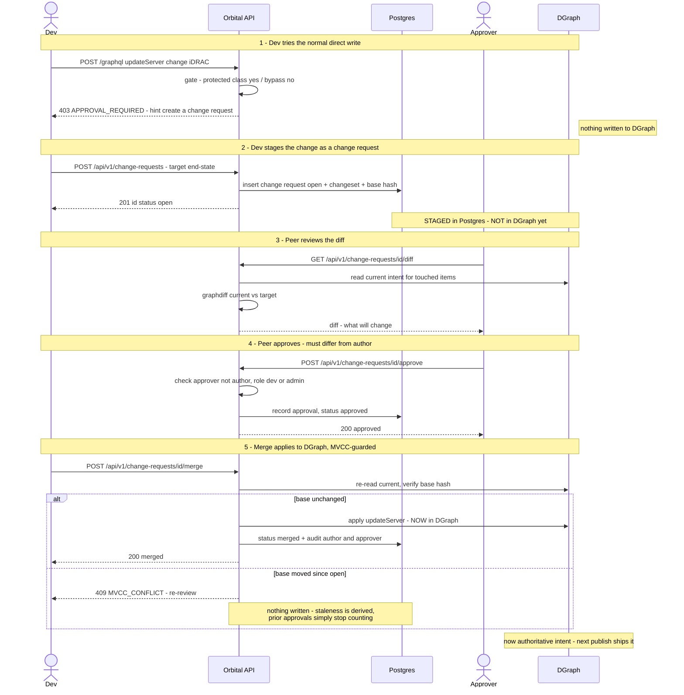

# Spike 36 — Change Requests & the generic approval engine

**Status:** Spike 36 — design **ratified 2026-08-26**, implementation not started (4-phase plan in §17). WIP spike doc: on ship, its decisions fold into `docs/reference/AUTH.md` + a new `docs/reference/CHANGE-CONTROL.md` and **this doc is deleted** (spike lifecycle). Lives under `docs/spikes/` per convention — not a standalone `docs/*-design.md`.
**Date:** 2026-08-26.
**Companion:** evidence + landscape in the companion `docs/spikes/spike-36-approval-engine-research.md`. Amends the Spike 31 decision ("client-layered approval is sufficient") — see §Dependencies.
**Design principle (per request):** every non-trivial decision is mapped to the convention used by leading solutions in the space (InfraHub, NetBox, GitHub, Terraform Cloud, Vault, K8s admission). See §Upstream alignment.

---

## 1. Problem & goals

Today any `dev`/`admin` writes intent directly via a `/graphql` mutation; there is no way to require that a change be reviewed/approved by a second person before it becomes authoritative intent. We want an **optional, enforced maker-checker** capability: for protected parts of the graph, a change is **staged as a change request**, **reviewed as a diff**, **approved by someone other than the author**, and only then **merged** into authoritative intent.

**Goals**
- **One generic approval engine; action types are adapters** — build the lifecycle/approval/policy/audit/UI once; config-change approval is the v1 action type, export/workflow approval plug in later with no rebuild (Nautobot `ApprovableModelMixin` / Vault Control Groups pattern; see §16).
- Enforced four-eyes on intent changes, **at orbital's own write chokepoint** (covers UI, AEP, orbctl, third-party clients).
- Opt-in and scoped, so adopters who don't want it pay nothing (general-platform requirement).
- Reuse existing machinery (`graphdiff`, guarded-apply/MVCC, roles, audit, Postgres/ent).
- Stay inside orbital's invariants: intent-only, cloud never reconciles, GraphQL mutations update authoritative intent only, UI is a thin renderer.

**Non-goals (v1)**
- Full materialized branching (isolated live-browsable workspaces). A multi-item change request already *is* a lightweight, changeset-based branch; materialized branching is a later, optional build (see research Addendum).
- Field-level *merge-conflict* resolution / three-way merge. v1 = detect **staleness** (base moved), hard-reject, re-review.
- Approval **orchestration sugar** — push notifications, reviewer routing/assignment, multi-stage CAB, ITSM mirroring. **Orbital owns the entire control loop standalone** — gate, change-request resource + lifecycle, diff, `proposer≠approver`, approval, merge, *and* a functional UI including a pull-based "awaiting my review" queue. The client (AEP) adds only the orchestration sugar; orbital's approval capability does **not** depend on any client. (ITSM is out of scope.)
- Approver groups / N-of-M policy, per-field policies. v2+.

---

## 2. Core model & terminology

- **Approval Request** — the generic, persisted, reviewable object the engine manages. Wraps a typed **action** (`action_type` + payload) and carries the lifecycle/approval state. Lives in **Postgres**. (See §16.)
- **Action type** — what is being approved: `config.mutation` (v1 — a change to intent), `export.publish` (future), `workflow.run` (future). Each is a pluggable **adapter** (preview · staleness · execute · policy-selector).
- **Change Request** — the **user-facing name for the `config.mutation` action type**: a staged change to authoritative intent. *Not-yet-intent*, so it must never live in DGraph. Analogous to a GitHub PR / InfraHub Proposed Change.
- **Changeset** — the content of a change request: the **target end-state** of each touched config item (+ its owned-child subtree), stored as canonical JSON. NOT a replay-log of mutations (see D2).
- **Protected class** — a namespace (optionally + type) for which an approval policy is configured. Absent policy ⇒ no gate (opt-in).
- **Approver** — a `dev`+ principal, other than the author, who approves. (v1: peer review; v2: approver groups.)
- **Privileged write** — a write to a protected class by a caller whose role appears in the policy's `bypass_roles` (**D15**). Applied directly with no proposal round-trip, and **always flagged as privileged in the audit event**. There is no user-held capability; bypass is a property of the policy. *(Supersedes the earlier `bypass_approval` capability and the "break-glass" framing.)*

---

## 3. Key design decisions (each mapped to upstream convention)

### D1 — Change Request scope: an arbitrary set of config items; the owned subtree is atomic
A change request carries **one or more changed config items within a single namespace** (v1), each including its **owned-child subtree as an atomic unit** (you cannot half-change a server's owned iDRAC/NICs). It is **not** limited to a single entity, and it is **not** required to cover a whole namespace — just confined to one. (Cross-namespace change requests are a future/branch extension — see §13.)
- *Why:* mirrors the universal PR/branch/plan convention — a review unit is "whatever changed," reviewed as a diff — while the owned-subtree-atomic rule aligns with orbital's ownership model (Spike 33) and gives staleness detection a concrete unit.
- *Upstream:* GitHub PR (arbitrary fileset), InfraHub Proposed Change (arbitrary branch delta), Terraform plan (whatever the config diff is).
- *Dependency:* the "owned subtree" unit depends on the Spike 33 ownership single-source.

### D2 — Changeset representation: target end-state (desired state), NOT a mutation-replay log
The changeset stores the **desired end-state** of each touched item as canonical JSON. The review diff = `current intent` vs `target`. The changeset is expressed as a per-item **field-delta in orbital's own neutral terms** (`set` = fields to set, `clear` = fields to unset) — **NOT** DGraph's dialect; orbital **translates it to the backing store's mutation at merge** (today: a DGraph `update{Type}(set/remove)`). So the change-request contract is **store-independent — clients never see "DGraph"** (see §13). This matches what the JSON editor already produces (snapshot→set/clear delta). The per-item contract — creates in scope, `type` optional-in/always-out, explicit `op` — is **D12**.
- *Why:* replaying captured mutations is fragile (a mutation captured against old state may not re-apply cleanly; staleness semantics are murky). Desired-state + diff makes "did the base move?" the clean staleness signal, and **orbital already computes exactly this** (`graphdiff` / `canonicalNode` / export-preview).
- *Upstream:* Terraform (desired config → plan → apply), Git/GitHub (stores resulting content, diffs against base), InfraHub/NetBox branching (branch holds desired data, diffed vs main). Desired-state is the near-universal convention; nobody ships an edit-replay log as the review artifact.

### D3 — Storage: Postgres (change request + changeset + approvals); DGraph sees the change only at merge
Change Request, changeset payload, approvals, and policy all live in **Postgres via ent**. DGraph holds authoritative intent only; a pending change request must never appear in the Topology API / exports / seeds.
- *Why / detail:* see research doc D1 (five reasons: operational data; must not pollute the graph; avoids `@id` global-uniqueness collision; relational workflow modeling; REST-convention fit).
- *Upstream:* every ITSM CMDB stores the change-request off to the side of the CI store; run-planes store the run/plan in their own DB, apply to the target only on approval.

### D4 — Enforcement: reject-and-redirect at the `/graphql` mutation chokepoint (not silent-transform, not client-only)
A gated mutation is **rejected** with `APPROVAL_REQUIRED` (403 + hint → `POST /api/v1/change-requests`). It does not silently become a change request.

> **D14 amends this decision's LOCATION** (not its semantics). `/graphql` is a chokepoint for *clients*, not for *writes*: `Handle` and `DispatchMutation` each POST to DGraph independently, so a gate in `Handle` alone is bypassable via divergence-Accept. The check belongs in a **shared write function** both call. D14 also settles that divergence-Accept *creates* a change request rather than 403-ing, since it is a REST action and the no-silent-transform rule is justified by the GraphQL contract specifically.
- *Why:* a mutation that returns "pending" instead of the mutated object breaks the GraphQL contract and the invariant "GraphQL mutations update authoritative intent only." Enforcing in the client (AEP) is bypassable by orbctl/third parties — the research's "chokepoint truth."
- *Upstream:* GitHub protected-branch push rejected server-side (405/422) regardless of client; Vault Control Groups intercept at the core API; K8s admission rejects at the apiserver for all clients.

### D5 — Staleness / concurrency: MVCC hard-reject on base-moved + stale-approval dismissal
At **open**, capture a content hash over the changeset's **declared** orbIds + their owned subtrees (the `graphdiff` `ContentHash()` concept, scoped — see D13). At **merge**, re-check; if the base moved → the change request is **stale**: reject with `409 MVCC_CONFLICT` (error code stays; message speaks staleness), existing approvals stop counting, and re-review against the new base is required.

> **D13 supersedes this decision's mechanics** (not its semantics): staleness is **derived on read**, never stored — there is no `stale` column, approvals are hash-stamped rather than dismissed, and nothing is event-driven. D13 also covers the deleted-target case. **Scope the hash by the changeset's *declared* orbIds, not by "what currently exists"** — otherwise a request creating an entity that someone else creates first merges over them undetected. No auto-merge/auto-rebase in v1 — the human re-reviews the recomputed diff and re-approves.
- **Granularity (v1): entity / owned-subtree level.** Any change to a touched entity's owned subtree since open marks the request stale (even a different field). Safe, reuses the guarded-apply hash; occasional over-conservative re-reviews are cheap. **Field-level staleness is v2.**
- **Vocabulary:** "**stale / staleness**" is the single canonical term for base-moved-must-re-review. "Conflict" is retired as a change-request state and reserved only for a possible v2 field-level *merge*-conflict feature; `MVCC_CONFLICT` remains only as the reused error code.
- *Why:* guarantees "merged == reviewed"; reuses guarded-apply verbatim.
- *Upstream:* GitHub "require branch up to date" + "dismiss stale approvals on new commits"; Terraform "stale plan"; InfraHub staleness detection.

### D6 — Protected-class policy: per-namespace (optional per-type), opt-in, admin-managed
An `approval_policy` row scopes where approval is required: `{namespace, type?(nullable=all), required_approvals(default 1), enabled}`. No matching policy ⇒ direct writes as today.
- *Why:* general platform needs the gate to be configuration, not hardcoded; namespace-first granularity matches "protect the main branch" coarseness.
- *Upstream:* GitHub branch-protection rules (per-ref), Vault `control_group` attached to policy paths, InfraHub per-branch policy, K8s admission bindings scoped by namespace/resource.

### D7 — Authz / approver: peer approval by `dev`+, `proposer ≠ approver` enforced; bypass is an audited capability
- **Propose:** any principal who can currently write (`dev`+).
- **Approve:** `dev`+ **and not the author** (peer review). **Self-approval is waived for callers whose role is in the policy's `bypass_roles`** (D15), and the approval is flagged accordingly. (v2: policy may require an admin approver or a named approver group.)
- **Privileged write (D15):** governed by the policy's `bypass_roles` (default `["admin"]`), not by a capability on the user. Two entry points — (a) write directly via `/graphql`, or (b) create a change request and self-approve it. **Both are flagged as privileged writes in the audit log** — frictionless, never invisible.
- *Why:* keeps v1 inside the existing `readonly<dev<admin` model without inventing a heavy role system, while enforcing the core control. **Silent admin exemption would undercut the entire compliance value** — you could say "some changes were reviewed" but never which. A frictionless-but-audit-flagged privileged write (D15) preserves it at zero cost to the admin.
- *Upstream:* GitHub (write-access can approve, author cannot); InfraHub (self-approval blocked, Super-Admin audited break-glass); NetBox (Change Manager vs Reviewer — the group split is the v2 target); Vault authorizer identity groups.

### D8 — State machine: open → approved → merged (+ rejected / closed, + stale flag)
`open` (review) → `approved` → `merged` (terminal). Also `rejected` and `closed`/withdrawn (terminal). `stale` is a flag on `open`/`approved` set when the base moves (D5), which dismisses approvals. (No `draft` in v1 — a change request is open on create; draft is a v2 nicety.)
- *Upstream:* InfraHub (Draft→Open→Approved→Merged/Closed); GitHub PR states.

### D9 — Merge is an explicit action (not auto-on-approval) in v1
Reaching `approved` does not auto-apply. A separate `POST /api/v1/change-requests/:id/merge` (by author or an approver) applies the changeset **atomically in one DGraph transaction (D11)**, MVCC-guarded, and records audit. (v2: policy-driven auto-merge on final approval.)
- *Why:* an explicit merge gives a final MVCC checkpoint and matches the review→confirm split.
- *Upstream:* GitHub (explicit merge, auto-merge opt-in), Terraform Cloud (explicit Confirm&Apply), InfraHub (merge is a step after approval).

### D10 — Audit: full lifecycle in the existing audit log; merge attributes author + approver(s)
Change Request created/opened/approved/rejected/merged/closed and every bypass are recorded in the existing Postgres audit log. The DGraph mutation emitted at merge references the change request id, author, and approver(s); bypass writes are flagged.
- *Upstream:* NetBox `ObjectChange` + `request_id` correlation; ServiceNow change-request audit trail.

### D11 — Merge is ATOMIC: one DGraph transaction, all-or-nothing; and the changeset is schema-validated at creation
**Ratified 2026-08-28.** A change request may touch several config items (D1), so merge must apply **all of them or none**. It executes as a **single DGraph transaction** via the DQL/`/mutate` path — not as N separate `update{Type}` GraphQL mutations.

**Why this is not optional — measured, not assumed.** DGraph's GraphQL layer executes multi-root mutations **independently, with no shared transaction**. Verified against the local stack: a two-field mutation where the first succeeds and the second hits a runtime `@id` uniqueness violation returns *both* a partial success and an error, and the first write **commits**:

```json
{"errors":[{"message":"…already exists for field orbId","path":["b"]}],
 "data":{"a":{"numUids":1}, "b":null}}
```

Without a transaction, a 5-item change request whose 3rd write fails leaves the graph half-changed while `status = merged` — the audit record asserts a reviewed change was applied when only part of it was. That is worse than an outright failure, because nothing signals that a re-review is needed. *(Note: D1's "the owned subtree is atomic" is a narrower guarantee — one item and its owned children move together. It says nothing about item A and item B moving together. D11 is what covers that.)*

- *Why atomicity is the right bar here, and not everywhere:* the split across the industry is not philosophical, it is **whether you write to one transactional store or many independent ones**. GitHub (atomic ref update) and InfraHub (graph branch merge) are atomic; Terraform and `kubectl apply -f dir/` are **not**, because they apply to many independent APIs with no shared transaction — their partial-apply-plus-converge model is a concession to the substrate, not a preference. Orbital writes to **one** store, and DGraph DQL upserts **are** transactional. We are in the first column, so atomicity is achievable and therefore required.
- *Consequence — merge owns what the GraphQL proxy normally does.* Leaving the proxy means the merge path must explicitly set `version` (increment) and `updatedBy`/`updatedAt`. It must **not** rely on the proxy's generic audit event: D10 already requires a bespoke merge event carrying the change-request id, author, and approver(s), which the proxy's event cannot express. MVCC `ifVersion` is superseded by `base_hash` (D5); `RequireRole` is enforced at the REST endpoint.
- **Validate the changeset at CREATION, not at merge.** DQL bypasses GraphQL schema validation, so a misspelled field would silently write a junk predicate instead of erroring. The changeset is therefore validated against `internal/configitems.Types` + `schema/schema.graphql` when the change request is **created** — a request that cannot possibly merge must never enter review. This also closes the DQL-validation gap without putting validation on the merge hot path.
- *Upstream:* GitHub/InfraHub atomic merge; contrast Terraform's explicitly non-atomic apply.

### D12 — Changeset item contract: creates are in scope; `type` is optional input / always output; `op` stays explicit
**Ratified 2026-08-28.** A change request may **create** a config item, not only update one. Each item in `changes[]` is:

```json
{ "orbId": "prod:server-SN1234", "op": "upsert",
  "set": { "idrac": { "timezone": "UTC" } }, "clear": [] }
```

**`type` is optional on input and always present on output.** `orbId` is `@id` on the `ConfigItem` interface — **globally unique across every type** — so for an item that already exists orbital resolves the type itself (DQL by `orbId`, concrete type via the existing `primaryType` helper). Do not make a client send what orbital already knows.
- **Omitted + entity exists** → resolved server-side.
- **Omitted + entity does not exist** → `400`. A create has nothing to look up.
- **Supplied and resolvable** → orbital **verifies it matches**; a mismatch is a `400` at creation. Redundant input that can drift must be checked, never silently ignored.
- **Always stored in the payload and echoed in every response**, whether or not the client sent it.

*Why store it when it's derivable:* (1) the D11 creation-time schema validation needs the type to check `set`/`clear` field names; (2) the review diff renders `orbId | Type | Change` and must not do a lookup per row (the Spike-30 "API carries what the view needs" rule); (3) the persisted payload **is the audit record of what was approved** — it must stay self-describing years later, when the entity may no longer exist or may have been recreated.

**Do NOT derive the type by parsing the orbId.** The `<namespace>:<kind>-<natural-key>` convention is only partly adopted — Server and the network types follow it, but DataCenter, Rack, and IPAddress still carry legacy bare keys (`colo:colo-galleon`, `2f-uae:2f-uae` are real DataCenter orbIds). A parser would work for some types and silently fail for others, which is not a foundation for validation. Resolve by lookup.

**`op` stays an explicit field** (`upsert` · `update` · `delete`). It is *not* inferable: `delete` cannot be distinguished from "an item with an empty `set`", and `upsert` vs `update` is the difference between creating a missing entity and failing on it. Keep the caller's intent explicit rather than reconstructing it from the shape of the payload.

- *Upstream:* Kubernetes server-side apply (the object carries its own `apiVersion`/`kind`; the API server does not guess), Terraform plan items (address + explicit action verb: create/update/destroy).

### D13 — Staleness is DERIVED on read, never stored or event-driven; and a target deleted during review is a hard failure
**Ratified 2026-08-28.** Amends D5's mechanics (the semantics of D5 are unchanged: base-moved ⇒ re-review).

**Derive, don't maintain.** One function, called from two kinds of place:

```
isStale(cr):
  orbIds  := cr.declaredOrbIds()                 // from the changeset
  scope   := ∪ collectRelatedOrbIDs(orbId)       // + owned subtrees (Spike 33)
  current := NormalizeCurrent(query(scope)).ContentHash()
  return current != cr.base_hash
```

**Read** paths (`GET :id`, list rows) call it to *display*; **write** paths (`approve`, `merge`) call the same function to *enforce*. `base_hash` is captured once at open and never recomputed.

**Explicitly NOT event-driven.** Marking change requests stale when a write lands is what GitHub does, and it is the wrong fit here. Orbital has no event bus, no job queue, and no worker pool — export jobs are goroutines plus DB rows; the only background components are the backup scheduler and the divergence ingester. Event-driven staleness would mean **building that machinery for this one feature**. It would also need marking hooks in four places — `Handle`, `DispatchMutation`, merge, and restore — and **restore cannot be hooked per-entity at all** (`dropAll` + reload). Every missed hook is a change request that silently claims to be fresh. The derived version has **zero** hook sites, cannot drift, and handles restore correctly for free (the next read recomputes against the restored graph — including the case where restored content happens to match, where the request is genuinely *not* stale).

Two consequences follow, and both are simplifications:

1. **There is no `stale` column.** A stored boolean is precisely the copy that drifts. Staleness is computed, never persisted.
2. **Approvals are hash-stamped instead of dismissed.** Each `approval` row records `approved_at_hash` — the `base_hash` it was cast against — and an approval counts only while its hash matches the current one:
   `valid_approvals = approvals where approved_at_hash == current_hash`
   This removes D5's "dismiss approvals" **state mutation** (a step someone must remember to perform) and is better UX: instead of approvals silently vanishing, the UI can say *"Alice approved an earlier version"* — which is what GitHub shows.

**Cost, stated honestly:** one subtree query + hash per change request per read. Bounded, and appropriate at orbital's scale (tens of open requests, a handful of operators — not GitHub's millions). **Measure before optimising.** If a queue ever gets slow, *that* is when the `change_target` projection (§4) earns its place — with a number to justify it. Until then it stays optional and `?orbId=` is served from the jsonb payload with a GIN index, avoiding a denormalised table that must be re-synced on every `PATCH`.

**Deleted target — a hard failure, not merely stale.** The declared-orbId scoping (D5) detects the entity vanishing, but *stale → re-review → approve → merge* would then run `op: upsert` against a missing orbId and **recreate the entity from a field-delta** — yielding a partial object containing only the fields this change request happened to touch. A successful-looking merge that quietly corrupts data. The precise rule:

| At open | At merge | `op` | Outcome |
|---|---|---|---|
| absent | absent | `upsert` | ✅ **creates** — a normal create (D12) |
| absent | present | `upsert` | ⚠️ **stale** — someone created it first; re-review |
| **present** | **absent** | `upsert` / `update` | 🛑 **hard fail** — `409 TARGET_MISSING`, naming the orbId |
| any | absent | `delete` | ✅ **no-op success** — deleting an absent entity is idempotent |

Note it is *not* "the target is missing" in general — an absent target is a perfectly valid create. Distinguishing row 1 from row 3 requires knowing what existed at open, so `approval_request` stores **`base_present`** (the orbIds present when the hash was captured) alongside `base_hash`. The snapshot that produces the hash already contains this; it is simply retained.

`TARGET_MISSING`'s hint states the three ways out: close the request, `PATCH` it to drop that item, or recreate the entity and re-review.

- *Upstream:* derived-not-stored freshness is the same reasoning as Terraform's plan-is-recomputed-against-current-state; hash-stamped approvals mirror GitHub's "approved an earlier version" rather than silent dismissal.

### D14 — The gate lives in a shared DGraph-write function, not at `/graphql`; divergence **Accept** produces a change request
**Ratified 2026-08-28.** Amends D4's *location* (its semantics — reject-and-redirect, no silent transform on GraphQL — are unchanged).

**`/graphql` is a chokepoint for CLIENTS, not for WRITES.** Verified in code: `GraphQL.Handle` and `GraphQL.DispatchMutation` each issue their **own** `http.Post` to `h.dgraphURL`, duplicating the POST, the error handling, and the audit call. They share no write function. A gate placed only in `Handle` therefore fails the research doc's own standard — *"a gate not at the universal write path is advisory."*

**The concrete bypass, with nothing malicious involved** — two legitimate features composing:
1. Drift appears at the edge (or someone changes something there).
2. An operator hits **Accept** on the divergence, which by design dispatches `update{Type}` so intent matches reality (`divergence.go` → `dispatchAcceptMutation` → `DispatchMutation`).
3. **Intent has changed in a protected namespace with no approval and no bypass record.**

That is the divergence workflow behaving exactly as specified — and "ratify a change made outside orbital entirely" is arguably the case that *most* deserves a second reviewer.

**Fix: extract one shared write function; the policy check lives inside it.** `Handle` and `DispatchMutation` both call it. Gating the two call sites separately means two checks to keep in sync and a third path, added later, that nobody remembers to gate — **make it structurally unbypassable in Go rather than by convention.**

D11's merge is a *third* write path (a DQL transaction) and is **correctly exempt**: it runs post-approval, and it does not go through the GraphQL write function at all, so the exemption falls out of the structure instead of needing a special case.

**One policy check, per-entry-point response.**

| Entry point | Caller's role ∈ policy `bypass_roles` (D15) | Not in `bypass_roles` |
|---|---|---|
| `/graphql` mutation | **writes directly**, audit flagged *privileged write* | `403 APPROVAL_REQUIRED` + hint (**D4 unchanged**) |
| divergence **Accept** | **writes directly**, audit flagged *privileged write* — no proposal round-trip for a routine resolution | **creates a change request** pre-filled from the divergence entry, and returns it |
| merge (D11) | exempt either way — post-approval by construction | exempt |
| divergence **Reject** / **Ignore** | **ungated** either way — verified: only `ActionAccept` dispatches a mutation (`divergence.go:294`); Reject and Ignore write `DivergenceResolution` records and never touch intent | ungated |

*(Divergence resolution is `dev`-gated today — `server.go:244` puts `PUT /divergences/:id/resolution` in the `RequireRole(RoleDev)` group, and `ui.go:426` sets `CanResolve` at `RoleDev`. `DIVERGENCE.md`'s "cloud admin" is a **persona**, not an enforced role. So the ungated bypass is live for devs, not hypothetical.)*

**Why Accept transforms where `/graphql` rejects.** D4's no-silent-transform rule is justified *specifically by the GraphQL contract* — "a mutation that returns `pending` instead of the mutated object breaks the GraphQL contract." Divergence Accept is a REST action orbital defines, so returning "created change request #42" breaks no contract; applying D4's conclusion past its rationale would be cargo-culting. The UX argument is decisive on its own: rejecting would tell the operator to go hand-build a change request reproducing the target value **orbital already holds** in the divergence entry. Transforming is one click and loses nothing.

*Side effect worth noting:* this makes divergence-Accept a **second producer** of change requests, which is a real validation of the generic-engine design (§16) — requests are not only born from `POST /change-requests`.

- *Upstream:* K8s admission controllers sit in the apiserver's write path, not in any one client-facing handler — every client and every internal actor traverses the same gate.

### D15 — Bypass lives on the POLICY, not on the user; a privileged write is frictionless but always recorded
**Ratified 2026-08-28.** Supersedes D7's `bypass_approval` capability and retires that term.

**`approval_policy` gains `bypass_roles []string`, defaulting to `["admin"]`.** There is **no user-held capability** and **no change to orbital's role model** — `user.role` stays the three flat values (`readonly` < `dev` < `admin`).

**Why on the policy rather than on the principal:**
- **It costs nothing at check time.** Resolving `(namespace, type) → policy` is already step one of the gate. Reading one more field from a row you already hold beats a second lookup against the user.
- **It is the more standard of the two shapes.** GitHub branch protection carries *"Allow specified actors to bypass required pull requests"* **on the rule**; GitLab's "Allowed to push/merge" lists likewise; Kubernetes attaches authorization via RoleBindings to the protected scope. Authorization attaching to the protected thing rather than being stamped on the person is the convention, not a deviation from it.
- **It gives per-namespace bypass for free.** A `prod` policy may omit `admin` from `bypass_roles` while `lab` keeps it — GitHub's "Include administrators" toggle, with no code and no new decision.
- **It avoids building a permission system for one flag.** A boolean column on `user` is the one-column-per-capability antipattern; a `user_capability` table is the right long-term shape but adds a join to price a single value. **Casbin is the right tool for a policy *language*** (conditions, wildcards, hierarchies) and the wrong tool for one boolean at one call site — revisit only if a second and third capability appear, and note any new dependency needs sign-off per CLAUDE.md.

**Roles, not principals, in v1.** `bypass_roles` holds role names. Widening it later to accept principals (e.g. a service-account email) needs no migration — it is a list of strings either way.

**A privileged write is frictionless, never invisible.** A caller whose role is in `bypass_roles` writes **directly**, exactly as today — no proposal round-trip, no confirmation dialog. The audit event is **flagged as a privileged write**. This is the entire compliance value: without the flag you can say "some changes were reviewed" and never *which*.

**Vocabulary: "break-glass" is retired, "privileged write" replaces it.** Break-glass implies a deliberate, exceptional act. An admin clicking Edit dozens of times a day is routine, and labelling routine traffic break-glass makes genuine break-glass entries meaningless by volume. Reserve the term if a truly exceptional path is ever added.

**The editor says so.** When an admin opens the config editor on a **protected** namespace, the modal states the write will be applied directly and recorded as privileged. No extra click. An admin should never discover after the fact that their edits were flagged, and it surfaces the policy where it applies rather than only on an admin page. (GitHub shows admins the equivalent notice while still letting the push through.)

**The gate therefore resolves three ways, uniformly at every entry point:**

| Caller | Namespace protected? | Result |
|---|---|---|
| role ∈ `bypass_roles` | yes | **writes directly**, audit flagged *privileged write* |
| role ∉ `bypass_roles` | yes | gated — `/graphql` → `403 APPROVAL_REQUIRED`; divergence **Accept** → creates a change request (D14) |
| anyone | no | writes normally, nothing flagged |

**Self-approval follows the same field.** D7 waived `proposer≠approver` for bypass holders; that now reads as *"waived when the caller's role is in the policy's `bypass_roles`"* — same rule, policy-scoped.

- *Upstream:* GitHub branch-protection bypass actors (on the rule) + `protected_branch.policy_override` audit events; GitLab protected-branch allow-lists; K8s RoleBindings scoping authorization to the protected resource.

---

## 4. Data model (Postgres / ent)

**Generic engine tables (action-agnostic — never rebuilt per feature):**
- **`approval_request`** — `id`(uuid), `action_type`(enum: `config.mutation`, …), `title`, `description`, `status`(enum), `author`(string, `actorFromContext`), `base_hash`(string — the adapter's staleness token, captured at open), `base_present`(jsonb — orbIds that existed when the hash was captured; distinguishes a create from a deleted target, D13), `payload`(jsonb, type-specific), `created_at`, `opened_at`, `executed_at`, `executed_by`.
- **`approval`** (child) — `approval_request_id`(fk), `approver`(string), `decision`(enum: approved|rejected), `comment`, `approved_at_hash`(string — the `base_hash` this decision was cast against), `created_at`. Enables N-of-M and `proposer≠approver`. **An approval counts only while `approved_at_hash` equals the current hash** (D13) — no dismissal step, and the UI can say "approved an earlier version" instead of the approval silently vanishing.
- **`approval_policy`** — `id`, `action_type`, `selector`(type-specific — for `config.mutation`: `namespace` + `type`(nullable)), `required_approvals`(int, default 1), **`bypass_roles`**(string list, default `["admin"]` — roles that write directly, audited as *privileged writes*; **D15** — bypass is a property of the policy, NOT a capability on the user), `enabled`(bool). Admin-managed.

**`config.mutation` adapter specifics (v1 — the "Change Request" flavor):**
- `payload` = the store-neutral **field-delta changeset** (D2): a list of `{orbId, type, op, set, clear}`, scoped to a **single namespace**.
- `base_hash` = a content hash over the touched entities (the guarded-Apply concept, scoped to the changeset).
- The generic **execute** step, for this adapter, is the **merge** to DGraph (D9). ("Merge" is the config flavor's name for the engine's generic *execute*.)
- *(Optional projection for "which requests touch this orbId": a `change_target` index `{approval_request_id, orb_id}`; or query the payload jsonb.)*

Only `config.mutation` is implemented in v1; a new action type adds rows with a different `action_type` + `payload` shape and its own adapter — **no schema change to the generic tables.**

## 5. API surface (REST — resource-centric, per orbital convention)

> **All endpoints here are core/public — orbital's UI is a *consumer* of them, never a privileged server-rendered path. A dev can rebuild any Change-Control page in their own app from these same endpoints. Response shapes must carry what the view needs (see *Response shapes* below) so the UI computes nothing.**
>
> *These are the `config.mutation` **facade** over the generic engine (§16, §4). The lifecycle actions (approve/reject/merge/close) are generic; future action types reuse the same engine. Whether they get typed facades (`/export-approvals`) or a unified `/approval-requests` is a **deferred API-naming choice** — not settled here to avoid over-committing before a 2nd action type exists.*

### Change Requests

| Method | Path | Purpose | Role |
|---|---|---|---|
| `POST` | `/api/v1/change-requests` | Create (open-on-create). Body: `title`, `namespace`, `changes[]` (single namespace) | dev+ |
| `GET` | `/api/v1/change-requests` | List — filters `status`, `namespace`, `author`, `mine`, `awaiting_review`, `orbId`; response carries `total` (drives the nav badge — **no separate count endpoint**) | readonly+ |
| `GET` | `/api/v1/change-requests/:id` | One CR (status, changes, approvals, `stale`) | readonly+ |
| `GET` | `/api/v1/change-requests/:id/diff` | Content diff (current intent vs target) — reuses `graphdiff` | readonly+ |
| `PATCH` | `/api/v1/change-requests/:id` | Amend an **open** CR (title/desc or changeset) -> **dismisses approvals** | dev+ (author) |
| `POST` | `/api/v1/change-requests/:id/approve` | Approve — peer **!= author**; recomputes stale first | dev+ |
| `POST` | `/api/v1/change-requests/:id/reject` | Reject | dev+ |
| `POST` | `/api/v1/change-requests/:id/merge` | Merge -> DGraph, MVCC-guarded -> `409 MVCC_CONFLICT` if stale | dev+ (author/approver) |
| `POST` | `/api/v1/change-requests/:id/close` | Withdraw | dev+ (author) |

`changes[]` is the **store-neutral field-delta** (D2) — not DGraph dialect. `type` is **optional on input** (orbital resolves it from the globally-unique `orbId`) and **always present on output**; it is required only when creating an entity that does not exist yet. `op` is explicit (D12):
```json
"changes": [
  { "orbId": "prod:server-SN1234", "op": "upsert",
    "set": { "idrac": { "timezone": "UTC" } }, "clear": [] }
]
```
Creates are in scope: an `upsert` on an orbId with no existing entity creates it, and must carry `type`. See **D12** for the full item contract (type resolution, mismatch = `400`, why `op` is not inferred).

### Approval Policies (admin)

| Method | Path | Purpose | Role |
|---|---|---|---|
| `GET` | `/api/v1/approval-policies` | List | admin |
| `POST` | `/api/v1/approval-policies` | Create (`namespace`, `type?`, `required_approvals`, `enabled`) | admin |
| `PATCH` | `/api/v1/approval-policies/:id` | Update | admin |
| `DELETE` | `/api/v1/approval-policies/:id` | Delete | admin |
| `GET` | `/api/v1/approval-policies/resolve?namespace=&type=` | *(convenience)* "is this gated?" -> `{required, required_approvals}`; lets the UI label **Save** vs **Propose** | dev+ |

### Gated mutation (behavior on existing write paths, not a new endpoint)
The policy check lives in the **shared DGraph-write function** that both `GraphQL.Handle` and `GraphQL.DispatchMutation` call (D14) — not in the `/graphql` handler, which would leave divergence-Accept ungated. Per entry point: `/graphql` **rejects**; divergence **Accept** **creates a change request** pre-filled from the divergence entry; divergence **Reject/Ignore** are ungated (they never mutate intent); merge is exempt (post-approval, D11).

A mutation on a protected class by a caller whose role is **not** in the policy's `bypass_roles` (D15) -> **`403 APPROVAL_REQUIRED`** (new `ERROR-RESPONSES.md` entry) + `hint` -> `POST /api/v1/change-requests`.

**HTMX:** list/detail return HTML fragments from these **same** endpoints via `HX-Request: true` — no sibling `/rows` routes (orbital convention).

### Response shapes (API-first — the UI computes nothing)

So orbital's UI stays a pure renderer *and* any client gets the same power, responses carry the view's needs — the UI never re-derives orbital's logic:
- **`available_actions`** (caller-relative) on each change request — e.g. `["approve","merge"]` — so no client re-implements eligibility (role ≥ dev · ≠ author · status == open · not-already-approved …). The API returns the verdict; clients just render the buttons.
- **Flattened, render-ready `diff`** — `…/diff` returns a flat list of added/removed/changed rows, **not** a nested tree the client must walk (the Spike-30 lesson).
- **Display-ready list fields** — `status`, `current`/`required` approvals, `stale`, `created_at` — tables format, they don't compute. (`stale` and the approval counts are **derived per request at read time** (D13), not stored columns — clients still just render them.)
- **`total` on list responses** — the "awaiting-my-review" nav badge is `GET /change-requests?awaiting_review=true` → `total`; orbital's menu and AEP use the *same* query. **No UI-only count.**
- **Namespace / type enumeration** for form dropdowns comes from existing public listings (reuse; don't add a UI-only endpoint).

---

## 6. Request flows

**Gated change, `dev` author** (iDRAC = `updateServer`): POST `/graphql` → gate: protected + no bypass → `403 APPROVAL_REQUIRED` (nothing written). Client → `POST /api/v1/change-requests` with the target subtree → `open`, `base_content_hash` captured. Approver (≠author) `GET .../diff` → `POST .../approve` → `approved`. Author/approver `POST .../merge` → MVCC-guarded `updateServer` to blue DGraph → audit (author+approver+merger) → `merged`. Next publish ships it.

**Privileged write, `admin`:** POST `/graphql` → gate sees the caller's role in `bypass_roles` → writes straight through (as today), audit flagged **bypass**.

**Stale (race):** base moved between open and merge → merge returns `409 MVCC_CONFLICT`, change request → `stale`, approvals dismissed, `.../diff` recomputed against new base → re-approve → re-merge.

---

## 7. UI (thin renderer over the API)
The UI renders API responses; it never computes the diff (the API carries it). AEP consumes the same endpoints and layers on notifications/routing. **Full surface + navigation design: see §15.**

---

## 8. Phasing
- **v1:** change request-as-changeset (target end-state) + `/diff` + single peer approval (`proposer≠approver`) + explicit MVCC-guarded merge + `approval_policy` per namespace(+type) + policy `bypass_roles` (D15) (audited) + `APPROVAL_REQUIRED` enforcement at the mutation chokepoint. Reuses `graphdiff` + guarded-apply.
- **v2:** N-of-M / approver groups (NetBox Change-Manager split), policy-driven auto-merge, staleness UX polish, richer audit views.
- **later / optional:** materialized branching (branch-as-changeset per research Addendum), only if isolated live-browsable workspaces become a real need.

---

## 9. Upstream alignment (summary)

| Decision | Orbital choice | Aligned with |
|---|---|---|
| Scope | arbitrary set of items; owned subtree atomic | GitHub PR, InfraHub proposed change, Terraform plan |
| Changeset form | store-neutral field-delta (orbital's terms), translated at merge | Terraform, Git, **InfraHub (data-model-level, store-neutral)** |
| Changeset item | `orbId` + explicit `op`; `type` resolved server-side, always echoed (D12) | K8s server-side apply (object self-describes; API server does not guess), Terraform plan (address + explicit action verb) |
| Storage | Postgres; DGraph only at merge | ITSM change-request-off-to-the-side; run-planes |
| Enforcement | reject-and-redirect at mutation chokepoint | GitHub protected-branch, Vault Control Groups, K8s admission |
| Gate location | **shared DGraph-write function**, so every internal actor traverses it too (D14) | K8s admission sits in the apiserver write path, not in one client-facing handler |
| Staleness | MVCC hard-reject, entity-level v1; **derived on read, never stored or event-driven** (D13) | GitHub up-to-date checks; Terraform recomputes the plan against current state rather than caching freshness |
| Stale approvals | **hash-stamped** — an approval counts only against the base it was cast on (D13) | GitHub "approved an earlier version" (vs silent dismissal) |
| Deleted target | `409 TARGET_MISSING` — a field-delta must never become a partial create (D13) | K8s server-side apply rejects rather than reconstructing a partial object |
| Policy scope | per-namespace(+type), opt-in | GitHub branch-protection rules, Vault control-group-on-path, K8s bindings |
| Approver | peer `dev`+, `proposer≠approver`; privileged writes audit-flagged | GitHub, InfraHub, NetBox, Vault |
| Bypass location | **on the policy** (`bypass_roles`), not a user capability (D15) | GitHub branch-protection bypass actors, GitLab allow-lists, K8s RoleBindings |
| State machine | open→approved→merged (+rejected/closed/stale) | InfraHub lifecycle, GitHub PR |
| Merge | explicit action, MVCC-guarded | GitHub, Terraform Cloud, InfraHub |
| Merge atomicity | **all-or-nothing, one DGraph transaction** (D11) | GitHub atomic ref update, InfraHub branch merge — **deliberately NOT** Terraform/`kubectl apply -f dir/`, whose partial-apply concedes a non-transactional substrate we do not have |
| Changeset validity | schema-validated at **creation**, so an unmergeable request never enters review (D11) | GitHub required status checks on the PR, Terraform `validate` before plan |
| Audit | lifecycle + author/approver attribution | NetBox ObjectChange/request_id, ServiceNow |

---

## 10. Ratified decisions (2026-08-26)
All six ratified with the architect:
1. **Approver pool** — peer approval by any `dev`+ who is **not** the author (GitHub-style). **Admins may self-approve** (the `proposer≠approver` rule is waived for the policy's `bypass_roles` (D15)), flagged as a privileged write.
2. **Draft state** — **no draft in v1.** A change request is **open for review on create**. (Draft is a possible v2 nicety.)
3. **Policy granularity** — **namespace + optional (nullable) type.** Blank type = whole namespace; set type = protect just that type.
4. **Merge trigger** — **explicit merge** only in v1 (author/approver clicks Merge; auto-merge is a v2 per-policy toggle).
5. **`APPROVAL_REQUIRED` status** — **403**, carrying `code: APPROVAL_REQUIRED` + a `hint` to `POST /api/v1/change-requests`.
6. **Spike 31** — **consciously amended.** A client-layered gate is bypassable given orbital's multiple write clients, so enforcement lives in orbital. The `AUTH.md` edit lands **when the feature ships/ratifies**; until then Spike 31 is *superseded pending ratification*.

**Also ratified (from discussion):** staleness granularity = **entity / owned-subtree level** for v1 (field-level is v2); **staleness** is the single canonical term (see D5) — "conflict" is retired as a change-request state, reserved only for a possible v2 field-level *merge*-conflict feature. Change-request **scope = single namespace** in v1 (cross-namespace is a future/branch extension).

**Ratified 2026-08-28 (D15):** **bypass lives on the policy, not the user.** `approval_policy.bypass_roles` (default `["admin"]`) — no user-held capability and **no change to orbital's `readonly<dev<admin` model**. Chosen over a `user` boolean/capability table because the gate already fetches the policy (zero extra lookup), it matches GitHub/GitLab/K8s attaching authorization to the protected thing rather than the principal, and it yields per-namespace bypass ("Include administrators") free. **Casbin was considered and rejected for v1** — right tool for a policy *language*, wrong tool for one boolean at one call site. **A privileged write is frictionless but always audit-flagged**; the term "break-glass" is **retired** (routine admin edits are not exceptional, and labelling them so devalues the signal) in favour of **privileged write**. The config editor **states** when a write will be privileged rather than staying silent.

**Ratified 2026-08-28 (D14):** the gate lives in a **shared DGraph-write function**, not in the `/graphql` handler. Verified in code that `Handle` and `DispatchMutation` each POST to DGraph independently, so a `Handle`-only gate is bypassable: drift at the edge → operator hits divergence **Accept** → `update{Type}` dispatched → **intent changes in a protected namespace with no approval and no bypass record**. Gating both call sites separately would leave two checks to keep in sync; one function makes it structurally unbypassable. Divergence **Accept** *creates* a change request pre-filled from the entry (a REST action, so D4's GraphQL-contract rationale does not apply, and rejecting would force the human to rebuild data orbital already holds); **Reject/Ignore stay ungated** — verified that only `ActionAccept` dispatches a mutation. Merge (D11) is exempt by construction.

**Ratified 2026-08-28 (D13):** **staleness is derived on read, not stored and not event-driven.** Orbital has no event bus, job queue, or worker pool — event-driven marking would mean building that machinery for one feature, and would need hooks in four places (`Handle`, `DispatchMutation`, merge, restore) where **restore cannot be hooked per-entity at all**. Consequences: **no `stale` column**, and **approvals are hash-stamped rather than dismissed** (an approval counts only while its `approved_at_hash` matches), which removes a state mutation and lets the UI say "approved an earlier version". The `change_target` projection stays **optional** — `?orbId=` is served from the jsonb payload with a GIN index; add the table when a query is *measured* slow. Also ratified: an entity that **existed at open and is gone at merge is a hard `409 TARGET_MISSING`**, not merely stale — `op: upsert` would otherwise recreate it from a field-delta and produce a partial object; `approval_request.base_present` records what existed at open so a create can be told apart from a deleted target.

**Ratified 2026-08-28 (D12):** **creates are in v1 scope** — a change request may create a config item, not only update one. **`type` is optional on input and always present on output**: `orbId` is `@id` and globally unique, so orbital resolves the type for existing entities rather than making clients send it; it is required only for a create (nothing to look up), a supplied-but-mismatched type is a `400`, and it is always persisted so the approved artifact stays self-describing. Deriving the type by **parsing the orbId is explicitly rejected** — the `<ns>:<kind>-<key>` convention is only partly adopted (DataCenter/Rack/IPAddress still carry legacy bare keys). **`op` stays explicit** (`upsert`/`update`/`delete`) because `delete` is not inferable from an empty `set`.

**Ratified 2026-08-28 (D11):** **merge is atomic** — one DGraph transaction, all-or-nothing across every item in the change request. Prompted by measuring the actual behaviour: DGraph's GraphQL layer executes multi-root mutations independently and **commits the successful ones alongside an error**, so N separate `update{Type}` calls would leave a half-applied graph under a `merged` status. Corollary also ratified: the **changeset is schema-validated at creation**, so a request that cannot merge never enters review — and the DQL path (which skips GraphQL's own validation) cannot write junk predicates.

## 11. Dependencies & risks
- **Spike 33 ownership** is a soft prerequisite (owned-subtree is the atomic changeset unit).
- **Amends Spike 31** — needs an explicit decision + `AUTH.md` update (not a quiet drift).
- **Investment size** — every product that ships this monetizes it; keep v1 ruthlessly scoped (single approver, hard-reject on staleness, namespace/type policy) or it balloons.
- **Two gates (RESOLVED — see §14)** — authoring *approve* (this feature: per-change correctness + four-eyes) vs publish (existing: per-batch release). Distinct by design (merge-to-main vs deploy), **not redundant, not mixed**. "Hold" = an unmerged change request; export stays whole-subgraph (no selective export); publish stays solo in v1.

---

## 12. Sequence — non-privileged (dev) change reaching DGraph

The key thing to hold onto: **the changeset lives in Postgres the whole time and only becomes intent in DGraph at merge (step 5)** — everything before that is staged and reversible, and DGraph never sees an unapproved change.



**In words:**
1. **Dev tries the normal write** (`POST /graphql`). Protected class + no bypass → orbital **rejects** (`403 APPROVAL_REQUIRED`) and points to the change request API. Nothing touches DGraph.
2. **Dev stages it as a change request** (`POST /api/v1/change-requests`) carrying the target end-state. Orbital writes change request + changeset to **Postgres** and captures `base_content_hash`. The change lives only in Postgres.
3. **Peer pulls the diff** (`GET …/diff`): orbital reads current intent from DGraph, runs `graphdiff(current, target)`.
4. **Peer approves** (`…/approve`): enforce approver ≠ author, role ≥ dev; recompute staleness first; record the approval in Postgres **stamped with the hash it was cast against** (D13); status → approved.
5. **Merge** (`…/merge`): apply the changeset **atomically in one DGraph transaction** (D11) after re-checking the base. If OK → **the only DGraph write** + audit (author+approver). If the base moved → `409 MVCC_CONFLICT`; **nothing is written and no state is mutated** — staleness is derived on the next read and the earlier approvals simply stop counting (D13). If an entity that existed at open has since been deleted → `409 TARGET_MISSING` (D13), never a partial recreate.

### Privileged bypass — how leading solutions handle it (informs D7)
Orbital resolves this on the **policy** (`bypass_roles`, D15), not as a user capability — see D15 for why. Comparables: **NetBox** = `bypass_policy` permission (merge without an approved CR). **GitHub** = a bypass allowlist ("allow specified actors to bypass required PRs") + an "include administrators" toggle; bypass actors push directly (skip the PR), non-subject admins open+merge their own PR (self-approve) — same setting, both flavors. **InfraHub** = Super Admin can self-approve, bypass min-approvals, and edit main directly. **ServiceNow** is the outlier: bypass by change *type* (Emergency/Standard pre-approved), not user privilege. → Orbital's `bypass_approval` capability with two entry points (direct write OR self-approved change request), both audited, matches NetBox/GitHub/InfraHub.

---

## 13. Forward-compatibility & the DGraph-invisibility principle

**Principle (orbital-wide): DGraph is an internal implementation detail, not part of orbital's product contract.** Orbital does not offer DGraph as a product; clients and users should neither know nor care which graph engine backs it. Public contracts — including the change-request payload (D2) and the review diff (orbital's canonical form) — are expressed in orbital's own terms and translated to the store at the boundary.
*Honest gap:* orbital's **existing** Topology/GraphQL API still leaks DGraph's generated dialect (`add/update/delete{Type}`, `filter/set/remove`). Closing that fully is a **separate, orbital-wide API-abstraction effort**. The change-request feature **leads** the principle (its contract is neutral) and does not deepen the leak; if/when the rest of the API is neutralized, the CR contract already conforms.

**Deferred features this v1 does NOT foreclose (no rework needed):**
- **Branches (later).** A change request is a proto-branch — a named collection of staged changes + a lifecycle. Real branches = the same object made **long-lived + optionally materialized** (applied to a scratch DGraph so it's queryable-as-live). Materialization is additive; `graphdiff` (main-vs-target) and guarded merge are already the branch diff/merge engines. Keep the CR modeled as a generic collection (D1) — done. (v1's single-namespace scope would relax to cross-namespace for branches — an additive change.)
- **N-of-M approvals / approver groups (later).** Nearly free: `approval_policy.required_approvals` is already an int (bump it), and approvals are already a child *collection* (`change_request_approval`), not a boolean on the CR — so N>1 needs no schema change. Approver-groups is an additive policy extension. The enabling decision (approvals-as-collection) is already in the v1 model (D4/§4).

---

## 14. The three-stage model: approve → merge → publish

A change moves through **three distinct decisions** before it reaches the edge. Keeping them separate is deliberate — it's the merge-to-main vs deploy-to-prod separation — and it means **orbital never needs "selective export."**

```
proposed / approved  ──merge──▶  in intent (DGraph)  ──publish──▶  edge
  (Postgres; NOT intent)          (will ship next publish)         (whole subgraph)
```

1. **Approve** — the change is *correct* (four-eyes; approver ≠ author). An **approved-but-unmerged** change request is "saved and correct, but **held**" — it lives in Postgres, is **not** in intent, and therefore cannot be exported. **This is the hold mechanism.**
2. **Merge** — the change is *ready*; release it into intent (DGraph). Now it's in the pool the next publish will carry. (This is the explicit merge from D9.)
3. **Publish** — ship the **whole** ready subgraph to the edge (batch, exactly as today).

**Why there is no "selective export."** The edge needs a complete, consistent picture of desired state, so export is intentionally whole-subgraph. Selectivity happens **before** intent, at the *merge* decision — intent only ever contains changes you've deliberately merged, so there is nothing to selectively exclude at export time. The principle *"saved ≠ ready to apply at the edge"* is satisfied by **where a change sits in the lifecycle**: not-ready changes simply aren't in intent yet (held as unmerged change requests).

**Analogy:** open PR = held; merge to main = ready for the next deploy; deploy = ship main. You don't selectively deploy some merged commits — you hold the not-ready ones as unmerged PRs.

**The two gates, precisely:**
- **Gate 1 — Approve (this feature):** per-change *correctness* + four-eyes — **1 approval**, by a peer (≠ author). ("Two-person" = one approval by someone other than the author — *not* two approvals.)
- **Gate 2 — Publish (exists today, unchanged in v1):** per-batch *release* — "ship the current ready intent now." Single-operator review-then-publish, guarded by `expectedContentHash`. **Does not gain approval semantics in v1.**

**Deferred / out of scope (not v1):** whether publish should also require a peer approval (symmetric four-eyes on release). v1 builds only Gate 1. Under the generic engine (§16), publish approval is simply the `export.publish` **action type** — an adapter on the same engine, not a separate mechanism.

---

## 15. UI & navigation

Follows orbital's UI conventions (HTMX + Bulma, thin renderer, fragments via `HX-Request`, DataTables for tables, status as plain colored text not tag pills).

**Four surfaces + one entry-point tweak:**
1. **Change Requests list** *(the main page under the Change Control section)* — DataTables + Bulma toolbar. Columns: title / namespace / author / status / #approvals / stale? / age. Tabs/filters: **Awaiting my review** / Mine / Open / Merged / All.
2. **Change Request detail / review view** — metadata header + **the diff** + approvals list + actions (Approve / Reject / Merge / Close, shown per role & state). **Reuses the export-preview diff component (Spike 30)** — the CR review *is* that diff, scoped to the changeset.
3. **Propose flow from the existing config-item editor** *(not a new page)* — for a gated class the JSON-editor **"Save" -> "Propose change"**; POSTs to `/change-requests` instead of `/graphql`; shows a "Proposed — pending approval" toast + link. UI relabels via `.../approval-policies/resolve`.
4. **Approval Policies admin page** — small table (namespace / type / required_approvals / enabled) with add/edit/delete. The **admin-only item** under the Change Control section (below), gated like `Users`.
5. *(Optional, v1-nice)* **"pending change" badge on a config item** — when viewing an entity with an open CR touching it, flag it so people avoid conflicting edits.

**Navigation — a new top-level "Change Control" section** (a title alongside Config Items / Edge / Operations in `internal/handler/ui.go`), containing two items:

| Item | Visibility | Implementation model (existing orbital pattern) |
|---|---|---|
| **Change Requests** (the queue) | readonly+ | `Badge: awaitingMyReview` — mirror the existing `Badge: pendingDivergences` on *Divergence Reports* (a per-user count computed in the handler) |
| **Approval Policies** | admin only | append `if userRole == "admin"` — the exact pattern `Users` uses under *Operations* |

- **Why a section, not a single item:** change control is a distinct domain housing *both* an operational queue and admin config; a section keeps them cohesive and matches the analogs (GitHub "Pull Requests," NetBox Change Management, InfraHub "Proposed Changes" are all their own areas). Room to grow — branches slot in here later.
- The **awaiting-my-review badge** is orbital's *standalone* answer to "how does a reviewer know there's work" (pull-based; no push notifications needed).
- **Naming:** title = **"Change Control"** to avoid a title==item collision; items are "Change Requests" + "Approval Policies." (If the title should read "Change Requests," rename the queue item, e.g. "Review Queue.")
- **Lighter alternative** (only if a 4th section feels too heavy): "Change Requests" as an item under Config Items + "Approval Policies" as an admin item under Operations — but this **splits the domain** across sections; not recommended.
- **No separate admin/settings area exists** in orbital — admin items are gated inline (like `Users`), which is why Approval Policies lives as an admin-gated item *inside* this section.

---

## 16. Generic approval engine + action-type adapters

**Approval is one generic mechanism, not per-feature machinery.** Everything that needs approval — config changes today, exports and workflows later — flows through the same engine. Matches Nautobot's model-agnostic `ApprovableModelMixin`, Vault Control Groups (one gate, any path), and K8s admission (one gate, any resource).

**Generic (built once, action-agnostic):** lifecycle (open → approved → executed, + rejected/closed/stale), `proposer≠approver`, N-of-M, approval recording, policy resolution, audit, and the whole UI (the "Change Control" section).

**Per-action-type adapter (pluggable):**

| Action type | Preview | Staleness | Execute on approval | Policy selector |
|---|---|---|---|---|
| `config.mutation` *(v1)* | `graphdiff` (current vs target) | `base_hash` over touched entities | apply field-delta → DGraph in **one transaction, all-or-nothing** (**"merge"**, D11) | namespace + type |
| `export.publish` *(future)* | export preview | **`expectedContentHash` — already exists as guarded-Apply** | run the export job (**"publish"**) | per-namespace / global |
| `workflow.run` *(future)* | workflow plan | type-specific | run the workflow | per-workflow |

**Seam discipline.** Genericize the *engine* (lifecycle/approval/policy/audit/UI); keep *preview* and *execute* **type-specific** — a config diff, an export preview, and a workflow plan are inherently different; don't unify them. That's the adapter boundary. Genericizing the wrong layer (trying to unify previews) is where this design goes bad.

**YAGNI.** Ship the generic *seams* but implement **only `config.mutation` in v1** — exactly Nautobot's "generic mixin, one type wired" pragmatism. Add `export.publish` / `workflow.run` adapters when actually needed, with **no engine rebuild**.

**This answers "does approval apply to publish?"** — not in v1, and *not* via separate machinery: publish approval is the `export.publish` **adapter on this same engine**, added when wanted. The config gate at `/graphql` and a future publish gate at `/export` are thin per-entry checks that both create approval requests in this one engine. Reuse to note: export's existing `expectedContentHash` *is* the staleness token for `export.publish`.

**Naming.** The engine's object is an **approval request**; **"Change Request"** is the display name for the `config.mutation` flavor; the **"Change Control"** nav section is the home for all action types (change requests today, export/workflow approvals later).

---

## 17. Implementation plan (4 sessions)

Design is settled → implementation is **Sonnet, normal effort**, except Session 2's gate (security-critical) which ends with a short **Opus / high-effort review** that the control can't be bypassed. One fresh session per milestone (session hygiene); each ends at a validated gate.

**Prerequisite:** confirm the Spike 33 ownership single-source state (owned-subtree = the atomic changeset unit).

1. **Backend engine** *(Sonnet)* — ent tables (§4) + engine + `config.mutation` adapter + REST endpoints (§5); no gate, no UI. **Gate:** integration test — create → approve (2nd user) → merge → change lands in DGraph; stale → `409 MVCC_CONFLICT`; **multi-item atomicity — a change request whose 2nd item fails leaves ZERO items applied and the status not `merged` (D11)**; **a changeset naming a field that does not exist in `schema.graphql` is rejected at CREATE, not at merge (D11)**; **`type` omitted on an existing entity resolves server-side, omitted on a create returns `400`, and a supplied-but-wrong `type` returns `400` (D12)**; **a create (`upsert` on a non-existent orbId) lands the new entity**; **staleness is derived — no `stale` column exists, and a change made directly in DGraph after open causes the very next `GET :id` to report stale with no hook having run (D13)**; **an approval cast before that change stops counting (hash-stamped, not dismissed)**; **an entity that existed at open and is deleted before merge returns `409 TARGET_MISSING`, NOT a silent partial recreate (D13)**.
2. **The gate** *(Sonnet build → Opus review)* — the gate in the shared write function (D14), `403 APPROVAL_REQUIRED`, policy resolution incl. `bypass_roles` (D15), `proposer≠approver`. **Gate:** security tests — gated class → 403; bypass writes + audited; approver ≠ author enforced; orbctl / direct API hit the same gate; **divergence Accept on a protected namespace does NOT reach DGraph directly — it produces a change request (D14)**; **divergence Reject/Ignore remain ungated**; **merge is not re-gated** (it is post-approval, D11).
3. **UI** *(Sonnet)* — Change Control nav section, list, review view (reuse the export-preview diff), propose-from-editor, policies admin page (incl. `bypass_roles`), badge, and the **privileged-write notice in the config editor** (D15).

   > **Scoping note on propose-from-editor — read before planning this session.** The lift is smaller than "touch every entity page", but it is *not* a single edit either.
   >
   > - **Dispatch logic is ONE shared module.** `web/shared/static/configitem-editor.js` has a single `fetch(BASE + '/graphql')` call site; `dcEditors` / `srvEditors` / `clusterEditors` / `deviceEditors` are instance registries, not four implementations. The propose-vs-save branch is one change there.
   > - **The editor already builds a changeset.** It assembles a `calls` array (root update + per-target updates + creates) and already branches `ch.existed` into update-vs-add — which maps almost 1:1 onto D12's `changes[]` with `op: update`/`upsert`. This is a shape translation, not a redesign.
   > - **`remove` → `clear` is lossless.** DGraph needs the *prior value* to clear a field; the store-neutral form needs only the field name. Merge re-reads for the D13 hash anyway, and if that value moved the request is stale and will not merge — so the prior value can never be stale when needed.
   > - **Button label + privileged notice ARE per-page** (~2 lines each × 4). `initConfigItemEditor()` returns a submit handler and **each page wires it to its own Save button** (`cluster-edit-submit-<id>`, …) with its own `showError`/`reloadFn`. **Extend the module's return to `{ submit, mode }`** (`mode` ∈ `save | propose | privileged`) so the *decision* stays in one place and pages only render it. Do **NOT** have each page resolve the policy itself — four copies of "am I gated?" is the drift pattern that has bitten this codebase before.
   > - **Related, not in scope:** the editor's parallel dispatch is non-atomic today (`docs/planning/debt.md` → Track A). If D11's atomic write path exists by then, routing Save through it is the natural fix — but it is a separate bug, not a Session 3 requirement. **Gate:** e2e flow + both UIs load without 500s.
4. **Docs / wrap** *(Sonnet)* — `make docs`, fold into `AUTH.md` + new `CHANGE-CONTROL.md`, `ERROR-RESPONSES.md` (**`APPROVAL_REQUIRED`** 403 and **`TARGET_MISSING`** 409; `MVCC_CONFLICT` is reused for staleness, not new), amend Spike 31, ROADMAP; then **delete this spike doc** (lifecycle). **Gate:** `make docs` clean; both UIs load.

**Validation levels:** unit (state machine · `proposer≠approver` · staleness · policy resolution · `available_actions`; round-trip test on the new persistence is mandatory) → integration (`make up`; the full loop) → e2e (both apps) → the `validate-local` skill (baseline → single-change → revert for the merge path).
